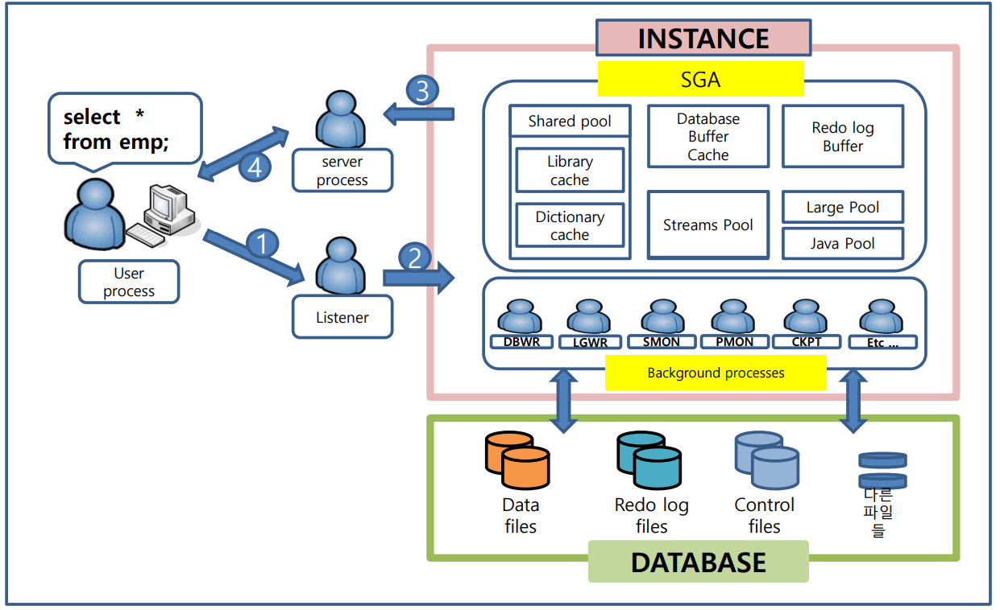
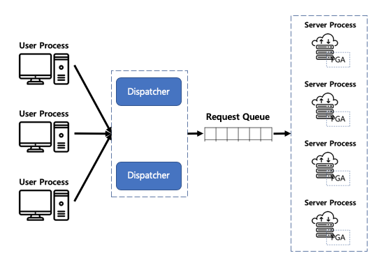

[toc]

---

# SQL 실행 원리

1. **client 서비스 요청**
   ex) select sysdate from dual;
2. **리스너가 해당 서비스 확인**
3. **server process에 의해 사용자의 접속 및 명령어 전달 관리**
   user process(client) -> server process 할당(dedicated[^Dedicated]일 경우 새로운 프로세스 한개 할당)

# 명령어 전달 과정

1. **sql 문장 전달**
2. **server process 할당**
3. **sql 체크(parse)**
   - **syntax check**: 적절한 문법을 사용하였는지(오타는 없는지) 검사(구문)
   - **semantic check**: sql에 명시된 객체들이 실제 존재하는지 검사(의미론), Dictionary Cache
4. **실행계획 체크** (execution|explain plan)
   1. **soft parse**
      메모리에 재사용 가능한 실행계획이 있을 경우(library cache hit ratio[^library cache hit ratio])
   2. **hard parse**
      메모리에 재사용 가능한 실행계획이 없거나 재사용한 실행계획이 존재하지만 공유할 수 없을 때
      optimizer가 data dictionary 등을 참조하여 실행계획 설계하는 경우
      1. 새로운 SQL 수행
      2. 오래된 SQL 수행(처음수행되는 SQL은 아니지만, 실행계획을 보관하는 공간에서 사라졌을 경우(LRU 알고리즘으로 메모리아웃, 쉽게 말해 오래된 sql))
      3. Literal SQL 수행 [^Literal SQL]

# 아키텍처



**Oracle Server**

- **Instance**: `in Memory` - AMM;[^AMM]
  - SGA;[^sga] - ASMM;[^ASMM]
  - background Processes
  - ...
- **Database**: `in Disk`
  - **control files**: DB 전체의 **관리정보**가 들어있는 영역 
  - **redo log files**: **장애 복구 시**에 사용되는 영역
  - **data files**: **데이터가 저장**되는 영역 
  - ...

# SGA [^SGA]

- 공유 메모리 공간
- **oracle parameter file**(spfile or pfile)내 기재되어 있는 각 부분의 사이즈로 할당, 자동으로 관리될 수 있음
- 동적으로 변경 가능(DB 운영중에 변경 가능 >= `9i`)
- 구성 요소
  - **Shared pool**: sql 정보 저장 공간
    - **Library Cache**: sql 정보 중 실행계획 정보 저장 공간
    - **Data Dictionary Cache**: sql 정보 중 객체 정보 저장 공간
  - **Database buffer cache**: 모든 sql의 결과 저장 공간
  - **Redo log buffer**: 모든 변경기록 저장 공간
  - ~~etc~~
    - **Large Pool**
    - **Java Pool**
    - **Extreme Pool**

## Shared pool [^Shared pool]

- 파라미터 조정

  - **shared_pool_size**

- 구성 요소
  - **Library Cache**
  - **Data Dictionary Cache**

### Library Cache [^Library Cache]

- 실행 계획을 저장하는 메모리 공간
- LRU([^LRU])알고리즘으로 관리
- 동일한 SQL이라 판단되면 실행계획을 공유하므로 문장의 파싱 속도가 향상(soft parsing)
- Library Cache Hit Ratio [^Library Cache Hit Ratio]를 체크하여 hard parsing을 유발하는 SQL이 많은지 확인

### Data Dictionary Cache [^Data Dictionary Cache]

- 객체의 정보를 저장하는 메모리 공간
- **semantic check**시 객체가 Data Dictionary Cache에 있는지 확인하고 있으면 ? pass : disk scan

### ~~Server Result Cache~~

- 11g <= New Feature 
- SQL실행 결과는 DB Buffer Cache에 저장하지만 데이터를 DB Buffer Cache에서 찾는 과정에서 부하 발생(순서를 정하는 과정) 일부를 Server Result Cache에 저장
- 하지만 한계가 있으므로 거의 사용하지 않음.

## Database Buffer Cache [^Database Buffer Cache]

> =Buffer Cache

- SQL의 결과를 저장하는 메모리 공간
- 디스크에서 읽은 데이터 블록[^block] 의 복사본을 가지고 동시 **접속된 사용자들은 Database Buffer Cache를 공유하여 Access** 한다
- LRU[^LRU]알고리즘에 의하여 가장 오래된 것은 디스크에 저장하고 메모리에는 가장 최근 사용 데이터를 저장함으로, **디스크 입출력이 줄어 들고, 데이터베이스 시스템의 성능이 증가** 됨
- 데이터를 조회시, Database Buffer Cache에 있으면 **Logical Read**[^Logical Read], 없으면 **Physical Read**[^Physical Read]

**LRU List[^LRU List]**

- 수많은 사용자가 동시에 **Physical Read** [^Physical Read]를 하여 동시에 **Database Buffer Cache**의 **Free Buffer**를 찾으려고 할 때 이 **LRU List**를 참조

**Database Buffer Cache Buffer의 상태**

> DB Cache Buffer 상태는 LRU List에서 관리하므로
> free buffer를 획득하는 과정에 순서를 정하는 wait 발생(=latch[^Latch])

- **Pinned Buffer**[^Pinned Buffer]: 사용중인 객실
- **Dirty Buffer**[^Dirty Buffer]: 체크아웃했지만, 체크인 불가한 상태
- **Free Buffer**[^Free Buffer]: 체크인 가능한 상태

## Redo Log Buffer

- dbms 내 **모든 변경 내용을 기록**(cretae, alter, insert, update, delete, ...)
- 장애복구를 위해 변경사항을 추적하기 위함
- 모든 변경 내용은 먼저 메모리의 Redo Log Buffer에 기록
  -> 특정 시점에 디스크 영역의 Redo Log File에 내려씀(LGWR [^LGWR])
- 😱**동적 변경 불가**
- **log buffer**로 크기 지정


✔ **Redo Log Buffer를 기록하지 않는 경우**
- **Direct Load**
  - SQL Loader
  - insert /*+ append */
  - 기타 이관툴의 Direct load option
- **enable nologging** 
  - table(CTAS)
  - index
  - DML
    - insert
    - update
    - delete

**✔대용량 트랜잭션 수행시 **

1. redo log buffer를 기록하지 않는 방법으로 대규모 트랜잭션을 수행
2. 수행 기준 이전, 이후 모두 수동 백업(로그가 존재하지 않아도 사후 장애 발생시 손실 방지)

---

## ~~etc~~

### ~~Large Pool~~

> = RMAN Pool

- 대규모 메모리 할당을 위해 제공하는 영역
- parallel 작업, RMAN 사용시 Large Pool 영역 사용
- **large_pool_size**: default `0`

### ~~Java Pool~~

- oracle에서 java 사용시 사용되는 영역
- **java_pool_size**: default `24MB`

### ~~Streams Pool~~

- DB간 데이터 이관(copy)시 사용하는 영역
- 10G <= New Feature
- Stream 기능: default **0**(지정하지 않으면 기본적으로 Shared Pool의 10%를 사용)

## Fixed SGA

> OS나 디바이스에서 항상 고정적으로 사용하고 있는 공간의 개념과 동일
> ex) 맥북 512GB 중, 실제 사용가능한 영역은 500GB남짓

- Oracle이 **내부적으로 사용하기 위해 생성시키는 공간**
- 주로 **백그라운드 프로세스들이 필요한** database 전반적인 공유 정보나 각 프로세스들끼리 공유해야 하는 lock 정보 같은 내용들이 저장
- Oracle이 시작될 때 **자동으로 설정되며 사용자나 관리자가 임의로 변경 할 수 없음**


---

# Tip

## ***실행 속도를 높이는 방법***

- 구간 관점
  - 해석: 쿼리를 파싱하는 구간 -> **스펙 및 파라미터 조정** 또는 **hard parse에서 soft parse로 유도**
  - 실행: 쿼리가 실행되는 구간 -> **Index 설계, 타입 일관화**
- 영역 관점
  - ~~disk~~ -> **memory**
- 범위 관점
  - ~~full scan~~ -> **index**

## ***표준이 필요한 이유***

> 세부내용은 같아도 실행계획 체크할 때
> 서로 다른 쿼리로 인지되어 실행계획을  공유하지 못하고
> **hard parse**처리 될 수 있음.
>
> 하여 **표준을 세우고 지킴으로써**
> **실행계획을 공유하는 방향으로 데이터 접근 구간의 퍼포먼스 향상**

```sql
select *
  from emp;
  
SELECT *
  from emp;
  
select * from emp;

select *
  from emp
 where empno = 1;

select *
  from emp
 where empno = 2;
```

## ***server client 구분***

서버가 실행할 수 있는 명령어와 클라이언트가 실행할 수 있는 명령어는 철저히 구분되어있다.

```sql
# only Server
SQL> shutdown immediate
SQL> startup

# anywhere
SQL> select
ORANGE> select
```

## ***DB 인스턴스 이름 및 상태 조회***

```sql
select instance_name, status from v$instance;
```

## ***서버 프롬프트 환경 출력 컬럼 사이즈 조절***

```shell
SQL> col ${COLUMN_NAME} format a${N}
SQL> col status format a7
SQL> col name format a50
```

## ***서버 프롬프트 환경에서 sqlplus 화살표 사용하기***

[rlwrap](https://oracle-base.com/articles/linux/rlwrap): rlwrap for Command Line History and Editing in SQL*Plus and RMAN on Linux

### **set up**

```shell
su - root
rpm -Uvh https://dl.fedoraproject.org/pub/epel/epel-release-latest-7.noarch.rpm
yum install rlwrap

su - oracle
vi ~/.bash_profile
alias sqlplus='rlwrap sqlplus'
export NLS_LANG=KOREAN_KOREA.AL32UTF8
. ~/.bash_profile
```

### **tutorial**

```shell
sqlplus / as sysdba
SQL> select instance_name, status from v$instance; # AFTER PRESS DOWN ARROW UP, DOWN

INSTANCE_NAME    STATUS
---------------- ------------
db1              OPEN

SQL>ed 	# editor
				# 1. without semicolon
				# 2. keep slash at last line

vi
      1 select instance_name,
      2        status
      3   from v$instance
      4 /
:wq

SQL>/ # end

INSTANCE_NAME    STATUS
---------------- ------------
db1              OPEN
```

## sqlplus상에서 서버 커맨드 실행하기

> alias는 되지않음

```shell
SQL> !ls
SQL> !pwd
SQL> !c
```

## ***자동 메모리 관리에 대하여...***

> AMM[^AMM], ASMM[^ASMM]

DBA의 사상, 실력, 프로젝트 팀의 분위기 등으로 인해 간혹 Manual하게 메모리 관리를 사용하기도 함.

## alert log ✴

**immediate tail follow log**

```shell
clear;log_files=$(ls -d $(find / -name alert_db1.log -type f 2> /dev/null) | sed 's/\/alert_db1.log//' | cat -n);maximum_num=$(echo "${log_files}" | wc -l);echo "$log_files";echo "Enter tail follow target number: ";read num;clear;[ $num -gt $maximum_num ] && (echo "Maxmum target number is ${maximum_num}";sleep 1;clear;exit;) || (target_file_path=$(echo "$log_files" | head -${num} | tail -1 | awk -F" " '{print $NF}');echo "Your Entered Number: ${num}";echo "Target file path: ${target_file_path}";acc='.'; for exp in ". . . . ." ". . . ." ". . ." ". ." "."; do (clear;echo $exp;sleep 0.2;) done;clear;cd ${target_file_path};tail -f alert_db1.log;);
```

**grep directories(safety)**

```shell
ls -d $(find / -name alert_db1.log -type f 2> /dev/null) | sed 's/\/alert_db1.log//'

# result
/oracle12
/oracle12/app/oracle/diag/rdbms/db1/db1/trace
```

---

# foot notes

[^SGA]: **S**hared|**S**ystem **G**lobal **A**rea
[^PGA]: **P**rogram|**P**rivate|**P**ersonal **G**lobal **A**rea
[^Data Dictionary Cache]: 객체(테이블, 컬럼, 사용자 정보 등)의 정보를 저장
[^library cache]: SQL 명령문, 구문 분석 트리, 실행계획 정보를 갖는 공간 실행계획 정보를 갖는 공간, LRU알고리즘으로 관리됨 SGA.Shared pool.Librach cache
[^library cache hit ratio]: 실행계획 재사용 비율(=library cache에 적중한 비율), library cache 메모리의 공간이나 구조가 비효율적이거나 literal sql이 무분별하게 사용되었을 경우 등이 주요 저하 요인
[^Shared pool]: SQL에 대한 정보를 저장하는 공간(모든 SQL 처리를 위해 설계)

[^LRU]: **L**east **R**ecently **U**sed 가장 오래된 내용 삭제
[^LFU]: **L**east **F**requently **U**sed 가장 적은 주기로 참조된 내용 삭제
[^ASMM]: Automatic Shared Memoery Management
[^AMM]: Automatic Memory Management

[^Database Buffer Cache]: 모든 SQL문의 결과를 저장하는 메모리 공간
[^Block]: 데이터를 저장하는 최소 단위의 논리 단위
[^Logical Read]: Database Buffer Cache hit
[^Physical Read]: Database Buffer Cache not exist -> disk scan (1. Database Buffer Cache의 Free Buffer를 확보, 2. Disk에서 데이터를 읽어 들여 cache하여 반환)
[^Pinned Buffer]: commit 전, 변경여지가 있는 상태; 다른 사용자가 이미 사용하고 있는 Buffer Block으로 사용할 수 없음
[^Dirty Buffer]: commit 후, disk로 내려쓰지 않은 상태; 현재 작업은 진행되지 않지만 다른 사용자가 내용을 변경한 후 아직 데이터 파일에 변경된 내용을 저장하지 않은 Buffer
[^Free Buffer]: 사용되지 않았거나(Unused) 또는 Dirty Buffer 였다가 디스크로 저장이 되고 다시 재사용 가능하게 된 Block
[^LRU List]: Buffer Block들의 상태를 관리하고 있는 list
[^Latch]: 걸쇠,자물쇠 등을 의미(=우선순위를 획득하기 위해 대기하는 행위)
[^scn]: system change number | system commit number
[^LGWR]: Log Writter(**L**O**G** **WR**ITTER) is one of background processes

[^Dedicated]: 1:1, WAS(Web Application Server)에서 Connection Pool을 이용해 서비스하게 되므로 **안정적인 서비스를 제공해야하는 환경이라면 Dedicated server mode를 사용하는게  일반적**, 왜냐하면 DBMS의 shared mode의 역할을 WAS의 Connection Pool이 대체하여 알아서 관리하게 될 경우,  굳이 shared server mode를 사용할 이유가 없음. (명령처리가 빠르고, 단점으로는 resource낭비 우려)                                                                                                        ↩

[^Shared]: N:1, 명령처리가 느린 대신 resource의 낭비 최소화
[^Literal SQL]: 상수를 그대로 노출하는 SQL

