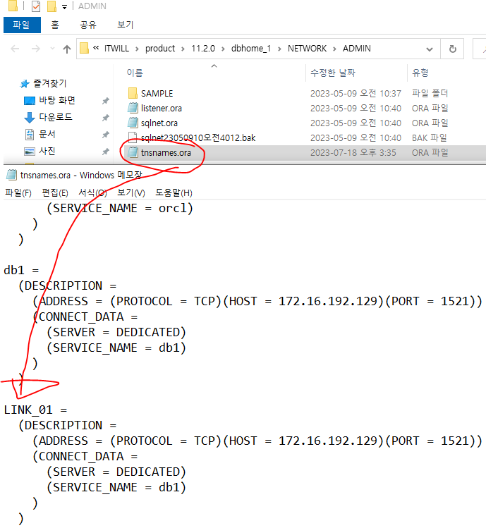

# Link

> orcl(window DB) -> db1(linux DB) 연결 가능한 db_link 생성

### 1. window의 tnsnames.ora 파일에 link 추가



### 2. 이미 tnsnames.ora에 명시된 이름을 사용하는 방법

1. db link를 사용할 DB의 tnsnames.ora에 target DB 정보 기재

   ```shell
   cd $ORACLE_HOME/network/admin
   vi tnsnames.ora
   
   LINK_01 =
     (DESCRIPTION =
       (ADDRESS = (PROTOCOL = TCP)(HOST = 172.16.65.132)(PORT = 1521))
       (CONNECT_DATA =
         (SERVER = DEDICATED)
         (SERVICE_NAME = db1)
       )
     )
   
   :wq
   ```

2. 생성

   ```sql
   create public database link LINK_TEST
   connect to system identified by oracle using 'LINK_01';
   ```

### 3. 조회 확인

```sql
select *
  from dba_db_links;
  
select *
  from scott.emp@LINK_TEST;
  
update scott.emp@LINK_TEST set sal = 3000;
```

