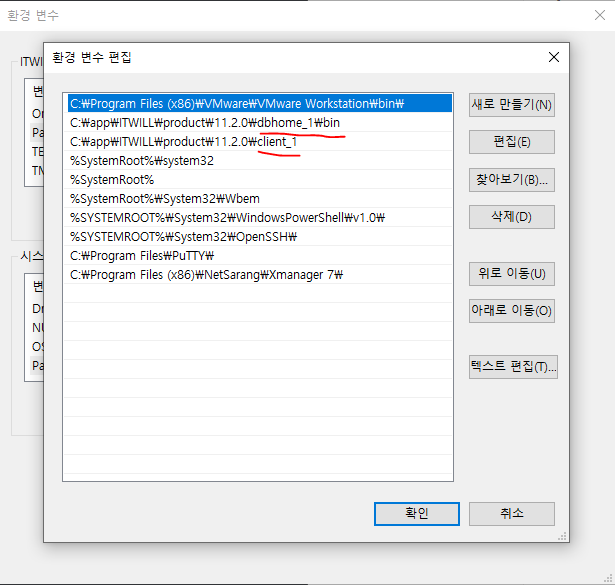

[toc]


## tnsnames.ora

> 데이터 접속목록 관리파일

### 위치

**if is Git Bash**

✔**open every tnsnames.ora in window**

```shell
clear;num=0;for tnsoranames_path in $(echo $PATH| sed 's/:/\n/g'| grep app| grep product| sed 's/\/bin//'| awk '{print $1"/NETWORK/ADMIN"}'); do if [ -d $tnsoranames_path ]; then num=$(expr $num + 1);echo '---------------------------------------------------------------------------------------------------------------------------------------------------------';echo "no: $num";echo "path: $tnsoranames_path";cd $tnsoranames_path;cat -n tnsnames.ora;echo; fi done;
```

✔**open tnsnames.ora directory at top priority in oracle environment path**

```shell
#!/bin/sh

# 목적
# CLIENT의 TNSNMES.ORA파일을 확인하기 위한 SHELL
#
# 내용
# 1. tnsnames.ora 파일 탐색
#   1.1. 환경변수에서 가장 우선순위 높은 경로 유추(/app/product)
#   1.2. 1.1번이 없을 경우, 뒤져서 검색(sample/tnsnames.ora)
# 2. tnsnames.ora 안에서 sid 선택
# 3. 폴더 및 파일 열기

clear

function open() {
  echo "$1"
  cd "$1" || exit
  cat -n tnsnames.ora
  echo
  echo "┌────────────────────────────────────────┐"
  echo "│   위의 본문에서 대상 SID를 입력하세요. │"
  echo "└────────────────────────────────────────┘"
  read sid
  clear
  echo "PATH: $(pwd)/tnsnames.ora"
  from=$(
    cat -n tnsnames.ora | grep -w "${sid} =" | awk -F " " '{print $1}'
  )
  to=$(expr "$from" + 7)
  echo "FROM: ${from}, TO: ${to}"
  cat -n tnsnames.ora | sed -n "${from},${to}p"
  echo
  echo "do you wanna open ? (just open)"
  read ans
  if [[ $ans = 'y' ]] ||  [[ $ans = 'Y' ]]; then
    explorer .
    explorer tnsnames.ora
  fi
  
  exit
}

# 1. tnsnames.ora 파일 탐색
predictedByPathByEnvironmentVariablePriority=$(echo "$PATH" | sed 's/:/\n/g' | grep app | grep product | head -1 | sed 's/\/bin//' | awk '{print $1"/network/admin/"}')
ls "$predictedByPathByEnvironmentVariablePriority" 2>/dev/null

if [ $? -eq 0 ]; then
  TARGET_PATH=$predictedByPathByEnvironmentVariablePriority
else
  for p in $(find /c/app -type f -name "tnsnames.ora" | grep "sample")
  do
    TARGET_PATH=$(echo $p | grep /network/admin | awk -F "/sample/" '{print $1}')
    ls $TARGET_PATH > /dev/null
    if [ $? -eq 0 ]; then
      echo "$TARGET_PATH"
      echo "break"
      break
    fi
  done  

fi

ls $TARGET_PATH > /dev/null
if [ $? -eq 2 ]; then
  echo "First, Install the admin client(TNSNAMES.ORA IS NOT EXISTS)"
  exit
fi

open "$TARGET_PATH"
```

**if not exist git bash**

```shell
/app/${USER}/product/${VERSION}/${SID}/NETWORK/ADMIN/tnsnames.ora
```

### 우선순위

>  client와 server를 여러번 설치했을 경우
>  설치시마다 tnsnames.ora파일을 생성하고
>  가장 최우선 순위에 해당하는 `tnsnames.ora`만 읽어들인다.

- 가장 상단에 있는 환경변수의 순서가 우선순위이므로
  **환경변수 순서를 수정**하거나 **가장 위에 존재하는 위치의 tnsnames.ora파일을 수정**하도록 한다.

  > 기존 위치에서는 수정불가이므로, 수정가능한 위치로 옮긴 후, 덮어써야함.



### 수정

- 우선순위에 의거한 tnsnames.ora파일을 외부 디렉토리에 복사
- 내용 추가 및 삭제
- 복제본을 원본에 덮어쓰기

##### template

```shell
${SID_AS_A_ALIAS} = 
  (DESCRIPTION =
    (ADDRESS = (PROTOCOL = TCP)(HOST = ${IP})(PORT = ${PORT}))
    (CONNECT_DATA =
      (SERVER = DEDICATED)
      (SERVICE_NAME = ${SID})
    )
  )
```

##### applied

```shell
db1 = 
  (DESCRIPTION =
    (ADDRESS = (PROTOCOL = TCP)(HOST = 172.16.192.129)(PORT = 1521))
    (CONNECT_DATA =
      (SERVER = DEDICATED)
      (SERVICE_NAME = db1)
    )
  )
```
