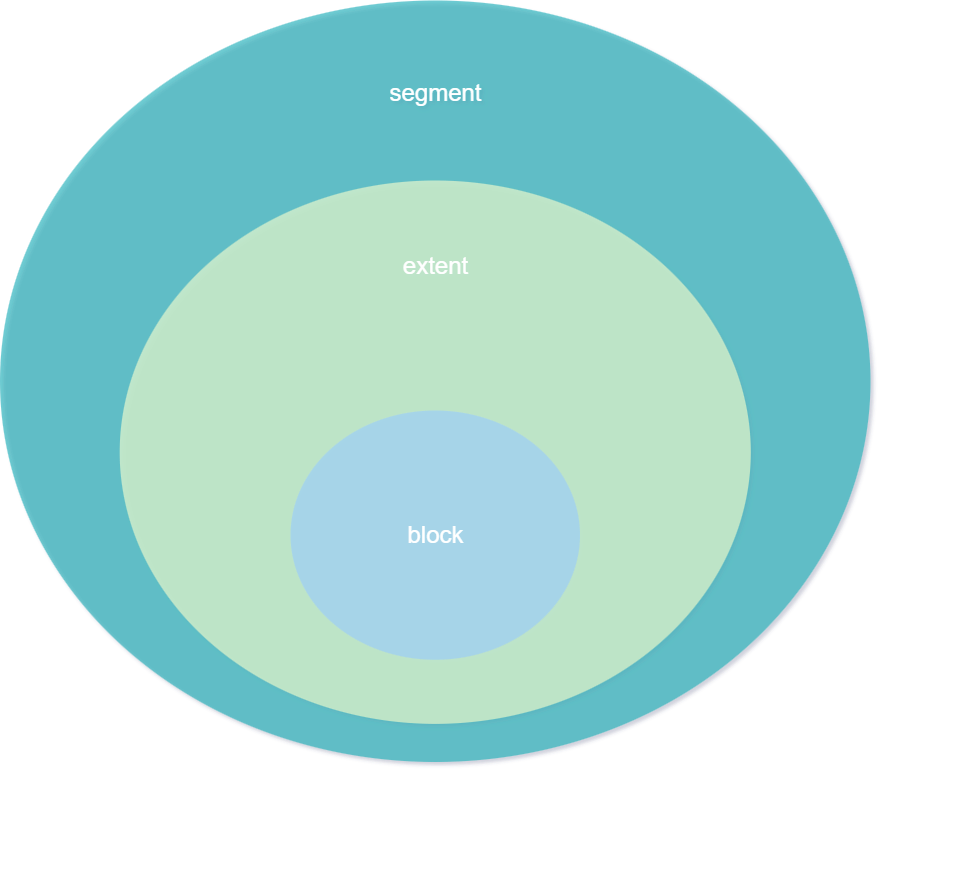

[toc]

# Storage



## datafile

- segment들의 실제 물리적인 파일
  논리적으로는 tablespace

## segment

- segment는 extent를 묶는 논리적 단위

## extent

- block을 묶는 논리적 단위(연속적인 block)
- default `64K`

## block

- 데이터를 관리하기 위한 논리적인 최소단위
- 짝수 권장
- default `8K`

## usage

```sql
TABLESPACE USERS
STORAGE
(
    INITIAL 64K
    NEXT 1M
)
NOLOGGING;
```


## 조회

### 1. extents

```sql
--1. dba_extents 
select segment_name,     -- 여러 extent로 구성, 실제로는 table or index 이름과 일치
       segment_type,     -- table / index 등의 구성 목적
       extent_id,        -- extent 구분 id
       bytes,            -- extent size
       blocks            -- extent를 구성하는 block의 수
  from dba_extents
 where segment_name = 'STG_TEST1';
```

### 2. segments

```sql
--2. dba_segments
select segment_name,
       segment_type,
       segment_subtype,
       tablespace_name,
       bytes/1024/1024 as "SIZE(MB)"
  from dba_segments
 where segment_name = 'STG_TEST1';
```

### 3. tablespaces

```sql
--3. dba_tablespaces
select tablespace_name, 
       block_size,               -- block size(tablespace마다 설정 가능, 권고x)
       initial_extent,           -- 초기 extent 할당 사이즈
       next_extent,              -- 다음 extent 할당 사이즈
       extent_management,        -- DMT OR LMT
       segment_space_management  -- ASSM or FLM
  from dba_tablespaces;
```

### tablespace 생성시 storage 옵션

```sql
select * from dba_data_files;
create tablespace users3 
       datafile '/oracle12/app/oracle/oradata/db1/users04.dbf' size 50m
       extent management local      -- 생략시 기본값
       uniform size 1m;             -- extent 할당 크기(INITIAL_EXTENT, NEXT_EXTENT)
       
select * from dba_tablespaces;    
```

### table 생성시 storage 옵션

```sql
create table extent_test1(
col1    number
)
tablespace users3
storage(
    initial     128K
    next        128K
    minextents  1       --생성 할 extent 최소 개수
    maxextents  50      --생성 할 extent 최대 개수
    pctincrease 0       --next값 증가율
);

select * 
  from dba_tables 
 where table_name='EXTENT_TEST1';
```

### 실사용블럭:할당블럭 조회

```sql
select a.blocks, 
			 b.blocks,
       a.blocks - b.blocks as gap
  from (select sum(BLOCKS) as blocks
          from dba_extents
         where segment_name = 'NOLOGGING_TEST'
       ) a,
       (select count(distinct dbms_rowid.rowid_block_number(rowid) || dbms_rowid.rowid_relative_fno(rowid)) as blocks
          from NOLOGGING_TEST
      ) b;
      
|BLOCKS|BLOCKS|GAP|
|------|------|---|
|11,264|10,876|388|
```

### 테이블:블럭 정보 조회

```sql
exec dbms_stats.gather_table_stats('scott','PCT_TEST1');

select owner, table_name, tablespace_name,
       pct_free, pct_used,
       num_rows, blocks, 
       last_analyzed            
  from dba_tables
 where table_name like 'PCT_TEST%';
```

