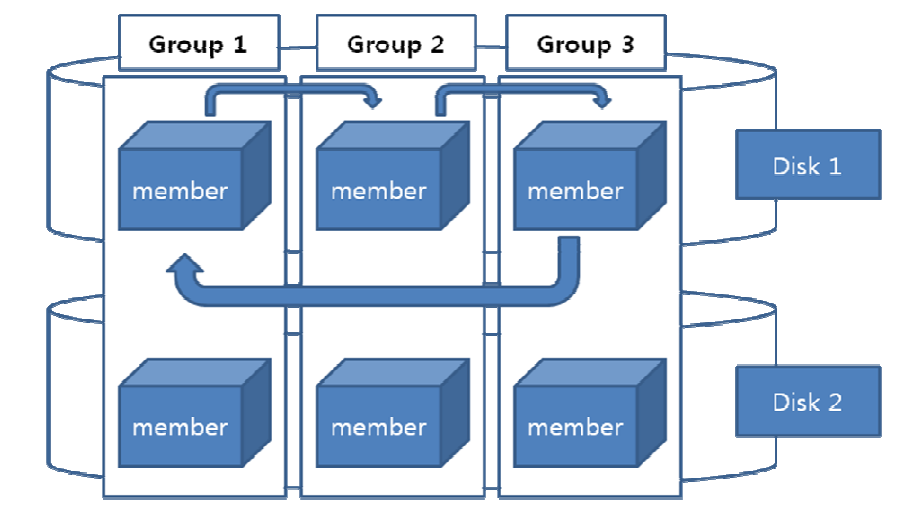

# Redo Log File

- [ ] TODO: Sequence Diagram (Group:Member:Disk)

> 장애를 대비해 변경되기 전의 내용과 변경된 후의 내용을 기록하는 파일
>
> - 메모리는 **Redo Log Buffer**
> - 파일은 **Redo Log File**



## 구성

> **Redo Log File은 그룹과 멤버라는 개념으로 관리**
>
> - `Logical`: group(like directory)
> - `Physical`: member(like file)

- 필수 조건은 2개의 그룹, 각 그룹에 1개 이상의 멤버
- 데이터베이스 생성시 3개의 그룹, 각 그룹에 하나의 멤버 구성(default)
- 같은 그룹에 속한 여러 Member는 같은 내용을 기록(다중화)
- 같은 그룹의 멤버는 서로 다른 디스크에 저장되는 것을 권장
  - ✅다른 디스크일 경우,  병렬로 동시에 기록
  - ❌같은 디스크일 경우, 직렬로 순차적 기록

## 동작 시점

- COMMIT
- OVER `1/3 || 1M` 
- ...

## 상태

### current[^current]

- 현재 redo log buffer가 기록중인 파일
- online중에 삭제, 변경할 수 없음

### active[^active]

- current 상태에서 log switch가 발생하게 되면 active 상태로 변경
- 현재 redo log file이 갖고 있는 시점만큼 동기화 진행중인 상태
  (DBWR가 해당 시점까지의 dirty buffer[^dirty buffer]들을 buffer cache에서 찾아 datafile에 기록중)

### inactive[^inactive]

- 동기화가 끝나면 inactive 상태가 됨(**삭제 가능**)
- 더 이상 사용하지 않고, 동기화가 이미 완료된 상태이므로 online drop  가능

## Log Switch

> Redo Log File 중에 가득차게 되면 **Log Switch가 발생**

- 라운드 로빈 방식[^Round Robin Scheduling]으로 다른 redolog를 current로 결정
- **Checkpoint 신호 발생**
- **잦은 발생은 성능저하**: DB HANG 유발(checkpoint not complete[^checkpoint notcomplete])

## log 생성 원리

**Write Log Ahead**

- 데이터를 변경하기 전에 Redo Log에 먼저 기록 후 데이터를 변경( LGWR 작동 후 DBWR 작동) 

**Log Force at commit**

- 사용자로부터 Commit요청이 들어오면 관련된 모든 Redo Recode들을 redo Log file에 저장한 후 Commit 을 완료
- 대량의 데이터 변경 후 Commit이 한꺼번에 수행시 성능이슈

## 명령어

```sql
# 그룹 추가
alter database add logfile group 4 ‘/home/oracle/oradata/testdb/redo04_a.log’ size 5M ;
# 멤버 추가
alter database add logfile member ‘/home/oracle/oradata/testdb/redo04_b.log’ to group 4;
#3 멤버 삭제
alter database drop logfile member ‘/home/oracle/oradata/testdb/redo04_b.log’ ;
# 그룹 삭제
alter database drop logfile group 4;
```


# foot note

[^global checkpoint]: shutdown immediate시 발생, checkpoint는 가장 강력한 동기 신호
[^Round Robin Scheduling]: 시분할 시스템을 위해 설계된 선점형 스케줄링 알고리즘, 쉽게말해 프로세스들에게 자원을 사용할 수 있는 기회를 공정하게 부여하기 위한 방법
[^checkpoint notcomplete]: Log Switch가 너무 빈번하게 일어날 경우 DBWR이 이전에 발생한 Check point 내용을 Data file에 다 기록을 못한 상태에서 다시 Log Switch가 발생하여 checkpoint 신호가 들어올 경우 발생, 심각할 경우 commit이 무시되어 db hang 유발
[^current]: record
[^active]: sync
[^inactive]: idle
[^Pinned Buffer]: commit 전, 변경여지가 있는 상태; 다른 사용자가 이미 사용하고 있는 Buffer Block으로 사용할 수 없음
[^Dirty Buffer]: commit 후, disk로 내려쓰지 않은 상태; 현재 작업은 진행되지 않지만 다른 사용자가 내용을 변경한 후 아직 데이터 파일에 변경된 내용을 저장하지 않은 Buffer
[^Free Buffer]: 사용되지 않았거나(Unused) 또는 Dirty Buffer 였다가 디스크로 저장이 되고 다시 재사용 가능하게 된 Block

