# set up OEL
> Oracle Enterprise Linux & ORACLE 12c

### in vmware
- new virtual machine for oracle database

- disk set up

### if first boot

​	select install menu for not default	

### software selection

- Server with GUI
	- Java Platform
	- compatibility Libraries
	- Development Tools

### partitioning

##### required

- boot
  - 1GB
- swap
  - min gte swap 4000MB
- /
  - remain

##### optional

- /oracle12
  - 30GB
- /home
  - 20GB

### Security Policy

- off

### Network & Host name

- ethernet enable
- change hostname

### Begin Installation

### password

- oracle

### user creation

- name: username
- pw: oracle

### ifconfig

172.16.192.129

### putty

window -> OEL7

### load Oracle Image file

win scp

```shell
# TARGET DIRECTORY
/oracle12/
```

### check and unzip target file

```shell
cd /oracle12/
ls -ld V839960-01.zip
unzip V839960-01.zip
```

### set hosts

```shell
su - root
vi /etc/hosts
172.16.192.129 oel7 # ${YOUR_IP} ${YOUR_HOST_NAME}
```

### set hostname

```shell
cat /etc/hostname # check oel7
```

if not exist

```shell
vi /etc/hostname

oel7
```

### set oracle

> oracle12c-R2

- `su - root `

- [preinstall](https://oracle-base.com/articles/12c/oracle-db-12cr2-installation-on-oracle-linux-6-and-7)

  - `yum install oracle-database-server-12cR2-preinstall -y`

    > yum 프로세스 충돌 주의(동시 진행 불가)
    > `ps -ef | grep yum | grep -v grep`

    - user setting
    - system control file
    - ...

- check user

  - `grep oracle /etc/passwd`

- update

  - `yum update -y`

- set oracle user password

  - `passwd oracle`
    - oracle

- set selinux

  - `vi /etc/selinux/config`
    - `SELINUX=permissive`
  - `setenforce Permissive`

- disable firewall(`when TEST`)

  - `systemctl stop firewalld`
  - `systemctl disable firewalld`

- directory and permission(partitioning)

  - ```shell
    mkdir -p /${ORACLE_PRODUCT}/app/oracle/product/12.2.0.1/db_1
    chown -R oracle:oinstall /${ORACLE_PRODUCT}
    chmod -R 775 /${ORACLE_PRODUCT}
    
    mkdir -p /oracle12/app/oracle/product/12.2.0.1/db_1
    chown -R oracle:oinstall /oracle12
    chmod -R 775 /oracle12
    ```

- modify owner and permission

  - ```shell
    cd /oracle12/
    ls -ld database
    chown -R oracle:oinstall database
    chmod -R 775 database
    ```

- check monitor 

  - ````shell
    ipconfig | findstr "IPv4 주소"
    
    or
    
    ipconfig | cat -n | head -9 | tail -1 | awk -F: '{print $NF}' | awk -F" " '{print "export DISPLAY="$NF":0.0; export LANG=C;"}'
    ````

  - ```shell
    su - root
    yum install -y xorg-x11-apps
    export DISPLAY=${YOUR_ID}:0.0
    xclock
    ```

- as a oracle

  - ```shell
    su - oracle
    export DISPLAY=${YOUR_ID}:0.0  	# window ip
    xclock							# check monitor
    export LANG=C					# Support for Korean
    
    cd /oracle12/database
    ./runInstaller
    ```

### Installer

1. Installation Option
   - uncheck oracle support
2. Select Installation Option
     - Install database software only
3. Select Database Installation Option
     - Single instance database installation
4. Select Database Edition
     - Enterprise Edition
5. Specify Installation Location

     - Oracle base

         	- `/${ORACLE PRODUCT}/app/oracle`
         	- `/oracle12/app/oracle`
     - Software location

         	- `/${ORACLE PRODUCT}/app/oracle/product/12.2.0.1/db_1`
         	- `/oracle12/app/oracle/product/12.2.0.1/db_1`
6. just next
7. Install Product
  - `su - root`
  - run scripts
    - orainstRoot.sh (`/oracle12/app/oraInventory/orainstRoot.sh`)
    - root.sh (`/oracle12/app/oracle/product/12.2.0.1/db_1/root.sh`)
      - Trace File Analyzer (TFA)
        - no

### config profile

**template**

```shell
# Oracle Settings
export TMP=/tmp
export TMPDIR=\$TMP

export ORACLE_HOSTNAME=ol7-122.localdomain
export ORACLE_UNQNAME=cdb1
export ORACLE_BASE=/u01/app/oracle
export ORACLE_HOME=\$ORACLE_BASE/product/12.2.0.1/db_1
export ORACLE_SID=cdb1

export PATH=/usr/sbin:/usr/local/bin:\$PATH
export PATH=\$ORACLE_HOME/bin:\$PATH

export LD_LIBRARY_PATH=\$ORACLE_HOME/lib:/lib:/usr/lib
export CLASSPATH=\$ORACLE_HOME/jlib:\$ORACLE_HOME/rdbms/jlib
```

**change `ORACLE_HOSTNAME, ORACLE_UNQNAME, ORACLE_BASE, ORACLE_SID`**

```shell
# Oracle Settings
export TMP=/tmp
export TMPDIR=$TMP

export ORACLE_HOSTNAME=oel7
export ORACLE_UNQNAME=db1
export ORACLE_BASE=/oracle12/app/oracle
export ORACLE_HOME=$ORACLE_BASE/product/12.2.0.1/db_1
export ORACLE_SID=db1

export PATH=/usr/sbin:/usr/local/bin:$PATH
export PATH=$ORACLE_HOME/bin:$PATH

export LD_LIBRARY_PATH=$ORACLE_HOME/lib:/lib:/usr/lib
export CLASSPATH=$ORACLE_HOME/jlib:$ORACLE_HOME/rdbms/jlib
```

1. `su - root`
2. `cd /home/${USER}`
3. `ls -al`
4. `vi ${PROFILE_FILE}`
   1. append `Oracle Settings`
5. `. ./bash_profile`

### set Listener Process

> 외부에서 DBMS로 접속을 관리하는 프로세스

DISPLAY, LANG 동일하게 유지

```shell
su - oracle
ps -ef | grep lsnr | grep -v grep

#ipconfig | cat -n | head -9 | tail -1 | awk -F: '{print $NF}' | awk -F" " '{print "DISPLAY="$NF":0.0; export DISPLAY; LANG=C; export LANG;"}'
# DISPLAY=192.168.17.17:0.0; export DISPLAY; LANG=C; export LANG;

export DISPLAY=${YOUR_ID}:0.0
export LANG=C
netca
```

### NETCA

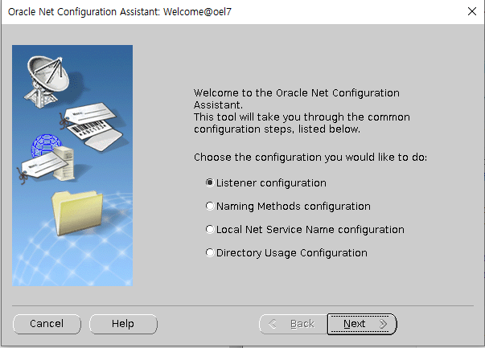

### DBCA

- Creation Mode

  - Advanced configuration

- Deployment Type

  - Oracle Single Instance database
  - Custom Database

- Database Identification

  > 가급적 동일한 이름으로 
  > 여기서는 SID를 Global database name으로 변경하여 진행

  - Global database name
  - SID

- Storage Option

  - Use following for the database storage attributes
    - File System

- Fast Recovery Option

  > 차후에 재설정 가능하므로, 현시점에서는 꺼놓도록 한다.

  - off: Specify Fast Recovery Area

  - off: Enable archiving

    > archive log mode : 아카이브 로그 생성
    > no archive log mode: 아카이브 로그 비생성
    >
    > **❗ archive log**: 데이터베이스 내에서의 모든 변경사항을 기록하는 로그
    > (궁극적으로 시점 복구를 하기 위함.)

- Network Configuration

  - check listner

- Database Options

  > 필요시 설정

  - off

- Conguration Options

  - Memory

    > ASM: Automatic Storage Management
    > ASMM: Automatic Shared Memoery Management
    > AMM: Automatic Memory Management
    > 

    - Use Automatic Shared Memory Management
    - Use Manual Shared Memory Management
    - ✅Use Automatic Memory Management

  - Sizing

    - Block size

      > a block is the smallest unit of storage for allocation and for I/O.
      > it cannot be changed once the database is created.
      >
      > = 할당 및 I/O를 위한 가장 작은 저장소 단위(데이터베이스가 생성 이후 변경불가)
      >
      > 할당: disk를 읽어 memory로 load하는 행위

  - Character sets

    - ✅UTF8
    - if window, MS Windows Code Page 949

  - Connection mode

    - ✅Delicated server mode

      > 1:1
      > 
      >
      > 명령처리 빠름, resource 낭비
      >
      > > 일반적으로 WAS(Web Application Server)에서 Connection Pool을 점유하면서 서비스하게 되므로 **안정적인 서비스를 제공해야하는 환경이라면 Delicated server mode를 사용하는게  일반적**이다.

    - Shared server mode

      > N:1
      > 
      > 명령처리가 느린 대신, resource의 낭비 최소화

  - Sample schemas

    - if dev ✅

- Management Options

  - ✅Configure Enterprise Manager (EM) database express

    > GUI dashboard monitoring manager
    > like php admin

- User Credentials

  - Use the same administrative password for all accounts
    - oracle, oracle

- Creation Option

  - ✅Create database
  - Save as a database template
  - Generate database creation scripts

# ref capture


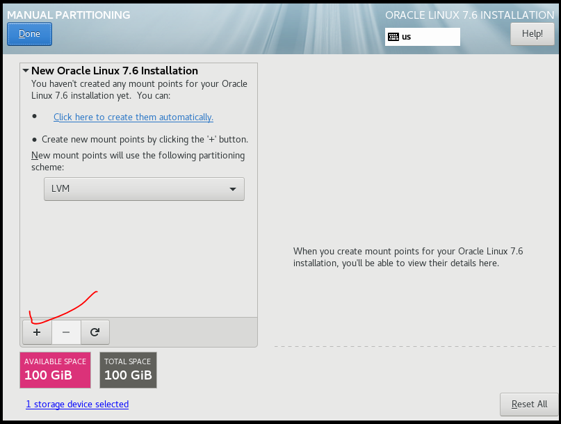


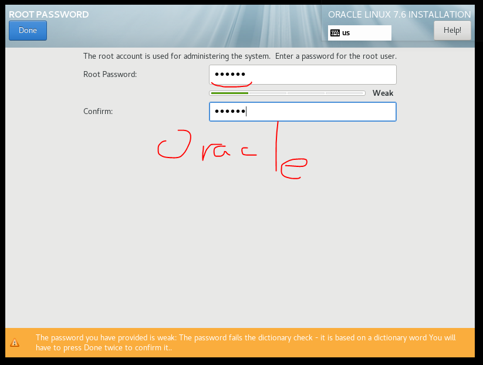


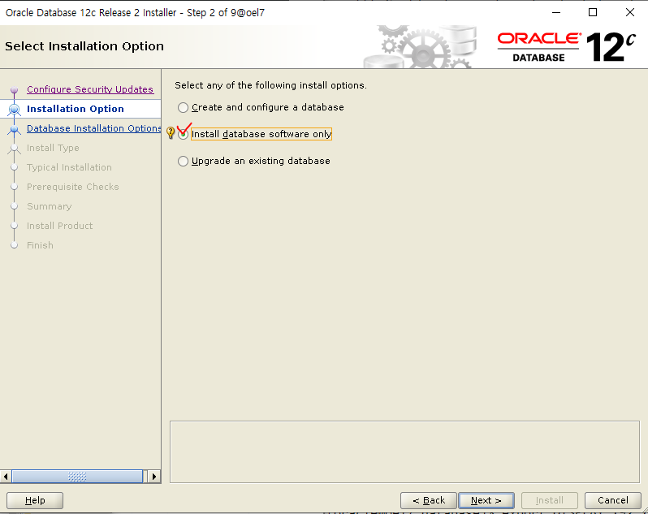


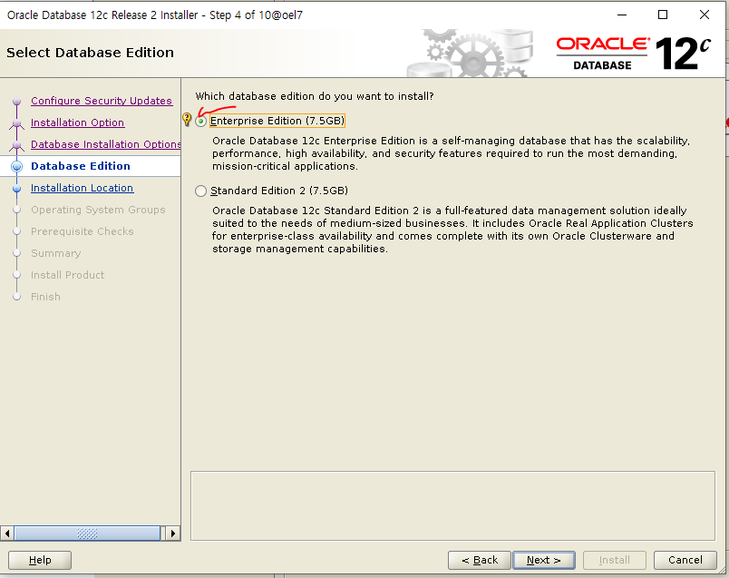


### NETCA

### DBCA

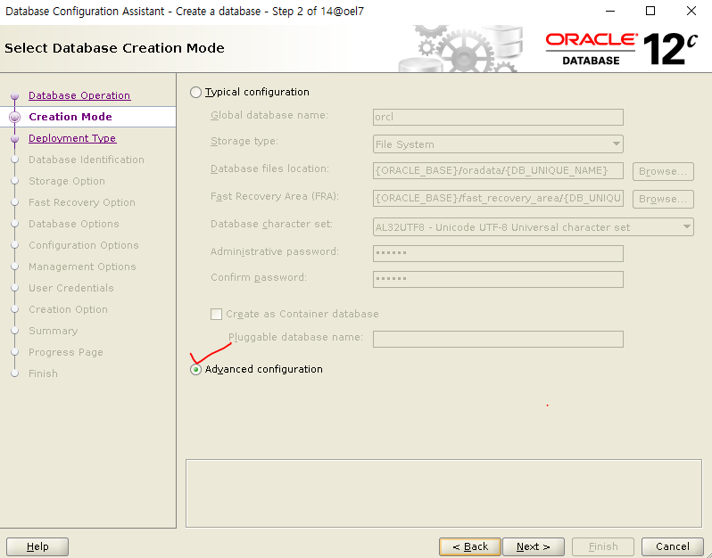

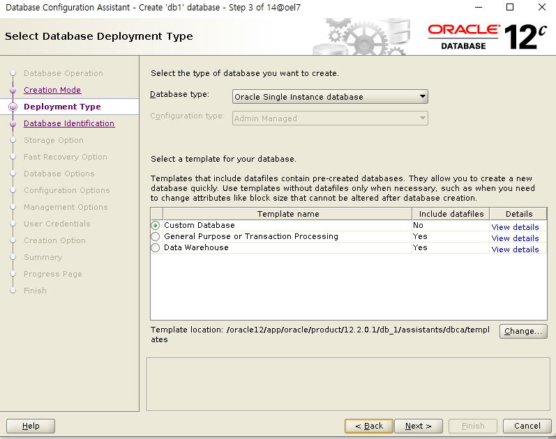

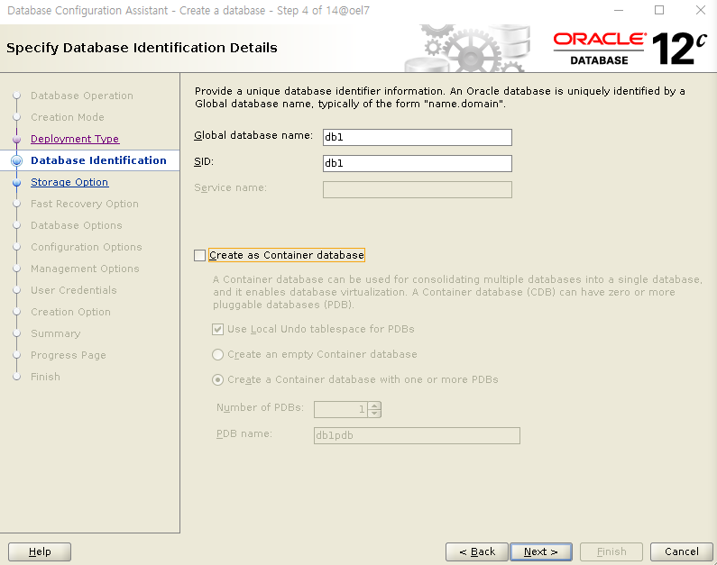


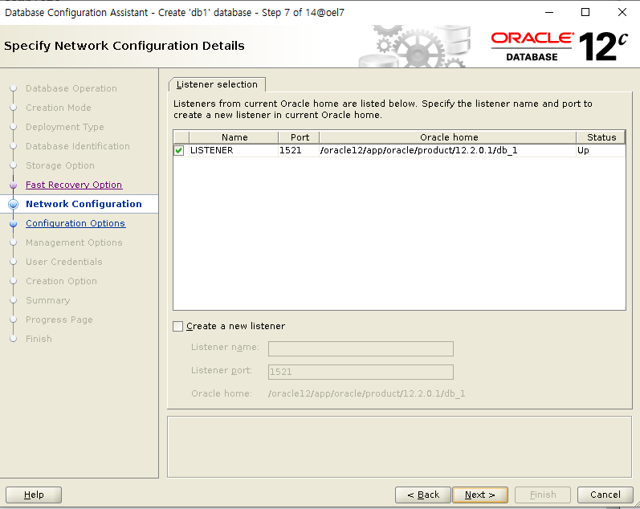


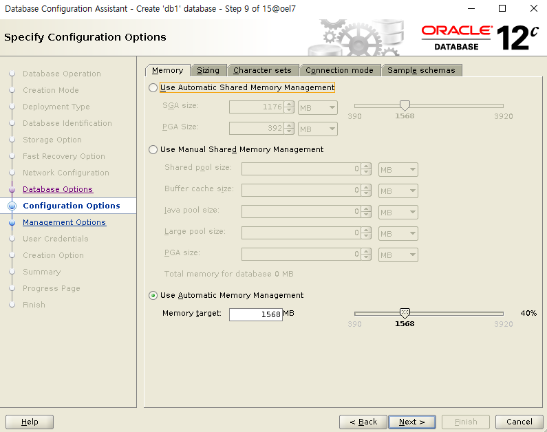

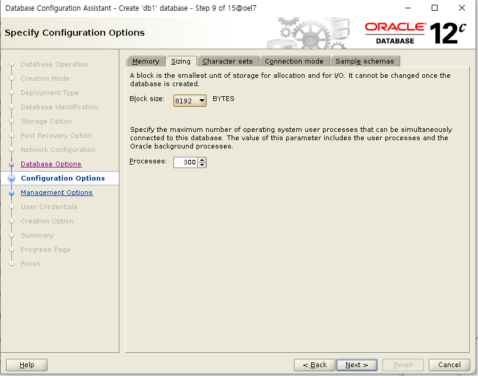

