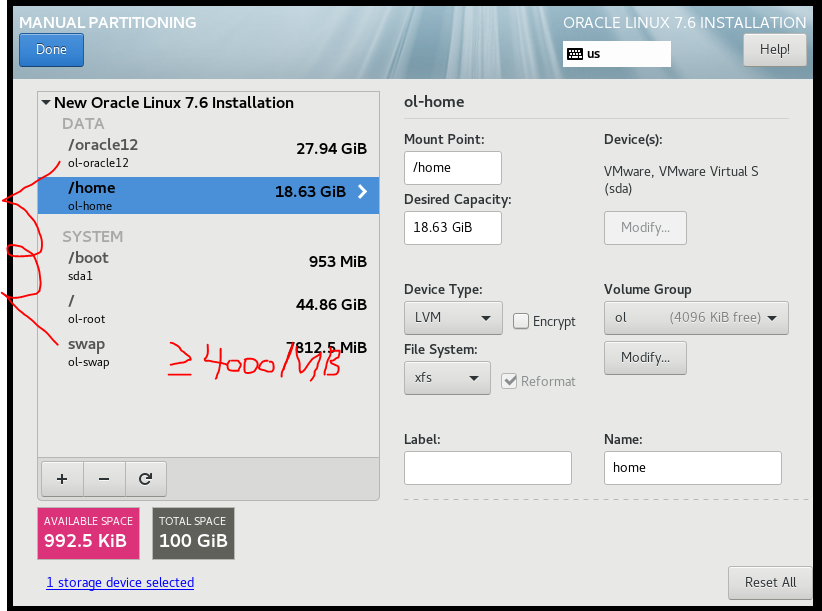
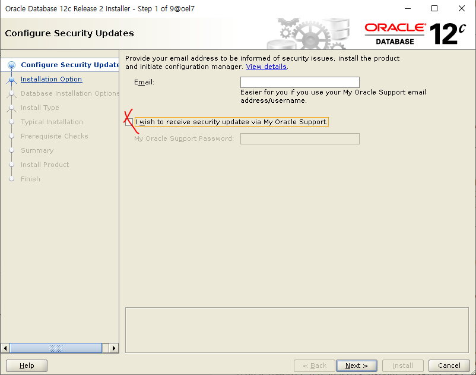
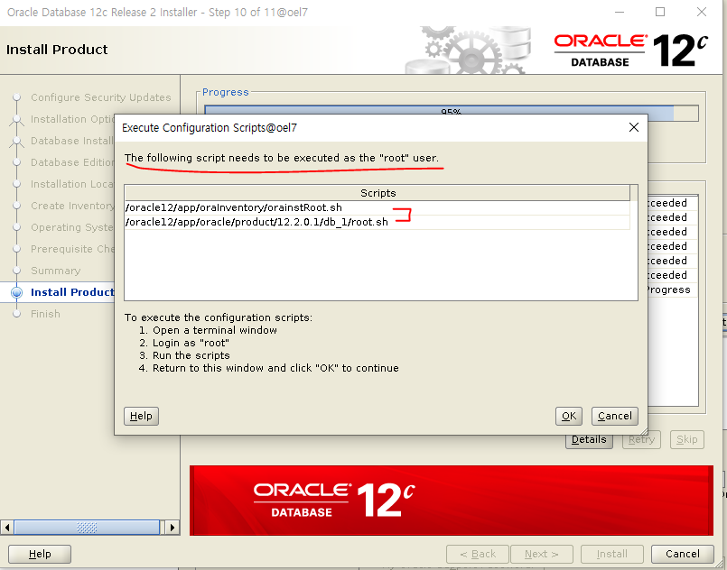

# set up OEL
> Oracle Enterprise Linux & ORACLE 12c

### in vmware
- new virtual machine for oracle database

- disk set up

### if first boot

​	select install menu for not default	

### software selection

- Server with GUI
	- Java Platform
	- compatibility Libraries
	- Development Tools

### partitioning

##### required

- boot
  - 1GB
- swap
  - min gte swap 4000MB
- /
  - remain

##### optional

- /oracle12
  - 30GB
- /home
  - 20GB

### Security Policy

- off

### Network & Host name

- ethernet enable
- change hostname

### Begin Installation

### password

- oracle

### user creation

- name: username
- pw: oracle

### ifconfig

172.16.192.129

### putty

window -> OEL7

### load Oracle Image file

win scp

```shell
# TARGET DIRECTORY
/oracle12/
```

### check and unzip target file

```shell
cd /oracle12/
ls -ld V839960-01.zip
unzip V839960-01.zip
```

### set hosts

```shell
su - root
vi /etc/hosts
172.16.192.129 oel7 # ${YOUR_IP} ${YOUR_HOST_NAME}
```

### set hostname

```shell
cat /etc/hostname # check oel7
```

if not exist

```shell
vi /etc/hostname

oel7
```

### set oracle

> oracle12c-R2

- `su - root `

- [preinstall](https://oracle-base.com/articles/12c/oracle-db-12cr2-installation-on-oracle-linux-6-and-7)

  - `yum install oracle-database-server-12cR2-preinstall -y`

    > yum 프로세스 충돌 주의(동시 진행 불가)
    > `ps -ef | grep yum | grep -v grep`

    - user setting
    - system control file
    - ...

- check user

  - `grep oracle /etc/passwd`

- update

  - `yum update -y`

- set oracle user password

  - `passwd oracle`
    - oracle

- set selinux

  - `vi /etc/selinux/config`
    - `SELINUX=permissive`
  - `setenforce Permissive`

- disable firewall(`when TEST`)

  - `systemctl stop firewalld`
  - `systemctl disable firewalld`

- directory and permission(partitioning)

  - ```shell
    mkdir -p /${ORACLE_PRODUCT}/app/oracle/product/12.2.0.1/db_1
    chown -R oracle:oinstall /${ORACLE_PRODUCT}
    chmod -R 775 /${ORACLE_PRODUCT}
    
    mkdir -p /oracle12/app/oracle/product/12.2.0.1/db_1
    chown -R oracle:oinstall /oracle12
    chmod -R 775 /oracle12
    ```

- modify owner and permission

  - ```shell
    cd /oracle12/
    ls -ld database
    chown -R oracle:oinstall database
    chmod -R 775 database
    ```

- check monitor 

  - ````shell
    ipconfig | findstr "IPv4 주소"
    
    or
    
    ipconfig | cat -n | head -9 | tail -1 | awk -F: '{print $NF}' | awk -F" " '{print "export DISPLAY="$NF":0.0; export LANG=C;"}'
    ````

  - ```shell
    su - root
    yum install -y xorg-x11-apps
    export DISPLAY=${YOUR_ID}:0.0
    xclock
    ```

- as a oracle

  - ```shell
    su - oracle
    export DISPLAY=${YOUR_ID}:0.0  	# window ip
    xclock							# check monitor
    export LANG=C					# Support for Korean
    
    cd /oracle12/database
    ./runInstaller
    ```

### Installer

1. Installation Option
   - uncheck oracle support
2. Select Installation Option
     - Install database software only
3. Select Database Installation Option
     - Single instance database installation
4. Select Database Edition
     - Enterprise Edition
5. Specify Installation Location

     - Oracle base

         	- `/${ORACLE PRODUCT}/app/oracle`
         	- `/oracle12/app/oracle`
     - Software location

         	- `/${ORACLE PRODUCT}/app/oracle/product/12.2.0.1/db_1`
         	- `/oracle12/app/oracle/product/12.2.0.1/db_1`
6. just next
7. Install Product
  - `su - root`
  - run scripts
    - orainstRoot.sh (`/oracle12/app/oraInventory/orainstRoot.sh`)
    - root.sh (`/oracle12/app/oracle/product/12.2.0.1/db_1/root.sh`)
      - Trace File Analyzer (TFA)
        - no

### config profile

**template**

```shell
# Oracle Settings
export TMP=/tmp
export TMPDIR=\$TMP

export ORACLE_HOSTNAME=ol7-122.localdomain
export ORACLE_UNQNAME=cdb1
export ORACLE_BASE=/u01/app/oracle
export ORACLE_HOME=\$ORACLE_BASE/product/12.2.0.1/db_1
export ORACLE_SID=cdb1

export PATH=/usr/sbin:/usr/local/bin:\$PATH
export PATH=\$ORACLE_HOME/bin:\$PATH

export LD_LIBRARY_PATH=\$ORACLE_HOME/lib:/lib:/usr/lib
export CLASSPATH=\$ORACLE_HOME/jlib:\$ORACLE_HOME/rdbms/jlib
```

**change `ORACLE_HOSTNAME, ORACLE_UNQNAME, ORACLE_BASE, ORACLE_SID`**

```shell
# Oracle Settings
export TMP=/tmp
export TMPDIR=\$TMP

export ORACLE_HOSTNAME=oel7
export ORACLE_UNQNAME=db1
export ORACLE_BASE=/oracle12/app/oracle
export ORACLE_HOME=\$ORACLE_BASE/product/12.2.0.1/db_1
export ORACLE_SID=db1

export PATH=/usr/sbin:/usr/local/bin:\$PATH
export PATH=\$ORACLE_HOME/bin:\$PATH

export LD_LIBRARY_PATH=\$ORACLE_HOME/lib:/lib:/usr/lib
export CLASSPATH=\$ORACLE_HOME/jlib:\$ORACLE_HOME/rdbms/jlib
```

1. `su - oracle`
2. `cd`
3. `ls -al`
4. `vi ${PROFILE_FILE}`
   1. append `Oracle Settings`
5. `. ./bash_profile`

### set Listener Process

> 외부에서 DBMS로 접속을 관리하는 프로세스

DISPLAY, LANG 동일하게 유지

```shell
su - oracle
ps -ef | grep lsnr | grep -v grep

# ipconfig | cat -n | head -9 | tail -1 | awk -F: '{print $NF}' | awk -F" " '{print "export DISPLAY="$NF":0.0; export LANG=C;"}'

export DISPLAY=${YOUR_ID}:0.0
export LANG=C
```

# ref capture








