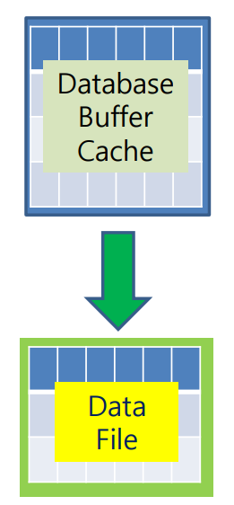

# Database Writer(**DBWR**)

> database buffer cache -> data file
> commit -> disk



## 특징

- Database Buffer Cache의 내용 중, dirty buffer를 datafile에 내려쓰는 역할(`memory -> disk`)
- 최대 개수는 1~10개 변경 가능(DBW0 – DBW9)
- commit 직후 동작하지 않고, 동작시점이 별도로 있음.

## 동작시점

> DBWR의 동작시점은 **CHECKPOINT**와 동일

1. **checkpoint** 발생
2. **Dirty Buffer**[^dirty buffer]가 임계값 초과
3. **Time out** 발생
4. **RAC Ping**[^RAC Ping] 발생
5. **shutdown immediate**
6. **tablespace** 단위 작업을 진행시
   1. **readonly**: 수정하지 못하게 변경 ex) 배치작업 수행 전
   2. **offline**: controlfile이 알지 못하게 쓰지 않는 상태로 변경
   3. **begin backup**: online backup의 시작 시점을 정의(=like readonly)
7. **table**
   1. drop
   2. truncate

## 확인

**1. Server **

```shell
ps -ef | grep dbw | grep -v grep
oracle    8633     1  0 10:05 ?        00:00:00 ora_dbw0_db1
```

**2. DB**

```sql
SQL> show parameter db_writer_processes;

NAME                                 TYPE        VALUE
------------------------------------ ----------- ------------------------------
db_writer_processes                  integer     1
```

**3. Data Dictionary View, Dynamic Performance View**

```sql
select *
  from v$parameter
 where name = 'db_writer_processes';
```

# footnote

---

[^Pinned Buffer]: commit 전, 변경여지가 있는 상태; 다른 사용자가 이미 사용하고 있는 Buffer Block으로 사용할 수 없음
[^Dirty Buffer]: commit 후, disk로 내려쓰지 않은 상태; 현재 작업은 진행되지 않지만 다른 사용자가 내용을 변경한 후 아직 데이터 파일에 변경된 내용을 저장하지 않은 Buffer
[^Free Buffer]: 사용되지 않았거나(Unused) 또는 Dirty Buffer 였다가 디스크로 저장이 되고 다시 재사용 가능하게 된 Block
[^RAC Ping]: 다른 인스턴스에서 커밋은 했지만, 아직 disk로 내려쓰지 않은 상태에서 서로 다름을 인지