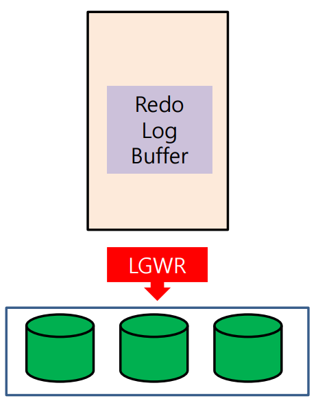

# LoG Writer(**LGWR**)

> redolog buffer -> redolog file



## 특징

- redolog buffer에서 redolog file로 내리는 역할 수행
  (server process가 해당 세션의 모든 변경 내용을 redolog buffer에 기록)
- 데이터의 최신 상태 정보를 관여하므로, disk I/O에 가장 먼저 접근하는 프로세스(`redolog file > data file`)
- commit시 **instance recovery[^instance recovery]에 대비하기 위해** redolog buffer 내용을 redolog file에 **즉시 내려씀**
- LGWR 동작 시점에 current redolog file이 물리적 손상/유실시 commit된 내용을 내려쓰지 못하고 무한 대기 -> DB HANG

## 동작시점

1. **Commit 발생**
2. 임계값 초과(1/3)
3. 변경량 1M 도달
4. every 3sec
5. **DBWR이 내려쓰기 전**

## 상태

**current**

수행상태

read/write

**active**

datafile과 redologfile을 DBWR가 동기화 중이거나 동기화 대기중인 상태

**inactive**

유휴상태

## 확인

**1. Server** 

```shell
ps -ef | grep lgwr | grep -v grep
oracle    8635     1  0 10:05 ?        00:00:00 ora_lgwr_db1
```

**2. online log files**

```sql
SQL> col member format a30;
SQL> select * from v$logfile;

    GROUP# STATUS  TYPE    MEMBER                                      IS_     CON_ID
---------- ------- ------- ------------------------------------------- --- ----------
         1         ONLINE  /oracle12/app/oracle/oradata/db1/redo01.log NO           0
         2         ONLINE  /oracle12/app/oracle/oradata/db1/redo02.log NO           0
         3         ONLINE  /oracle12/app/oracle/oradata/db1/redo03.log NO           0
```

**3. online log files with status(active|current|inactive)**

```sql
select a.group#,
       a.member,
       b.bytes/1024/1024 MB,
       b.archived,
       b.status
from   v$logfile a,
       v$log b
where  a.group# = b.group#
order by 1, 2;

    GROUP# MEMBER                                              MB ARC STATUS
---------- ------------------------------------------- ---------- --- ----------------
         1 /oracle12/app/oracle/oradata/db1/redo01.log        200 NO  INACTIVE
         2 /oracle12/app/oracle/oradata/db1/redo02.log        200 NO  INACTIVE
         3 /oracle12/app/oracle/oradata/db1/redo03.log        200 NO  CURRENT
```

## log switch 

redo log buffer에서 redo log file로 덮어쓸 파일을 변경하는 현상

여러개의 redo log file에서 current -> active -> current | inactive로 되는 현상

### 발생시점

- 가득찼거나
- 스위칭 명령시
  `alter system checkpoint;`

### CHECKPOINT NOT COMPLETE

- log switch 도중, current로 돌입할 수 없는 상태일 경우 발생하는 현상.
- critical한 상황은 아니고 그저 대기하면 됨.

만약, 빈번하게 발생할 경우

- 원인: 잦은 log switching 및 current로 변경할 file이 없을 때
- 해결: redo log file의 할당량이 트랜잭션 대비 적으므로 **redo log file의 총 할당량을 증가**(갯수 증가 또는 각 유닛의 사이즈 증설)

### TEST

시나리오

> DML을 준비할 수 없으니 명령어 수행으로 확인

1. 강제로 logfile 스위칭
2. ASIS CURRENT는 ACTIVE로 변경
3. DBWR를 트리거하기 위해 CHECKPOINT 실행
4. DBWR이 트리거되어 ASIS CURRENT가 ACTIVE에서 INACTIVE로 변경
5. 결과적으로 TOBE CURRENT는 CURRENT유지되며, ASIS CURRENT는 ACTIVE에서 INACTVE로 변경

```sql
select a.group#, a.member, b.bytes/1024/1024 MB, b.archived, b.status from v$logfile a, v$log b where a.group# = b.group# order by 1, 2;
alter system switch logfile;
select a.group#, a.member, b.bytes/1024/1024 MB, b.archived, b.status from v$logfile a, v$log b where a.group# = b.group# order by 1, 2;
alter system checkpoint;
select a.group#, a.member, b.bytes/1024/1024 MB, b.archived, b.status from v$logfile a, v$log b where a.group# = b.group# order by 1, 2;
```


# footnote

---

[^Pinned Buffer]: commit 전, 변경여지가 있는 상태; 다른 사용자가 이미 사용하고 있는 Buffer Block으로 사용할 수 없음
[^Dirty Buffer]: commit 후, disk로 내려쓰지 않은 상태; 현재 작업은 진행되지 않지만 다른 사용자가 내용을 변경한 후 아직 데이터 파일에 변경된 내용을 저장하지 않은 Buffer
[^Free Buffer]: 사용되지 않았거나(Unused) 또는 Dirty Buffer 였다가 디스크로 저장이 되고 다시 재사용 가능하게 된 Block
[^RAC Ping]: 다른 인스턴스에서 커밋은 했지만, 아직 disk로 내려쓰지 않은 상태에서 서로 다름을 인지
[^instance recovery]: 비정상 종료하였을 때, 디스크에 내려쓰지 못한 메모리의 정보를 일치시켜주는 작업(SMON이 mount단계에서 수행)