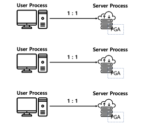

# Process

> similar equal session

## **background process**

> Oracle Server가 시작되면 자동으로 시작되어 운영과 유지를 담당

- PMON
- LGWR
- ...

## **server process**

- user process에 대응하는 server 쪽의 process
- 서버에서 **ps로 확인가능**하며 DB에서도 **v$session** 뷰로 확인이 가능
- user process가 전달하는 SQL에 대해 실행 명령을 server로 전달하는 역할
- 일반적으로 1개의 user process에 1개의 server process를 할당(dedicated server mode;[^dedicated server mode])
- 동시 접속이 많은 경우 DB의 자원을 절약하기위해 공유서버 구성을 하기도함(shared server mode;[^shared server mode])

## **user process**

- client, 단말기를 의미(ex: sqlplus, orange, toad, was server, ...)
- **그저 client를 표현하기 위한 용어**일 뿐, DBA의 **관리 대상이 아님**
- 사용자가 실행시킨 SQL 구문을 server process에 전달하고 그 결과를 다시 응답하는 역할 수행

## **Test**

**maximum process unit count(total)**

```sql
select name,
       value
  from v$parameter
 where name = 'processes';
```

**current process unit count(server process + system process)**

```sql
select *
  from v$processes;
```

✔ **current process unit count at session(server prcess + client information)**[de facto standard]

```sql
select SID, SERIAL#, STATUS, SERVER, OSUSER, MACHINE, TERMINAL, PROGRAM
  from v$session;
```

---

💊 참고

대부분의 웹서비스들은 web server -> was -> db -> was -> web server 방향으로 트랜잭션이 수행되고 종료되는데
이 때, was[^was]와 DB와의 연결을 connection pool을 할당하여 관리하는데
이는 마치 shared server mode와 같아도 user process마다 1개의 server process가 할당되는 구조를 갖지 않는다.

# foot notes

[^was]: Web Application Server
[^Dedicated Server mode]: 1:1, WAS(Web Application Server)에서 Connection Pool을 이용해 서비스하게 되므로 **안정적인 서비스를 제공해야하는 환경이라면 Dedicated server mode를 사용하는게  일반적**, 왜냐하면 DBMS의 shared mode의 역할을 WAS의 Connection Pool이 대체하여 알아서 관리하게 될 경우,  굳이 shared server mode를 사용할 이유가 없음. (명령처리가 빠르고, 단점으로는 resource낭비 우려)                                                                                                       
[^Shared Server mode]: N:1, 명령처리가 느린 대신 resource의 낭비 최소화