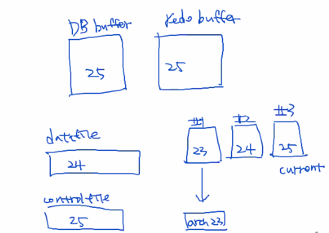

[toc]

# Redolog

## 방향

| case | 단위   | REDO상태 | ARCHIVE              | DB상태 | 방법                                                         |
| ---: | ------ | -------- | -------------------- | ------ | ------------------------------------------------------------ |
|    1 | MEMBER | !CURRENT |                      | OPEN   | DROP                                                         |
|    2 | MEMBER | CURRENT  |                      | OPEN   | LOGSWITCH -> DROP                                            |
|    3 | GROUP  | !CURRENT |                      | OPEN   | CLEAR                                                        |
|    4 | GROUP  | CURRENT  |                      | OPEN   | RECOVERY                                                     |
|    5 | GROUP  | !CURRENT | NO(cause abort)      | CLOSE  | DROP -> RECOVERY                                             |
|    6 | GROUP  | CURRENT  | YES(cause immediate) | CLOSE  | DROP ❌<br />CLEAR                                            |
|    7 | GROUP  | CURRENT  | NO                   | ABORT  | DROP ❌<br />CLEAR ❌<br />COMPLETE RECOVER ❌<br />INCOMPLETE RECOVER ✅ |

## 주요 쿼리

```sql
SQL> col member format a30;
SQL> select * from v$logfile;

SQL> col group# format 9999999
SQL> col member format a50
SQL> select group#, member from v$logfile;

-- v$logfile: 로그 파일 정보, v$log: 로그 상세 정보
select a.group#
     , a.member
     , b.bytes/1024/1024 mb
     , b.sequence# "seq#"
     , b.status
     , b.archived arc
  from v$logfile a
     , v$log b
 where a.group# = b.group#
 order by 1, 2;
 
-- clear
alter database clear unarchived logfile group 1;
```

## case

### 1. normal member 삭제

각 그룹에 두개 이상의 member가 있는 상태에서 member하나에 손상 발생

해결. 멤버를 삭제 후 재생성(online)

```sql
[ 실습환경 구성 ]
1. 현재 리두로그 구성 확인
select a.group#
     , a.member
     , b.bytes/1024/1024 mb
     , b.sequence# "seq#"
     , b.status
     , b.archived arc
  from v$logfile a
     , v$log b
 where a.group# = b.group#
 order by 1, 2;
 
2. 멤버 추가
alter database add logfile member
			'/oracle12/app/oracle/oradata/db1/redo01_2.log' to group 1,
			'/oracle12/app/oracle/oradata/db1/redo02_2.log' to group 2,
			'/oracle12/app/oracle/oradata/db1/redo03_2.log' to group 3;
			
3. 장애 발생
inactive이면서, arc YES인 그룹 중 2번 멤버를 물리적으로 하나 삭제
(어차피 default 멤버는 삭제 불가)
rm /oracle12/app/oracle/oradata/db1/redo01_2.log

4. log switch
삭제한 멤버의 그룹이 current가 될 때까지 진행
alter system switch logfile;
=> ✨logswitch가 발생하면서 alert log에 해당 파일이 없음 기록되지만 DB운영에 문제가 없고, 장애난 group이 current가 되는것도 문제없음

-- alert
Errors in file /oracle12/app/oracle/diag/rdbms/db1/db1/trace/db1_lgwr_7484.trc:
ORA-00313: open failed for members of log group 1 of thread 1
ORA-00312: online log 1 thread 1: '/oracle12/app/oracle/oradata/db1/redo01_2.log'
ORA-27037: unable to obtain file status
Linux-x86_64 Error: 2: No such file or directory
Additional information: 7

5. 물리적으로 삭제된 멤버를 논리적으로 삭제하여 복구
alter database drop logfile member '/oracle12/app/oracle/oradata/db1/redo01_2.log';

-- alert
ORA-01609: log 1 is the current log for thread 1 - cannot drop members
ORA-00312: online log 1 thread 1: '/oracle12/app/oracle/oradata/db1/redo01.log'
ORA-00312: online log 1 thread 1: '/oracle12/app/oracle/oradata/db1/redo01_2.log'

=> current 상태인 그룹의 멤버를 삭제하는 것은 불가능
		=> logswitch 후, 삭제 재시도
		
6. 물리적, 논리적으로 삭제된 멤버를 다시 복구
alter database add logfile member '/oracle12/app/oracle/oradata/db1/redo01_2.log' to group 1;
```

### 2. default member 삭제

> 버전에 따라 default member 삭제가 불가능할 수도 있지만,
> 현재 실습하는 환경에서는 정상적으로 수행되어 default 멤버와 not default 멤버가 물리적으로 삭제된 케이스는 동일하게 해결하면 됨.

```sql
[ 실습환경 구성 ]
1. 현재 리두로그 구성 확인
select a.group#
     , a.member
     , b.bytes/1024/1024 mb
     , b.sequence# "seq#"
     , b.status
     , b.archived arc
  from v$logfile a
     , v$log b
 where a.group# = b.group#
 order by 1, 2;
 
2. 멤버 추가
alter database add logfile member
			'/oracle12/app/oracle/oradata/db1/redo01_2.log' to group 1,
			'/oracle12/app/oracle/oradata/db1/redo02_2.log' to group 2,
			'/oracle12/app/oracle/oradata/db1/redo03_2.log' to group 3;
			
3. 장애 발생
inactive이면서, arc YES인 그룹 중 1번 멤버를 물리적으로 하나 삭제
(어차피 default 멤버는 삭제 불가)
rm /oracle12/app/oracle/oradata/db1/redo01.log

4. log switch
삭제한 멤버의 그룹이 current가 될 때까지 진행
alter system switch logfile;
=> ✨logswitch가 발생하면서 alert log에 해당 파일이 없음 기록되지만 DB운영에 문제가 없고, 장애난 group이 current가 되는것도 문제없음

5. 물리적으로 삭제된 멤버를 논리적으로 삭제 시도
alter database drop logfile member '/oracle12/app/oracle/oradata/db1/redo01.log';

log 1 is the current log for thread 1 - cannot drop members
ORA-00312: online log 1 thread 1: '/oracle12/app/oracle/oradata/db1/redo01.log'
ORA-00312: online log 1 thread 1: '/oracle12/app/oracle/oradata/db1/redo01_2.log'

=> current 상태인 그룹의 멤버를 삭제하는 것은 불가능하고, default member 삭제도 불가능 ?
		=> logswitch 후, 삭제 재시도
```

### 3. current가 아닌 그룹이 삭제된 후, DB 종료된 경우(DB가 정상 open 되지 않는 현상)


```sql
[ 실습환경 구성 ]
1. 현재 리두로그 구성 확인
select a.group#
     , a.member
     , b.bytes/1024/1024 mb
     , b.sequence# "seq#"
     , b.status
     , b.archived arc
  from v$logfile a
     , v$log b
 where a.group# = b.group#
 order by 1, 2;
 
 alter system checkpoint; -- active상태를 inactive 상태로 만들기 위해 강제 체크포인트 발생
 
2. 그룹을 구성하는 로그파일 물리적 삭제
(current가 아니면서 archive 완료된 그룹)
rm /oracle12/app/oracle/oradata/db1/redo01*

3. DB shutdown immediate
SQL> shutdown immediate;

=>
		이미 checkpoint가 완료된 그룹의 물리적 손상은 global checkpoint에 방해가 되지 않으므로 immediate 종료 가능
		(이미 archive로 내려졌으므로)
		
4. startup
mount까지는 되고, redo info의 에러로 인해 강제 close
(closed => nomount => mount => closed)
하기 이미지 참고

Database mounted.
ORA-03113: end-of-file on communication channel => 강제 종료(closed 상태)
Process ID: 12993
Session ID: 1 Serial number: 14952

```


```sql
위에서의 startup을 통해 
mount 과정 이후에서 강제 종료된 사실을 알게되었으므로

startup mount 후, 
datafile info와 redo info등을 조회하여 비교해본다.

--- ✴ 참고 
** 문제점 파악 방법
1. alert log
	2023-07-21T11:49:48.433413+09:00
  Errors in file /oracle12/app/oracle/diag/rdbms/db1/db1/trace/db1_lgwr_13394.trc:
  ORA-00313: open failed for members of log group 1 of thread 1
  ORA-00312: online log 1 thread 1: '/oracle12/app/oracle/oradata/db1/redo01_2.log'
  ORA-27037: unable to obtain file status
  Linux-x86_64 Error: 2: No such file or directory
  Additional information: 7
  2023-07-21T11:49:48.433525+09:00
  Errors in file /oracle12/app/oracle/diag/rdbms/db1/db1/trace/db1_lgwr_13394.trc:
  ORA-00313: open failed for members of log group 1 of thread 1
  ORA-00312: online log 1 thread 1: '/oracle12/app/oracle/oradata/db1/redo01_2.log'
  ORA-27037: unable to obtain file status
  Linux-x86_64 Error: 2: No such file or directory
2. 진행상황별 대상 확인
	- mount
		- datafile
			TODO:
		- redo
			SQL> col member format a30;
			SQL> select * from v$logfile;
---

5. 문제 확인
SQL> startup mount;
SQL> col group# format 9999999
SQL> col member format a50
SQL> select group#, member from v$logfile;

  GROUP# MEMBER
-------- --------------------------------------------------
       1 /oracle12/app/oracle/oradata/db1/redo01.log
       3 /oracle12/app/oracle/oradata/db1/redo03.log
       2 /oracle12/app/oracle/oradata/db1/redo02.log
       1 /oracle12/app/oracle/oradata/db1/redo01_2.log
       2 /oracle12/app/oracle/oradata/db1/redo02_2.log
       3 /oracle12/app/oracle/oradata/db1/redo03_2.log
       

!ls /oracle12/app/oracle/oradata/db1/redo01.log
!ls /oracle12/app/oracle/oradata/db1/redo03.log
!ls /oracle12/app/oracle/oradata/db1/redo02.log
!ls /oracle12/app/oracle/oradata/db1/redo01_2.log
!ls /oracle12/app/oracle/oradata/db1/redo02_2.log
!ls /oracle12/app/oracle/oradata/db1/redo03_2.log

=> No such file or directory인 파일 확인
ls: cannot access /oracle12/app/oracle/oradata/db1/redo01.log: No such file or directory
ls: cannot access /oracle12/app/oracle/oradata/db1/redo01_2.log: No such file or directory


6. 삭제된 파일들의 상태 확인
SQL> select a.group#, a.member, b.status, b.archived arc from v$logfile a, v$log b where a.group# = b.group# and a.member in ('/oracle12/app/oracle/oradata/db1/redo01.log', '/oracle12/app/oracle/oradata/db1/redo01_2.log') order by 1, 2;

  GROUP# MEMBER                                             STATUS           ARC
-------- -------------------------------------------------- ---------------- ---
       1 /oracle12/app/oracle/oradata/db1/redo01.log        INACTIVE         YES
       1 /oracle12/app/oracle/oradata/db1/redo01_2.log      INACTIVE         YES

=> 만약 INACTIVE이면서 ARC여부가 YES 확인되었다면 단순히 그룹을 재생성하거나 멤버를 삭제하도록 조치

7. 그룹 삭제 및 추가
💥 만약 INACTIVE이면서 ARC가 YES가 아닌 상태에서 삭제하면 안됨!!!
SQL> alter database drop logfile group 1;
SQL> alter database add logfile group 1 ('/oracle12/app/oracle/oradata/db1/redo01.log', '/oracle12/app/oracle/oradata/db1/redo01_2.log') size 200M;
SQL> select group#, member from v$logfile;

  GROUP# MEMBER
-------- --------------------------------------------------
       1 /oracle12/app/oracle/oradata/db1/redo01.log
       3 /oracle12/app/oracle/oradata/db1/redo03.log
       2 /oracle12/app/oracle/oradata/db1/redo02.log
       1 /oracle12/app/oracle/oradata/db1/redo01_2.log
       2 /oracle12/app/oracle/oradata/db1/redo02_2.log
       3 /oracle12/app/oracle/oradata/db1/redo03_2.log

8. open
SQL> alter database open
SQL> select instance_name, status from v$instance;

INSTANCE_NAME    STATUS
---------------- ------------
db1              OPEN
```

### 4. current가 아닌 그룹이 삭제된 후, DB가 오픈인 상태

> current가 아닌 그룹이 삭제된 후 DB가 open인상태
>
> 계속 운영중 => 계속된 logswitch 발생 => DB hang
>
> 1. log switch를 트리거하고있는 DML을 kill
> 2. archive log dest 잠시 중단

```sql
alter system switch logfile;
alter system checkpoint;

-- 1. 현재 상태 확인
select a.group#
     , a.member
     , b.bytes/1024/1024 mb
     , b.sequence# "seq#"
     , b.status
     , b.archived arc
  from v$logfile a
     , v$log b
 where a.group# = b.group#
 order by 1, 2;
 
-- 2. 물리적으로 리두로그 그룹 삭제
		INACTIVE, YES인 그룹 삭제
rm /oracle12/app/oracle/oradata/db1/redo01*

-- 3. logswitch 시도 until DBhang with tail -f alert
SQL> alter system switch logfile;

-- 4. 결과 확인
3번 시점부터 모든 redo의 archive가 떨어지지 않고,
log switch가 더이상 진행되지 않아, 추가되는 DML은 아예 받아쓰기가 불가능한 상태
=>
DB 장애

---
✅ 상세 원인 규명
1번 그룹 손상 후, 로그스위치가 발생하면 1번 그룹 로그파일로부터 아카이브 생성 시도
-> 에러 발생(아카이빙 불가)💥
이후 반복되는 로그스위치로 인해 2번 그룹과 3번 그룹까지 연쇄적으로 아카이빙 불가💥
장애난 그룹으로 다시 current 돌입할 떄, 아카이빙이 완료되지 않았으므로 로그스위치 불가💥
(이때부터 어떠한 모든 dml 수행 불가💥)


-- 상태확인 쿼리(ARC가 전원 NO)
|GROUP#|MEMBER                                       |MB |seq#|STATUS  |ARC  |
|------|---------------------------------------------|---|----|--------|-----|
|1     |/oracle12/app/oracle/oradata/db1/redo01.log  |200|42  |INACTIVE|NO💥 |
|1     |/oracle12/app/oracle/oradata/db1/redo01_2.log|200|42  |INACTIVE|NO💥 |
|2     |/oracle12/app/oracle/oradata/db1/redo02.log  |200|44  |CURRENT |NO💥 |
|2     |/oracle12/app/oracle/oradata/db1/redo02_2.log|200|44  |CURRENT |NO💥 |
|3     |/oracle12/app/oracle/oradata/db1/redo03.log  |200|43  |INACTIVE|NO💥 |
|3     |/oracle12/app/oracle/oradata/db1/redo03_2.log|200|43  |INACTIVE|NO💥 |

-- alert 로그 확인
2023-07-21T12:28:25.537689+09:00
ORACLE Instance db1 - Cannot allocate log, archival required 💥
2023-07-21T12:28:25.537873+09:00
Thread 1 cannot allocate new log, sequence 45 💥
All online logs need archiving
Examine archive trace files for archiving errors
Current log# 2 seq# 44 mem# 0: /oracle12/app/oracle/oradata/db1/redo02.log
Current log# 2 seq# 44 mem# 1: /oracle12/app/oracle/oradata/db1/redo02_2.log

💊 복구
-- 1. 장애난 그룹 삭제(controlfile 정보 삭제)
=> 아카이브 완료되지 않은 그룹 삭제 불가
SQL> alter database drop logfile group 1;
ORA-00350: log 1 of instance db1 (thread 1) needs to be archived💥

-- 2. redo clear
✅ redo를 정상적으로 삭제할 수 없을 경우 해당 정보를 clear 시켜서 더이상 archive를 시도하지 않도록 조치
=> 데이터 손실을 떠안고 하는 행위이므로 👉🏻반드시 사후에 fullbackup 진행
alter database clear unarchived logfile group 1;

이후, 
1. arc가 정상적으로 YES로 되고, UNUSED
		|GROUP#|MEMBER                                       |MB |seq#|STATUS  |ARC|
    |------|---------------------------------------------|---|----|--------|---|
    |1     |/oracle12/app/oracle/oradata/db1/redo01.log  |200|0   |UNUSED  |YES|
    |1     |/oracle12/app/oracle/oradata/db1/redo01_2.log|200|0   |UNUSED  |YES|
    |2     |/oracle12/app/oracle/oradata/db1/redo02.log  |200|44  |CURRENT |NO |
    |2     |/oracle12/app/oracle/oradata/db1/redo02_2.log|200|44  |CURRENT |NO |
    |3     |/oracle12/app/oracle/oradata/db1/redo03.log  |200|43  |INACTIVE|YES|
    |3     |/oracle12/app/oracle/oradata/db1/redo03_2.log|200|43  |INACTIVE|YES|
2. 손상된 redo그룹의 물리적 파일 생성
		(아마 `> /oracle12/app/oracle/oradata/db1/redo01.log`의 초기화하는 구문이 내부적으로 존재하는듯)
		SQL> !ls /oracle12/app/oracle/oradata/db1/redo01.log
		/oracle12/app/oracle/oradata/db1/redo01.log
```



### 5. current가 아닌 그룹이 삭제된 후, 해당 그룹이 archive되지 않은 상태

```sql
사전 준비
3번 그룹 current, 나머지 inactive, arc YES 상태로
alter system switch logfile;
alter system checkpoint;
 
 |GROUP#|MEMBER                                       |MB |seq#|STATUS  |ARC|
|------|---------------------------------------------|---|----|--------|---|
|1     |/oracle12/app/oracle/oradata/db1/redo01.log  |200|45  |INACTIVE|YES|
|1     |/oracle12/app/oracle/oradata/db1/redo01_2.log|200|45  |INACTIVE|YES|
|2     |/oracle12/app/oracle/oradata/db1/redo02.log  |200|44  |INACTIVE|YES|
|2     |/oracle12/app/oracle/oradata/db1/redo02_2.log|200|44  |INACTIVE|YES|
|3     |/oracle12/app/oracle/oradata/db1/redo03.log  |200|46  |CURRENT |NO |
|3     |/oracle12/app/oracle/oradata/db1/redo03_2.log|200|46  |CURRENT |NO |
```


```sql
1. 현황 조회
select a.group#
     , a.member
     , b.bytes/1024/1024 mb
     , b.sequence# "seq#"
     , b.status
     , b.archived arc
  from v$logfile a
     , v$log b
 where a.group# = b.group#
 order by 1, 2;
 
2. archive가 완료된 inactive 그룹 삭제
rm /oracle12/app/oracle/oradata/db1/redo01*

3. logswitch
alter system switch logfile;
=> hang 발생(새로운 일반 세션 접속 불가할 수 있음.  sys 계정만 접속 가능)

4. shutdown abort


---
복구

1. startup mount

SQL> @log_check.sql

  G MEMBER                                                MB seq# STATUS   ARC
--- -------------------------------------------------- ----- ---- -------- ---
  1 /oracle12/app/oracle/oradata/db1/redo01.log          200   54 INACTIVE NO
  1 /oracle12/app/oracle/oradata/db1/redo01_2.log        200   54 INACTIVE NO
  2 /oracle12/app/oracle/oradata/db1/redo02.log          200   56 CURRENT  NO
  2 /oracle12/app/oracle/oradata/db1/redo02_2.log        200   56 CURRENT  NO
  3 /oracle12/app/oracle/oradata/db1/redo03.log          200   55 INACTIVE NO
  3 /oracle12/app/oracle/oradata/db1/redo03_2.log        200   55 INACTIVE NO

2. startup mount

3. drop 시도
alter database drop logfile group 1
ORA-00350: log 1 of instance db1 (thread 1) needs to be archived

4. clear 시도
SQL> alter database clear unarchived logfile group 1;

SQL> !ls /oracle12/app/oracle/oradata/db1/redo01*

5. open
```

### 6. current인 그룹이 삭제된 후, 복구

```sql
사전 준비
1. 1번 그룹 current, 나머지 inactive, arc YES 상태로
alter system switch logfile;
alter system checkpoint;
 
|GROUP#|MEMBER                                       |MB |seq#|STATUS  |ARC|
|------|---------------------------------------------|---|----|--------|---|
|1     |/oracle12/app/oracle/oradata/db1/redo01.log  |200|57  |CURRENT |NO |
|1     |/oracle12/app/oracle/oradata/db1/redo01_2.log|200|57  |CURRENT |NO |
|2     |/oracle12/app/oracle/oradata/db1/redo02.log  |200|56  |INACTIVE|YES|
|2     |/oracle12/app/oracle/oradata/db1/redo02_2.log|200|56  |INACTIVE|YES|
|3     |/oracle12/app/oracle/oradata/db1/redo03.log  |200|55  |INACTIVE|YES|
|3     |/oracle12/app/oracle/oradata/db1/redo03_2.log|200|55  |INACTIVE|YES|

2. 테스트 테이블 및 데이터 추가
create table scott.redo_test1(no number) tablespace users;
insert into scott.redo_test1 values(1);
commit;

3. physical current redo group 삭제 
rm /oracle12/app/oracle/oradata/db1/redo01*

4. logswitch until DB hang
alter system switch logfile;

4. clear
alter database clear unarchived logfile group 1;

5. 데이터 유실 확인 -> ❌
select * from scott.redo_test1;

=>
	데이터 정상(DB open중이면 current redo file이 손상되더라도 buffer에 기록중이므로, 크게 문제가 되지 않음)
```

> ❓
>
> shutdown immediate시 global checkpoint가 유발된 상태 -> 데이터 유실 걱정 X
>
> 다만, current group이므로 단순 drop으로 current group을 삭제할 수없음.
>
> -> ✅ archive 떨구고나서 잃을게 없으므로 마음놓고 clear
>
> ---
>
> 만약, shutdown immediate로 정상 종료하지 않은 상태라면 데이터 유실 우려가 존재함.
> 절대 clear하면 안될 것 같고(clear하는 순간 데이터 유실)
>
> 먼저 과거로 시점 복구후에 archive파일을  추가하면서 복구진행
> 근데 여기서 유일한 데이터를 간직하고 있을 archive가 없다면 이건 노답일듯 -> just lost data💥

### 7. CURRENT 그룹이 삭제된 후, DB 장애발생하여 바라보던 redofile에 써내려내지 않은 상황

```sql
--- 상황 만들기 ---
select a.group#
     , a.member
     , b.bytes/1024/1024 mb
     , b.sequence# "seq#"
     , b.status
     , b.archived arc
  from v$logfile a
     , v$log b
 where a.group# = b.group#
 order by 1, 2;
alter system switch logfile;
alter system checkpoint;

create table scott.dml_test2(no number);
-- 1번 group이 current인 상황에서 1번 값 insert
insert into scott.dml_test2 values (1);
commit;
-- 2번 group이 current인 상황에서 2번 값 insert
insert into scott.dml_test2 values (2);
commit;

-- 3번 group을 current로 맞추어놓고 다음의 스텝을 빠르게 진행(DBWR가 실행되기전에)

-- 1. insert & commit
insert into scott.dml_test2 values (3);
commit;

-- 2. rm redo03*
SQL> !rm /oracle12/app/oracle/oradata/db1/redo03*

-- 3. shutdown abort
SQL> shutdown abort

--- 복구 진행 ---
1. startup 시도
SQL> startup
ORACLE instance started.

Total System Global Area 1660944384 bytes
Fixed Size                  8621376 bytes
Variable Size            1056965312 bytes
Database Buffers          587202560 bytes
Redo Buffers                8155136 bytes
Database mounted.
ORA-00313: open failed for members of log group 3 of thread 1💥
ORA-00312: online log 3 thread 1:
'/oracle12/app/oracle/oradata/db1/redo03_2.log'
ORA-27037: unable to obtain file status
Linux-x86_64 Error: 2: No such file or directory
Additional information: 7
ORA-00312: online log 3 thread 1: '/oracle12/app/oracle/oradata/db1/redo03.log'
ORA-27037: unable to obtain file status
Linux-x86_64 Error: 2: No such file or directory
Additional information: 7


2. mount는 되었으므로, log_check
SQL> @log_check.sql

  G MEMBER                                                MB seq# STATUS   ARC
--- -------------------------------------------------- ----- ---- -------- ---
  1 /oracle12/app/oracle/oradata/db1/redo01.log          200   72 ACTIVE   YES
  1 /oracle12/app/oracle/oradata/db1/redo01_2.log        200   72 ACTIVE   YES
  2 /oracle12/app/oracle/oradata/db1/redo02.log          200   71 ACTIVE   YES
  2 /oracle12/app/oracle/oradata/db1/redo02_2.log        200   71 ACTIVE   YES
  3 /oracle12/app/oracle/oradata/db1/redo03.log          200   73 CURRENT  NO
  3 /oracle12/app/oracle/oradata/db1/redo03_2.log        200   73 CURRENT  NO

3. drop 시도
SQL> alter database drop logfile group 3;
alter database drop logfile group 3
*
ERROR at line 1:
ORA-01623: log 3 is current log for instance db1 (thread 1) - cannot drop💥
ORA-00312: online log 3 thread 1: '/oracle12/app/oracle/oradata/db1/redo03.log'
ORA-00312: online log 3 thread 1: '/oracle12/app/oracle/oradata/db1/redo03_2.log'

4. clear 시도(DBWR가 동작하기전에 상황부여를 빠르게 잘 수행했다면, 다음과 같이 instance recovery가 crash발생하는게 정상)
SQL> alter database clear unarchived logfile group 3;
alter database clear unarchived logfile group 3
*
ERROR at line 1:
ORA-01624: log 3 needed for crash recovery of instance db1 (thread 1)💥
ORA-00312: online log 3 thread 1: '/oracle12/app/oracle/oradata/db1/redo03.log'
ORA-00312: online log 3 thread 1: '/oracle12/app/oracle/oradata/db1/redo03_2.log'

5. recover
5-1) TRY COMPLETE RECOVERY(from 현재 to 과거)
SQL> recover database;
ORA-00283: recovery session canceled due to errors
ORA-00313: open failed for members of log group 3 of thread 1💥
ORA-00312: online log 3 thread 1: '/oracle12/app/oracle/oradata/db1/redo03_2.log'
ORA-27037: unable to obtain file status
Linux-x86_64 Error: 2: No such file or directory
Additional information: 7
ORA-00312: online log 3 thread 1: '/oracle12/app/oracle/oradata/db1/redo03.log'
ORA-27037: unable to obtain file status
Linux-x86_64 Error: 2: No such file or directory
Additional information: 7

5-2) TRY INCOMPLETE RECOVERY(from 과거 to 현재)
=>
	불완전복구를 시도해야하는 이유
	CONTROLFILE은 3번 커밋내용까지를 기대하지만,
	DATAFILE에는 3번 커밋내용이 없음.
	STARTUP시 INSTANCE RECOVERY를 통해 3번 커밋내용을 REDO에서 뒤지지만 3번이 존재하지 않음.
	그러므로 3번 커밋내용을 기대하지 않는 CONTROLFILE로 돌아가야함

5-2-1) shutdown
SQL> shutdown immediate;
5-2-2) full restore(과거로부터 시작하기 위함)
cd /opt/backup4oracle12/backup_202307240950
cp * /oracle12/app/oracle/oradata/db1/
cp *.ora /oracle12/app/oracle/product/12.2.0.1/db_1/dbs

5-2-2) recover 시도
SQL> startup mount
SQL> recover database until cancel;
Media recovery complete.
SQL> alter database open;
alter database open
*
ERROR at line 1:
ORA-01589: must use RESETLOGS or NORESETLOGS option for database open💥

5-2-3) 불필요하므로 RESETLOGS로 open
SQL> alter database open resetlogs;
Database altered.

5-2-4) select * from scott.dml_redo2;
SQL> select * from scott.dml_redo2;
select * from scott.dml_redo2💥
                    *
ERROR at line 1:
ORA-00942: table or view does not exist💥

=> table생성당시 redolog file이 아카이빙되지 않아 table이 존재하지 않음.
```

