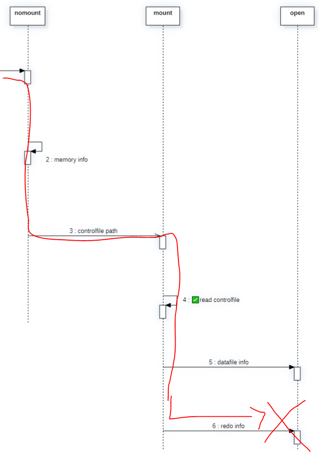

[toc]

# Redolog

## case

### 1. normal member 삭제

각 그룹에 두개 이상의 member가 있는 상태에서 member하나에 손상 발생

해결. 멤버를 삭제 후 재생성(online)

```sql
[ 실습환경 구성 ]
1. 현재 리두로그 구성 확인
select a.group#
     , a.member
     , b.bytes/1024/1024 mb
     , b.sequence# "seq#"
     , b.status
     , b.archived arc
  from v$logfile a
     , v$log b
 where a.group# = b.group#
 order by 1, 2;
 
2. 멤버 추가
alter database add logfile member
			'/oracle12/app/oracle/oradata/db1/redo01_2.log' to group 1,
			'/oracle12/app/oracle/oradata/db1/redo02_2.log' to group 2,
			'/oracle12/app/oracle/oradata/db1/redo03_2.log' to group 3;
			
3. 장애 발생
inactive이면서, arc YES인 그룹 중 2번 멤버를 물리적으로 하나 삭제
(어차피 default 멤버는 삭제 불가)
rm /oracle12/app/oracle/oradata/db1/redo01_2.log

4. log switch
삭제한 멤버의 그룹이 current가 될 때까지 진행
alter system switch logfile;
=> ✨logswitch가 발생하면서 alert log에 해당 파일이 없음 기록되지만 DB운영에 문제가 없고, 장애난 group이 current가 되는것도 문제없음

-- alert
Errors in file /oracle12/app/oracle/diag/rdbms/db1/db1/trace/db1_lgwr_7484.trc:
ORA-00313: open failed for members of log group 1 of thread 1
ORA-00312: online log 1 thread 1: '/oracle12/app/oracle/oradata/db1/redo01_2.log'
ORA-27037: unable to obtain file status
Linux-x86_64 Error: 2: No such file or directory
Additional information: 7

5. 물리적으로 삭제된 멤버를 논리적으로 삭제하여 복구
alter database drop logfile member '/oracle12/app/oracle/oradata/db1/redo01_2.log';

-- alert
ORA-01609: log 1 is the current log for thread 1 - cannot drop members
ORA-00312: online log 1 thread 1: '/oracle12/app/oracle/oradata/db1/redo01.log'
ORA-00312: online log 1 thread 1: '/oracle12/app/oracle/oradata/db1/redo01_2.log'

=> current 상태인 그룹의 멤버를 삭제하는 것은 불가능
		=> logswitch 후, 삭제 재시도
		
6. 물리적, 논리적으로 삭제된 멤버를 다시 복구
alter database add logfile member '/oracle12/app/oracle/oradata/db1/redo01_2.log' to group 1;
```

### 2. default member 삭제

> 버전에 따라 default member 삭제가 불가능할 수도 있지만,
> 현재 실습하는 환경에서는 정상적으로 수행되어 default 멤버와 not default 멤버가 물리적으로 삭제된 케이스는 동일하게 해결하면 됨.

```sql
[ 실습환경 구성 ]
1. 현재 리두로그 구성 확인
select a.group#
     , a.member
     , b.bytes/1024/1024 mb
     , b.sequence# "seq#"
     , b.status
     , b.archived arc
  from v$logfile a
     , v$log b
 where a.group# = b.group#
 order by 1, 2;
 
2. 멤버 추가
alter database add logfile member
			'/oracle12/app/oracle/oradata/db1/redo01_2.log' to group 1,
			'/oracle12/app/oracle/oradata/db1/redo02_2.log' to group 2,
			'/oracle12/app/oracle/oradata/db1/redo03_2.log' to group 3;
			
3. 장애 발생
inactive이면서, arc YES인 그룹 중 1번 멤버를 물리적으로 하나 삭제
(어차피 default 멤버는 삭제 불가)
rm /oracle12/app/oracle/oradata/db1/redo01.log

4. log switch
삭제한 멤버의 그룹이 current가 될 때까지 진행
alter system switch logfile;
=> ✨logswitch가 발생하면서 alert log에 해당 파일이 없음 기록되지만 DB운영에 문제가 없고, 장애난 group이 current가 되는것도 문제없음

5. 물리적으로 삭제된 멤버를 논리적으로 삭제 시도
alter database drop logfile member '/oracle12/app/oracle/oradata/db1/redo01.log';

log 1 is the current log for thread 1 - cannot drop members
ORA-00312: online log 1 thread 1: '/oracle12/app/oracle/oradata/db1/redo01.log'
ORA-00312: online log 1 thread 1: '/oracle12/app/oracle/oradata/db1/redo01_2.log'

=> current 상태인 그룹의 멤버를 삭제하는 것은 불가능하고, default member 삭제도 불가능 ?
		=> logswitch 후, 삭제 재시도
```

### 3. current가 아닌 그룹이 삭제된 후, DB 종료된 경우(DB가 정상 open 되지 않는 현상)


```sql
[ 실습환경 구성 ]
1. 현재 리두로그 구성 확인
select a.group#
     , a.member
     , b.bytes/1024/1024 mb
     , b.sequence# "seq#"
     , b.status
     , b.archived arc
  from v$logfile a
     , v$log b
 where a.group# = b.group#
 order by 1, 2;
 
 alter system checkpoint; -- active상태를 inactive 상태로 만들기 위해 강제 체크포인트 발생
 
2. 그룹을 구성하는 로그파일 물리적 삭제
(current가 아니면서 archive 완료된 그룹)
rm /oracle12/app/oracle/oradata/db1/redo01*

3. DB shutdown immediate
SQL> shutdown immediate;

=>
		이미 checkpoint가 완료된 그룹의 물리적 손상은 global checkpoint에 방해가 되지 않으므로 immediate 종료 가능
		(이미 archive로 내려졌으므로)
		
4. startup
mount까지는 되고, redo info의 에러로 인해 강제 close
(closed => nomount => mount => closed)
하기 이미지 참고

Database mounted.
ORA-03113: end-of-file on communication channel => 강제 종료(closed 상태)
Process ID: 12993
Session ID: 1 Serial number: 14952

```



```sql
위에서의 startup을 통해 
mount 과정 이후에서 강제 종료된 사실을 알게되었으므로

startup mount 후, 
datafile info와 redo info등을 조회하여 비교해본다.

--- ✴ 참고 
** 문제점 파악 방법
1. alert log
	2023-07-21T11:49:48.433413+09:00
  Errors in file /oracle12/app/oracle/diag/rdbms/db1/db1/trace/db1_lgwr_13394.trc:
  ORA-00313: open failed for members of log group 1 of thread 1
  ORA-00312: online log 1 thread 1: '/oracle12/app/oracle/oradata/db1/redo01_2.log'
  ORA-27037: unable to obtain file status
  Linux-x86_64 Error: 2: No such file or directory
  Additional information: 7
  2023-07-21T11:49:48.433525+09:00
  Errors in file /oracle12/app/oracle/diag/rdbms/db1/db1/trace/db1_lgwr_13394.trc:
  ORA-00313: open failed for members of log group 1 of thread 1
  ORA-00312: online log 1 thread 1: '/oracle12/app/oracle/oradata/db1/redo01_2.log'
  ORA-27037: unable to obtain file status
  Linux-x86_64 Error: 2: No such file or directory
2. 진행상황별 대상 확인
	- mount
		- datafile
			TODO:
		- redo
			SQL> col member format a30;
			SQL> select * from v$logfile;
---

5. 문제 확인
SQL> startup mount;
SQL> col group# format 9999999
SQL> col member format a50
SQL> select group#, member from v$logfile;

  GROUP# MEMBER
-------- --------------------------------------------------
       1 /oracle12/app/oracle/oradata/db1/redo01.log
       3 /oracle12/app/oracle/oradata/db1/redo03.log
       2 /oracle12/app/oracle/oradata/db1/redo02.log
       1 /oracle12/app/oracle/oradata/db1/redo01_2.log
       2 /oracle12/app/oracle/oradata/db1/redo02_2.log
       3 /oracle12/app/oracle/oradata/db1/redo03_2.log
       
       
6. 삭제된 그룹이 INACTIVE이면서 ARC여부가 YES 확인되었다면
=> 그룹 재생성
	만약 INACTIVE가 아니거나 ARC여부가 YES가 아니라면 그건 다음 내용

7. 그룹 삭제 및 추가
```

