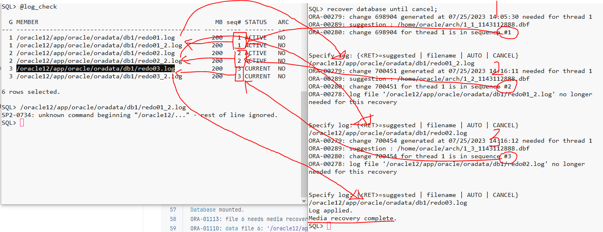

# When noarchive log mode

> offline full bakcup이 선행되어있어야만 가능

## Setting

### 1. archive log mode to noarchive log mode

```sql
startup mount;
alter database noarchivelog;
alter database open;
archive log list;
```

```sql
SQL> startup mount
Database mounted.
SQL> alter database noarchivelog;
Database altered.
SQL> alter database open;
Database altered.
SQL> archive log list;
Database log mode              No Archive Mode
Automatic archival             Disabled
```

---

### 2. offline full backup

```sql
SQL> !mkdir /oracle12/backup
SQL> alter database backup controlfile to trace as '/oracle12/backup/control.sql';
vi /oracle12/backup/control.sql
SQL> shutdown immediate;

backupdir=/opt/backup4oracle12/backup_$(date +"%Y%m%d%H%M")
echo $backupdir

mkdir -p $backupdir
cp /oracle12/backup/control.sql $backupdir
cp /oracle12/app/oracle/oradata/db1/* $backupdir
cp /oracle12/app/oracle/product/12.2.0.1/db_1/dbs/*.ora $backupdir

cd $backupdir;ll;
total 2751240
-rw-r-----. 1 oracle oinstall  10600448 Jul 20 11:46 control01.ctl
-rw-r-----. 1 oracle oinstall  10600448 Jul 20 11:46 control02.ctl
-rw-r--r--. 1 oracle oinstall      1010 Jul 20 11:46 initdb1.ora
-rw-r--r--. 1 oracle oinstall      3079 Jul 20 11:46 init.ora
-rw-r-----. 1 oracle oinstall 209715712 Jul 20 11:46 redo01.log
-rw-r-----. 1 oracle oinstall 209715712 Jul 20 11:46 redo02.log
-rw-r-----. 1 oracle oinstall 209715712 Jul 20 11:46 redo03.log
-rw-r-----. 1 oracle oinstall      3584 Jul 20 11:46 spfiledb1.ora
-rw-r-----. 1 oracle oinstall 576724992 Jul 20 11:46 sysaux01.dbf
-rw-r-----. 1 oracle oinstall 734011392 Jul 20 11:46 system01.dbf
-rw-r-----. 1 oracle oinstall  20979712 Jul 20 11:46 temp01.dbf
-rw-r-----. 1 oracle oinstall 351281152 Jul 20 11:46 undotbs01.dbf
-rw-r-----. 1 oracle oinstall   5251072 Jul 20 11:46 users01.dbf

df


```

## Cases

|   no | noarchive log mode | Damage information | recently Redolog(SCN) | trouble shooting                                   |
| ---: | ------------------ | ------------------ | --------------------- | -------------------------------------------------- |
|    1 | Yes                | normal tablespace  | Yes                   | complete recovery                                  |
|    2 | Yes                | normal tablespace  | No                    | drop✅<br />incomplete recovery => hidden parameter |
|    3 | Yes                | system tablespace  | No                    | full restore recovery                              |

### 1. 일반 tablespace의 datafile 손상(when noarchivelogmode)

```sql
1. tablespace 확인
select *
  from dba_tablespaces;
  
2. 일반 tablespace 생성
select * from dba_data_files;
create tablespace test1
   			 datafile '/oracle12/app/oracle/oradata/db1/test1.dbf' size 10m;
Tablespace created.
3. offline backup
backupdir=/opt/backup4oracle12/backup_202307251405

4. 데이터 생성
alter user scott quota unlimited on test1;
create table scott.noarch_test1(no number) tablespace test1;
insert into scott.noarch_test1 values(1);
insert into scott.noarch_test1 values(2);
insert into scott.noarch_test1 values(3);
commit;

5. 장애 상황 발생
!rm /oracle12/app/oracle/oradata/db1/test1.dbf

6. switch log
alter system switch logfile; -- min 3

7. DB hang
2023-07-25T14:16:15.314501+09:00
USER (ospid: 32269): terminating the instance due to error 1242
=> db 강제 종료
	 연속적인 log switch가 발생하여 current redo log로 다시 로깅을 시도하는 순간
	 해당 SCN정보를 아직 동기화하지 못했으므로 덮어쓸 수 없어서 DB Hang -> shutdown abort
	 
-- recovery --
1. startup 시도
SQL> startup
ORACLE instance started.

Total System Global Area 1660944384 bytes
Fixed Size                  8621376 bytes
Variable Size            1056965312 bytes
Database Buffers          587202560 bytes
Redo Buffers                8155136 bytes
Database mounted.
ORA-01157: cannot identify/lock data file 6 - see DBWR trace file
ORA-01110: data file 6: '/oracle12/app/oracle/oradata/db1/test1.dbf'

2. shutdown
SQL> shutdown immediate

3. recovery
3-1) restore(test1.dbf)
	cp $backupdir/test1.dbf /oracle12/app/oracle/oradata/db1/test1.dbf
	
3-2) startup
SQL> startup
ORACLE instance started.
Database mounted.
ORA-01113: file 6 needs media recovery
ORA-01110: data file 6: '/oracle12/app/oracle/oradata/db1/test1.dbf'

3-3) recover
SQL> recover database until cancel;
ORA-00279: change 698904 generated at 07/25/2023 14:05:30 needed for thread 1
ORA-00289: suggestion : /home/oracle/arch/1_1_1143112888.dbf
ORA-00280: change 698904 for thread 1 is in sequence #11️⃣💥


Specify log: {<RET>=suggested | filename | AUTO | CANCEL}
/oracle12/app/oracle/oradata/db1/redo01_2.log1️⃣💊
ORA-00279: change 700451 generated at 07/25/2023 14:16:11 needed for thread 1
ORA-00289: suggestion : /home/oracle/arch/1_2_1143112888.dbf
ORA-00280: change 700451 for thread 1 is in sequence #22️⃣💥
ORA-00278: log file '/oracle12/app/oracle/oradata/db1/redo01_2.log' no longer
needed for this recovery


Specify log: {<RET>=suggested | filename | AUTO | CANCEL}
/oracle12/app/oracle/oradata/db1/redo02.log2️⃣💊
ORA-00279: change 700454 generated at 07/25/2023 14:16:12 needed for thread 1
ORA-00289: suggestion : /home/oracle/arch/1_3_1143112888.dbf
ORA-00280: change 700454 for thread 1 is in sequence #33️⃣💥
ORA-00278: log file '/oracle12/app/oracle/oradata/db1/redo02.log' no longer
needed for this recovery


Specify log: {<RET>=suggested | filename | AUTO | CANCEL}
/oracle12/app/oracle/oradata/db1/redo03.log3️⃣💊
Log applied.
Media recovery complete.✅

3-4) open
-- 불완전 복구시, 가급적 resetlogs로 open 시도권장✅
SQL> alter database open resetlogs;

3-5) test
SQL> select * from scott.noarch_test1;

        NO
----------
         1
         2
         3

=> 이런 케이스는 이론적으로 가능할 정도의 행복케이스임.
	 noarchivelogmode를 해놓은 site인데, 항상 최신의 offline 백업본이 있을리도 없거니와
	 offline -> online하면서 새로들어오는 DML에 대해 대응이 불가능할 것.
	 이론적으로는 완전복구이지만 서비스관점에서는 무중단 서비스가 깨짐으로 손실발생
```



### 2. 일반 tablespace의 datafile 손상, 최신 SCN이 redofile에 존재하지 않는 경우(when noarchivelogmode)

> 빠르게 손절해서 해당 tablespace를 버리고, open을 시키거나
> 될지 안될지 미지수임에도 챙겨야하는 데이터일 경우에만 recovery 시도(실패할 경우, 결국 버리고 가는것과 동일)

```sql
1. users tablespace에 데이터 생성
create table scott.noarch_recover2(no number) tablespace users;
insert into scott.noarch_recover2 values(1);
insert into scott.noarch_recover2 values(2);
insert into scott.noarch_recover2 values(3);
commit;

2. switch log
alter system switch logfile; -- 4

3. test1 tablespace에 데이터 생성
create table scott.noarch_recover3(no number) tablespace test1;
insert into scott.noarch_recover3 values (1);
commit;
alter system switch logfile; -- 4
insert into scott.noarch_recover2 values(2);
commit;

4. 장애 발생
!rm /oracle12/app/oracle/oradata/db1/test1.dbf
shutdown abort

-- 복구 --
1. try startup
SQL> startup
Database mounted.
ORA-01157: cannot identify/lock data file 6 - see DBWR trace file
ORA-01110: data file 6: '/oracle12/app/oracle/oradata/db1/test1.dbf'

2. restore(test1.dbf)
	cp $backupdir/test1.dbf /oracle12/app/oracle/oradata/db1/test1.dbf
	
3) try startup
SQL> startup
Database mounted.
ORA-01190: control file or data file 6 is from before the last RESETLOGS
ORA-01110: data file 6: '/oracle12/app/oracle/oradata/db1/test1.dbf'

4) try recover
recover database until cancel;💥

5) 재판단
1. datafile drop offline(빠른손절)
	- 문제 발생 직후, recovery를 시도하지 않고, 선드랍했어도 무방
2. time recovery

5-1) drop normal tablespace
=> but, 이미 recover를 시도했으므로 시점차이 발생
SQL> alter database datafile '/oracle12/app/oracle/oradata/db1/test1.dbf' offline drop;
Database altered.
SQL> alter database open noresetlogs;
alter database open resetlogs
*
ERROR at line 1:
ORA-01190: control file or data file 1 is from before the last RESETLOGS
ORA-01110: data file 1: '/oracle12/app/oracle/oradata/db1/system01.dbf'

---☠️☠️☠️☠️☠️
👻 hidden parameter를 통해 시점의 갭을 jump하기
> pfile에 파라미터 추가하여 기동시도

1. add parameter
vi initdb1.ora

...
_allow_resetlogs_corruption=true

:wq

2. remove spfile
rm spfiledb1.ora

3. try open
SQL> startup
ORACLE instance started.
Database mounted.
ORA-01589: must use RESETLOGS or NORESETLOGS option for database open

SQL> alter database open resetlogs;
alter database open resetlogs
*
ERROR at line 1:
ORA-00603: ORACLE server session terminated by fatal error
ORA-01092: ORACLE instance terminated. Disconnection forced
ORA-00704: bootstrap process failure
ORA-00704: bootstrap process failure
ORA-00600: internal error code, arguments: [kcbzib_kcrsds_1], [], [], [], [],
[], [], [], [], [], [], []
Process ID: 5732
Session ID: 1 Serial number: 36579

4. remove parameter
vi initdb1.ora
~~_allow_resetlogs_corruption=true~~

5. try open
SQL> startup
ORACLE instance started.
Database mounted.
Database opened.
SQL> @status

INSTANCE_NAME    STATUS
---------------- ------------
db1              OPEN
```

### 3. system tablespace의 손상

```sql
create table scott.noarch_recover4(no number) tablespace system;
insert into scott.noarch_recover4 values(1);
insert into scott.noarch_recover4 values(2);
commit;
alter system switch logfile; -- 4번
insert into scott.noarch_recover4 values(3);
commit;
alter system switch logfile; -- 4번

!rm /oracle12/app/oracle/oradata/db1/system01.dbf
shutdown abort

1. try start
ORA-01157: cannot identify/lock data file 1 - see DBWR trace file
ORA-01110: data file 1: '/oracle12/app/oracle/oradata/db1/system01.dbf'
2. unavailable offline drop...
3. full backup
SQL> shutdown immediate;
offline full restore✅
```

