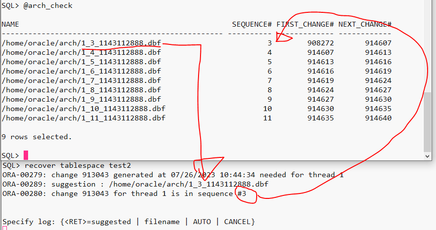
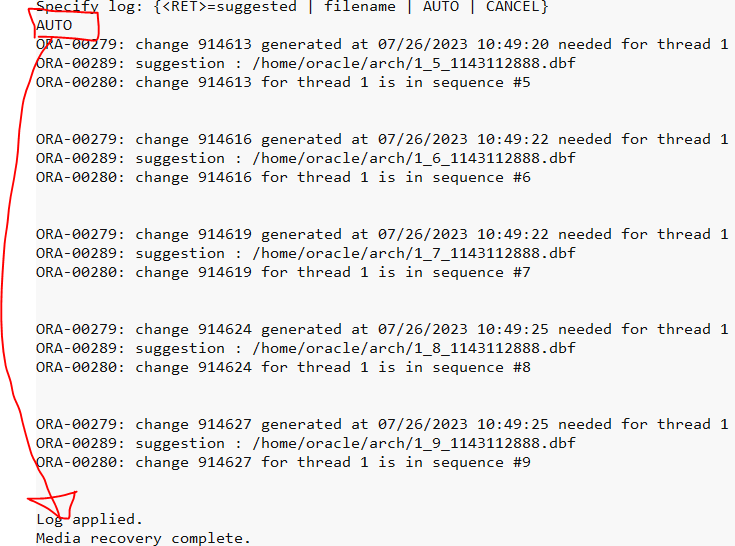

[toc]

# When archive log mode

> archive log mode 선행

## Setting

### 1. noarchive log mode to archive log mode

```sql
startup mount;
alter database archivelog;
alter database open;
archive log list
```

### 2. 불필요한 테이블스페이스 정리 및 새로운 테이블스페이스 생성

```sql
select * from dba_tablespaces;
select * from dba_data_files;

drop tablespace test1;
drop tablespace test1 including contents;

create tablespace test2
         datafile '/oracle12/app/oracle/oradata/db1/test2_01.dbf' size 10m;
```

### 3. offline full bakcup

### ---

## Cases

|   no | archive log mode | Damage information | recently Redolog(SCN) | available offline | trouble shooting   |
| ---: | ---------------- | ------------------ | --------------------- | ----------------- | ------------------ |
|    1 | Yes              | normal tablespace  |                       | No                | recover tablespace |
|    2 | Yes              | normal tablespace  |                       | Yes               |                    |

### 1. 일반 tablespace의 datafile 손상(when archivelogmode)

```sql
0. 상황 제작
create table arch_test1(no number) tablespace test2;

insert into arch_test1 values(1);
commit;

alter system switch logfile;		-- 4번

insert into arch_test1 values(2);
commit;

alter system switch logfile;		-- 4번

insert into arch_test1 values(3);
commit;

alter system switch logfile;

💥
!rm '/oracle12/app/oracle/oradata/db1/test2_01.dbf'

✅ 복구 수행
1. 해당 tablespace offline 시도
SQL> alter tablespace test2 offline;💥
alter tablespace test2 offline
*
ERROR at line 1:
ORA-01116: error in opening database file 6
ORA-01110: data file 6: '/oracle12/app/oracle/oradata/db1/test2_01.dbf'
ORA-27041: unable to open file
Linux-x86_64 Error: 2: No such file or directory
Additional information: 3

=> dirty buffer에 대한 checkpoint가 발생할 경우, offline 불가할 수 있음
offline이 안되는 경우, DB가 내려간 상태에서 복구
(운영중일 경우, DB를 그대로 두고 copyDB를 통해 진행하지만, 여아직 그렇게까지는 하지않기로!!)

2. shutdown immediate
SQL> shutdown immediate💥
ORA-01116: error in opening database file 6
ORA-01110: data file 6: '/oracle12/app/oracle/oradata/db1/test2_01.dbf'
ORA-27041: unable to open file
Linux-x86_64 Error: 2: No such file or directory
Additional information: 3

3. physical restore
cd /oracle12/app/oracle/oradata/db1
cp /opt/backup4oracle12/backup_202307261044/test2_01.dbf ./

4. shutdown abort

5. try startup mount
SQL> startup mount;

5. try complete recovery(only tablespace) ✅
SQL> @arch_check
SQL> recover tablespace test2;
```

**복구시 seq정보와 scn 정보를 확인하여 suggestion archive file과 실제 archive file이 일치하는지 확인하여**
**진행하도록한다.**

**예시 이미지**





```sql
6. try open
alter database open;
```

### 2. 

```sql
0. 상황 제작
create table arch_test2(no number) tablespace test2;

insert into arch_test2 values(1);
commit;

alter system switch logfile;		-- 4번

insert into arch_test2 values(2);
commit;

alter system switch logfile;		-- 4번

insert into arch_test2 values(3);
commit;

alter system checkpoint;

alter system switch logfile;

💥
!rm '/oracle12/app/oracle/oradata/db1/test2_01.dbf'

✅ 복구 수행
1. 해당 tablespace offline 시도
SQL> alter tablespace test2 offline;
alter tablespace test2 offline

2. physical restore
cd /oracle12/app/oracle/oradata/db1
cp /opt/backup4oracle12/backup_202307261044/test2_01.dbf ./

3. complete recovery(only tablespace) ✅
SQL> @arch_check
SQL> recover tablespace test2;
...
Media recovery complete.

4. 해당 tablespace online 시도
SQL> alter tablespace test2 online;
Tablespace altered.

SQL> select tablespace_name, status from dba_tablespaces;

5. tablespace 상태조회
TABLESPACE_NAME                STATUS
------------------------------ ---------
SYSTEM                         ONLINE
SYSAUX                         ONLINE
UNDOTBS1                       ONLINE
TEMP                           ONLINE
USERS                          ONLINE
TEST2                          ONLINE

```

