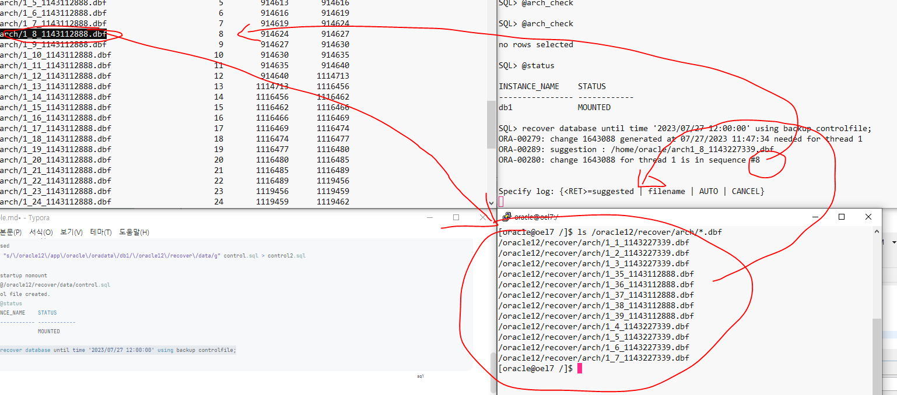
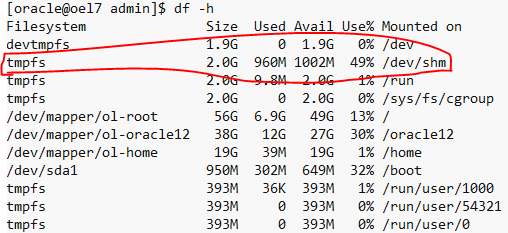

운영 중인 DB에 truncate table 논리적 장애 발생

copy DB에서 데이터복구 후, 운영 DB로 데이터 이관(db link)


```sql
1. backup확인

2. 장애 발생
select sysdate from dual;
truncate table scott.emp;

select * from scott.emp;

---
복구
1. 마지막 백업시점 확인
202307271153
2. 복구시점 확인
202307271200
3. 필요한 아카이브 확인
alter system switch logfile;

-- archive 목록 확인
select name,
       round((blocks*block_size)/1024/1024, 2) "SIZE(MB)",
     completion_time
  from v$archived_log
 where 1=1
   and completion_time between to_date('2023/07/27 11:50:00', 'YYYY/MM/DD HH24:MI:SS') 
   and to_date('2023/07/27 12:20:00', 'YYYY/MM/DD HH24:MI:SS')
   and name not like '%worm%'
 order by completion_time desc;  
|NAME                                 |SIZE(MB)|COMPLETION_TIME        |
|-------------------------------------|--------|-----------------------|
|/home/oracle/arch/1_9_1143227339.dbf |0       |2023-07-27 12:17:08.000|
|/home/oracle/arch/1_10_1143227339.dbf|0       |2023-07-27 12:17:08.000|
|/home/oracle/arch/1_8_1143227339.dbf |11.08   |2023-07-27 12:17:06.000|

-- archive 총 사이즈
select sum(round((blocks*block_size)/1024/1024/1024, 2)) as "TOTAL(GB)"
  from v$archived_log
 where 1=1
   and completion_time between to_date('2023/07/27 11:50:00', 'YYYY/MM/DD HH24:MI:SS') 
   and to_date('2023/07/27 12:20:00', 'YYYY/MM/DD HH24:MI:SS')
   and name not like '%worm%'
 order by completion_time desc;
|TOTAL(GB)|
|---------|
|0.01     |
 
💙 IS BLUE SERVER 
💚 IS GREEN SERVER

💚
whoru # i am green
mkdir -p /oracle12/recover/data
mkdir -p /oracle12/recover/arch
💙
whoru # i am blue
SQL> archive log list
cd /home/oracle/arch/
ll
find . -maxdepth 1 -name "*.dbf" -type f -mtime +1 -exec rm {} \; # 2일이 지난 목록 제거

-- archive
cd /home/oracle/arch/
scp *.dbf oracle@172.16.192.131:/oracle12/recover/arch

cd /opt/backup4oracle12/backup_202307271153
-- *.dbf
scp *.dbf oracle@172.16.192.131:/oracle12/recover/data
-- control.sql
scp control.sql oracle@172.16.192.131:/oracle12/recover/data
-- init*.ora
scp initdb1.ora oracle@172.16.192.131:/oracle12/recover/data

💚
ls -al /oracle12/recover/data
ls -al /oracle12/recover/arch

echo $ORACLE_SID
export ORACLE_SID=db1
cp /oracle12/recover/data/initdb1.ora $ORACLE_HOME/dbs

cd $ORACLE_HOME/dbs
rm spfile*.ora

vi initdb1.ora
*.control_files='/oracle12/recover/data/control.ctl'
:wq

vi /oracle12/recover/data/control.sql
1. KEEP RESETLOGS ARCHIVELOG
2. KEEP LOGFILE 2 GROUP, 1 MEMBER
3. REPLACE PATH
	1. in vi
	%s/\/oracle12\/app\/oracle\/oradata\/db1/\/oracle12\/recover\/data/
	2. sed
	sed "s/\/oracle12\/app\/oracle\/oradata\/db1/\/oracle12\/recover\/data/g" control.sql > control2.sql
		
SQL> startup nomount
SQL> @/oracle12/recover/data/control.sql
Control file created.
SQL> @status
INSTANCE_NAME    STATUS
---------------- ------------
db1              MOUNTED

SQL> recover database until time '2023/07/27 12:00:00' using backup controlfile;
SQL> alter database open resetlogs;
SQL> @status
INSTANCE_NAME    STATUS
---------------- ------------
db1              OPEN

💙 data migration
1. update tnsnames.ora
vi /${ORACLE_HOME}/network/admin/tnsnames.ora

2. create db link
create public database link GREEN
connect to system identified by oracle using 'GREEN_DB1';

3. dblink test
select * from scott.dept@green;
select * from scott.emp@green;

4. itas
insert into scott.dept select * from scott.dept@green;
insert into scott.emp select * from scott.emp@green;

5. complete
select * from scott.emp;
select * from scott.dept;
```



### 💊 만약 메모리로 인해 cloneDB가 올라오지 않는다면 (ORA-00845)?

원인 memory

해결



### control.sql asis:tobe

asis

```sql
CREATE CONTROLFILE REUSE DATABASE "DB1" RESETLOGS  ARCHIVELOG
	...
LOGFILE
  GROUP 1 (
    '/oracle12/app/oracle/oradata/db1/redo01.log',
    '/oracle12/app/oracle/oradata/db1/redo01_2.log'
  ) SIZE 200M BLOCKSIZE 512,
  GROUP 2 (
    '/oracle12/app/oracle/oradata/db1/redo02.log',
    '/oracle12/app/oracle/oradata/db1/redo02_2.log'
  ) SIZE 200M BLOCKSIZE 512,
  GROUP 3 (
    '/oracle12/app/oracle/oradata/db1/redo03.log',
    '/oracle12/app/oracle/oradata/db1/redo03_2.log'
  ) SIZE 200M BLOCKSIZE 512
-- STANDBY LOGFILE
DATAFILE
  '/oracle12/app/oracle/oradata/db1/system01.dbf',
  ...
CHARACTER SET AL32UTF8
;
```

tobe

```sql
CREATE CONTROLFILE REUSE DATABASE "DB1" RESETLOGS  ARCHIVELOG
	...
LOGFILE
  GROUP 1 (
    '/oracle12/recover/data/redo01.log'
  ) SIZE 200M BLOCKSIZE 512,
  GROUP 2 (
    '/oracle12/recover/data/redo02.log'
  ) SIZE 200M BLOCKSIZE 512
-- STANDBY LOGFILE
DATAFILE
  '/oracle12/recover/data/system01.dbf',
  '/oracle12/recover/data/sysaux01.dbf',
  '/oracle12/recover/data/undotbs01.dbf',
  '/oracle12/recover/data/users01.dbf',
  '/oracle12/recover/data/users02.dbf',
  '/oracle12/recover/data/test2_01.dbf'
CHARACTER SET AL32UTF8
;
```

