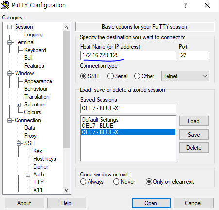
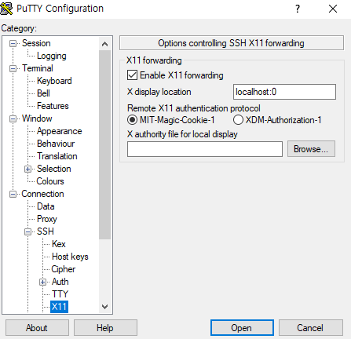
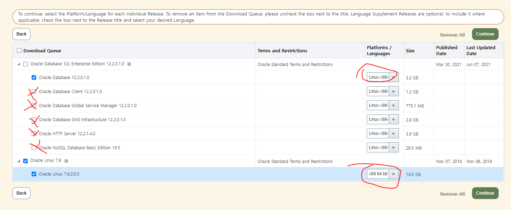
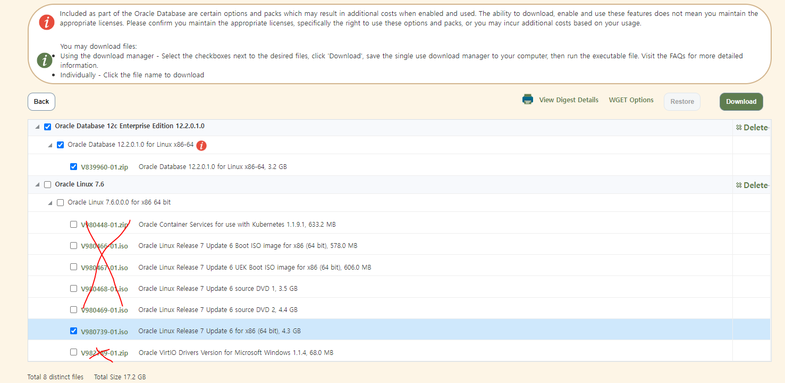
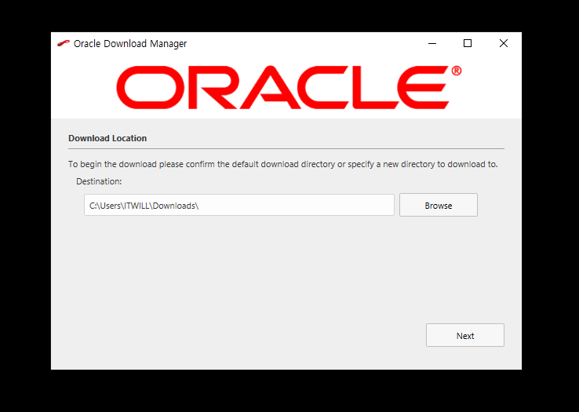
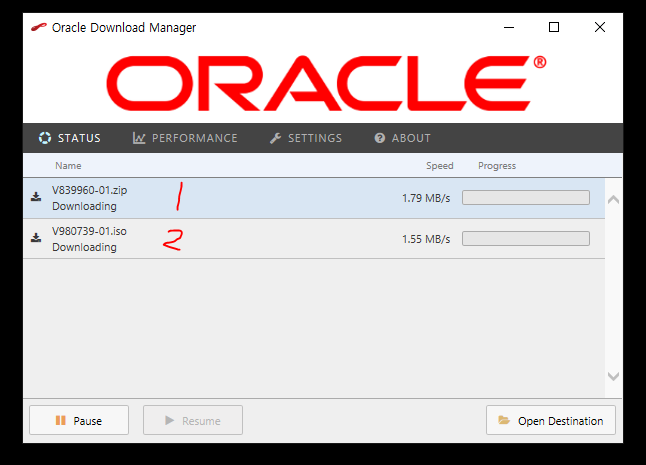
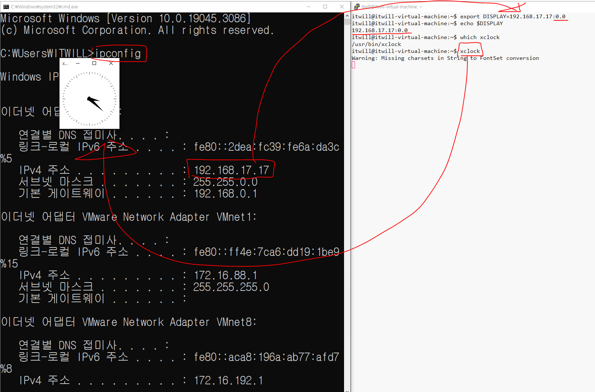

[toc]

## set up Oracle Enterprise Linux & Oracle


## compatibility

> Linux and Oracle

1) CentOS + Oracle
2) OEL(7,8,9) + ORACLE(~~11g~~, 12c, 19c, 21c)
3) OEL(7) + RAC(12C)

### if Oracle Enterprise Linux : Oracle

| Oracle Version | Oracle Enterprise Linux Version |
| -------------- | ------------------------------- |
| ~~11g~~        | **7**, 8, 9                     |
| 12c            | **7**, 8, 9                     |
| 19c            | 7, **8**, **9**                 |
| 21c            | 7, **8**, **9**                 |

## Download Product

1. **[oracle](edelivery.oracle.com)**
2. sign in
3. add to cart product
   1. **Oracle Linux 7.6 ( Oracle Linux )**
   2. **Oralce Database 12c Enterprise Edition 12.2.0.1.0 ( Oracle Database Enterprise Edition )**
4. checkout
   1. **Oracle Database 12.2.0.1.0**
      1. Platform: Linux x86
   2. **Oracle Linux 7.6.0.0.0**
      1. Platform: x86 64 bit
5. install download manager
6. run download manager
7. next

## Download Cygwin

https://x.cygwin.com/docs/ug/setup.html

https://blog.naver.com/xenos/20015008684

1. [download xming](https://sourceforge.net/projects/xming/)

2. execute XLanuch(keey default)

3. open putty

   1. load connection info

   2. setting x11 display

      1. Category: Connection - SSH - X11
      2. Enable X11 forwarding ✅
      3. X display location: `localhost: 0`
      4. MIT-Magic-Cookie-1 ✅

      

      
      

4. login

5. xclock

6. ✅

## ~~Download Xmanager~~

> Oracle 설치를 GUI가 지원되지 않는 환경(linux, unix)에서 설치시
> 설치화면을 윈도우 환경에 가시적으로 진행하기 위한 유틸성 프로그램
>
> 라이센스가 없거나 평가판이 종료되었을 경우

1. [Netsarang](https://www.netsarang.com/ko/xmanager-download/)

2. install xmanager

3. run xmanager passive

4. get ip
   ```shell
   ipconfig
   ipconfig | findstr "IPv4 주소"
   
   or
   
   ipconfig | cat -n | head -9 | tail -1 | awk -F: '{print $NF}' | awk -F" " '{print $NF}'
   ```
   
5. install xclock

   1. ```shell
      su - root
      yum install -y xorg-x11-apps
      ```

6. enter linux

   1. set server DISPLAY and test

      ```shell
      export DISPLAY=${YOUR_ID}:0.0
      xclock
      ```

---

# ref capture

1. 
   





**window | linux GUI**

