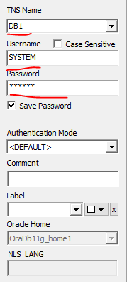
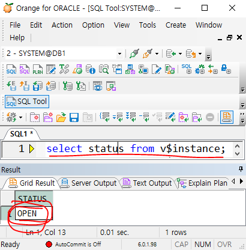
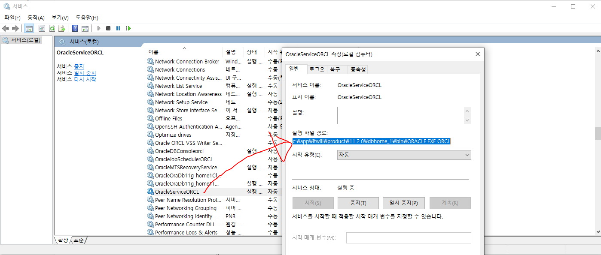
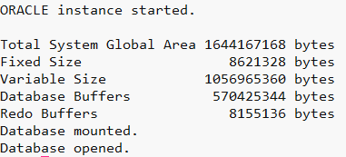

[toc]

> Oracle DBMS 설치가 완료되었을 경우,

# Check status

- **check listener process** ( [^check process])
  
- **check DBMS process**
  
  - **Server**
  
    - execute sqlplus [^sqlplus]
      
    - sql [^check status]
    
  - **Client**
  
    - ping test [^ping]
      
    - connect test(ex: orange, toad)
      
  
      
  
- **Oracle Essential Processes** [^check pmon]

# ORACLE 접속관리

### 접속 과정

> oracle 설치 후, 최초 접속 시도할 경우 시스템의 계정을 초기화[^잠금 해제 및 비번 변경]해주어야함.

1. client 접속 시도

   > ${ORACLE_HOME}/network/admin/tnsnames.ora 파일에 target DB 정보 저장

   - 위치 확인 방법
     - window
       - SYSTEM 환경변수 PATH 확인
         `ORACLE_HOME`
       - 서비스 정보 확인(bin의 상위)
         

2. 리스너 접속 허가

   > 예전에는 sqlnet.ora 파일에 whitelist, blacklist를 확인하여 관리했으나
   > 데이터베이스 접근 통제를 기타 보안툴을 사용하여 관리

   1. 리스너 정상 서비스 여부 확인 [^check process] [^check listener]

   2. 필요시 sqlnet.ora 파일 확인
      1. 접속 허가 IP 목록 관리
         (데이터베이스 접근 통제를 기타 보안툴을 사용하여 관리)

      2. 접속 허가 DBMS 버전 관리

3. 서버프로세스 할당

   > 전용모드 vs 공유모드에 따라 추가 할당 여부 다름

### TNS 통신에 필요한 여러 파일

```shell
su - oracle
cd $ORACLE_HOME/network/admin
pwd # /oracle12/app/oracle/product/12.2.0.1/db_1/network/admin
ls -al
```

1. `sqlnet.ora`
   - (과거) 접속 IP 허가 목록을 관리하는 파일
2. `listener.ora`
   - 리스너 설정과 관련된 파일(server IP가 listener.ora 파일에 설정된 IP와 일치해야함, 만약 hostname일 경우, /etc/hosts 파일에 기록된 정보와 동일해야함.)
3. `tnsnames.ora`
   - 다른 DBMS에 접속할 때 필요한 접속정보 기록

---

### DBMS 기동과 중지

- 리눅스/유닉스 서버 중단되면 기본적으로 DBMS는 자동으로 shutdown
- 따라서 리눅스/유닉스 서버를 다시 기동할 경우 DBMS를 수동으로 startup 시켜야함
- 자동으로 dbms를 startup을 시킬 수 있는 환경설정 가능

#### 기동 [^oracle start up flow]

```shell
# A session
tail -f alert${SID}.log

# B session
sqlplus system/oracle as sysdba # or sqlplus / as sysdba
SQL> startup		-- orange에서 수행 불가 명령어
```

#### 중지 [^oracle shut down flow]

```shell
sqlplus system/oracle as sysdba # or sqlplus / as sysdba
SQL> shutdown immediate; -- orange에서 수행 불가 명령어
```

### 리스너 기동 및 중지

>  listener ? [^listener]
>
>  - 리스너 프로세스 확인 [^check process]
>  - 리스너 확인 [^check listener]
>    1.  The listener supports no services: 아직 서비스가 원활하지 않은 상태(DB와의 connection 중)
>    1.  Services Summary...: 리스너 정상 서비스 제공 중
>    1.  no listener: 리스너 중지상태

#### 기동

```shell
lsnrctl start
```

#### 중지

```shell
lsnrctl stop
```

# Trouble shooting

### Check network (firewall)

- enable telnet client

- ```cmd
  telnet [server host] [server port]
  ```

### tnsnames.ora

- 잘못된 DB 접속정보(tnsnames.ora)
  - host 확인
  - port 확인
  - mode 확인(`DEDICATED` || `SHARED`)
  - sid 확인

### Target DB Status

- 서버 접속

- sysdba로 dbms 접속
  ```shell
  sqlplus / as sysdba
  # sqlplus system/oracle as sysdba
  ```
  
- 상태 확인 쿼리
  ```sql
  select instance_name, status from v$instance;
  ```

### ORA-28040: No matching authentication protocol

> ORA-28040: No matching authentication protocol
>
> client 버전이 server 버전이 낮아서 발생하는 현상이므로
> server쪽의 sqlnet.ora 파일에 최소 허용 버전 명시

```shell
cd $ORACLE_HOME/network/admin/
pwd

vi sqlnet.ora
```

```shell
# template
SQLNET.ALLOWED_LOGON_VERSION_SERVER=${VERSION}
SQLNET.ALLOWED_LOGON_VERSION_CLIENT=${VERSION}

# apply
SQLNET.ALLOWED_LOGON_VERSION_SERVER=11
SQLNET.ALLOWED_LOGON_VERSION_CLIENT=11
```

### ORA-01017: Invalid username/password; logon denied

> ORA-01017: Invalid username/password; logon denied

```shell
sqlplus / as sysdba
alter user system account unlock identified by oracle;
```

### ORA-12514: TNS:리스너가 현재 접속 기술자에 요청된 서비스를 알지 못함

> 리스너 프로세스가 올라오는 동안 시도할 경우 발생

---

[^check status ]:`select instance_name, status from v$instance;`
[^oracle start up flow]: closed -> no mount -> mount -> open
[^oracle shut down flow]: closed -> dismounted -> instance shutdown
[^Data Dictionary View]: DBMS가 자동으로 관리하는 뷰(시스템에 대한 전반적인 내용 보관)

> Static Dictionary View
>
> - dba_XXX: just total
> - all_XXX: Owned by me + not owned by me but accessible
> - user_XXX: Owned by me
>
> Dynamic Performance View
>
> - v$XXX

[^mount]: load memory from disk



[^listener]: DB로의 원격 접속을 통제하는 프로세스. 반드시 원활한 서비스를 위해 리스너는 정상 기동되어야함.
[^check process]: `ps -ef | grep lsnr | grep -v grep`
[^check listener]: `lsnrctl status`
[^sqlplus]: `sqlplus system/oracle as sysdba || sqlplus / as sysdba`
[^ping]: `ping ${TARGET_SERVER}`
[^check pmon]: `ps -ef | grep pmon | grep -v grep`
[^잠금 해제 및 비번 변경]: `alter user system account unlock identified by oracle;`
