[toc]

# set up OEL

> Oracle Enterprise Linux & ORACLE 12c
>
> 💊 checkpoint
>
> 1. 서버기준 유저당 하나의 데이터베이스를 설정
>    이유: 환경변수의 충돌 발생
>    해결방법: 새로운 유저에 새로운 데이터베이스를 생성
> 2. 서버기준 포트 체크
>    이유: 기존 데이터베이스가 포트를 점유하고 있어 새로운 데이터베이스 추가시 충돌발생 여지
>    해결방법: 현재 포트를 확인하여 사용가능한 포트로 생성

### in vmware
- new virtual machine for oracle database

- disk set up

### if first boot

​	select install menu for not default	

### software selection

- Server with GUI
	- Java Platform
	- compatibility Libraries
	- Development Tools

### partitioning

##### required

- boot
  - 1GB
- swap
  - min gte swap 4000MB
- /
  - remain

##### optional

- /oracle12
  - 30GB
- /home
  - 20GB

### Security Policy

- off

### Network & Host name

- ethernet enable
- change hostname

### Begin Installation

### password

- oracle

### user creation

- name: username
- pw: oracle

### ifconfig

172.16.192.129

### putty

window -> OEL7

### load Oracle Image file

win scp

```shell
# TARGET DIRECTORY
/oracle12/
```

### check and unzip target file

```shell
cd /oracle12/
ls -ld V839960-01.zip
unzip V839960-01.zip
```

### set hosts

```shell
su - root
vi /etc/hosts
172.16.192.129 oel7 # ${YOUR_IP} ${YOUR_HOST_NAME}
```

### set hostname

```shell
cat /etc/hostname # check oel7
```

if not exist

```shell
vi /etc/hostname

oel7
```

### set oracle

> oracle12c-R2

- `su - root `

- [preinstall](https://oracle-base.com/articles/12c/oracle-db-12cr2-installation-on-oracle-linux-6-and-7)

  - `yum install oracle-database-server-12cR2-preinstall -y`

    > yum 프로세스 충돌 주의(동시 진행 불가)
    > `ps -ef | grep yum | grep -v grep`
    > ps 존재할 경우, 완료될 때까지 대기
    
    - user setting
    - system control file
    - ...

- check user

  - `grep oracle /etc/passwd`

- update

  - `yum update -y`

- set oracle user password

  - `passwd oracle`
    - oracle

- set selinux

  - `vi /etc/selinux/config`
    - `SELINUX=permissive`
  - `setenforce Permissive`

- disable firewall(`when TEST`)

  - `systemctl stop firewalld`
  - `systemctl disable firewalld`

- directory and permission(partitioning)

  - ```shell
    mkdir -p /${ORACLE_PRODUCT}/app/oracle/product/12.2.0.1/db_1
    chown -R oracle:oinstall /${ORACLE_PRODUCT}
    chmod -R 775 /${ORACLE_PRODUCT}
    
    mkdir -p /oracle12/app/oracle/product/12.2.0.1/db_1
    chown -R oracle:oinstall /oracle12
    chmod -R 775 /oracle12
    ```

- modify owner and permission

  - ```shell
    cd /oracle12/
    ls -ld database
    chown -R oracle:oinstall database
    chmod -R 775 database
    ```

- check monitor 

  - ````shell
    ipconfig | findstr "IPv4 주소"
    ipconfig | cat -n | head -9 | tail -1 | awk -F: '{print $NF}' | awk -F" " '{print "DISPLAY="$NF":0.0; export DISPLAY; LANG=C; export LANG;"}'
    # DISPLAY=192.168.17.17:0.0; export DISPLAY; LANG=C; export LANG;
    ````
    
  - ```shell
    su - root
    yum install -y xorg-x11-apps
    export DISPLAY=${YOUR_ID}:0.0
    xclock
    ```
  
- as a oracle

  - ```shell
    su - oracle
    export DISPLAY=${YOUR_ID}:0.0  	# window ip
    xclock							# check monitor
    export LANG=C					# Support for Korean
    
    cd /oracle12/database
    ./runInstaller
    ```

### Installer

1. Installation Option
   - uncheck oracle support
2. Select Installation Option
     - Install database software only
3. Select Database Installation Option
     - Single instance database installation
4. Select Database Edition
     - Enterprise Edition
5. Specify Installation Location

     - Oracle base

         ```shell
         /${ORACLE PRODUCT}/app/oracle
         /oracle12/app/oracle
         ```
     - Software location
     
         ```shell
         /${ORACLE PRODUCT}/app/oracle/product/${VERSION}/${SID}
         /oracle12/app/oracle/product/12.2.0.1/db_1
         ```
6. just next
7. Install Product
  - `su - root`
  - run scripts
    - orainstRoot.sh (`/oracle12/app/oraInventory/orainstRoot.sh`)
    - root.sh (`/oracle12/app/oracle/product/12.2.0.1/db_1/root.sh`)
      - Trace File Analyzer (TFA)
        - no

### config profile

**template**

```shell
# Oracle Settings
export TMP=/tmp
export TMPDIR=\$TMP

export ORACLE_HOSTNAME=ol7-122.localdomain
export ORACLE_UNQNAME=cdb1
export ORACLE_BASE=/u01/app/oracle
export ORACLE_HOME=\$ORACLE_BASE/product/12.2.0.1/db_1
export ORACLE_SID=cdb1

export PATH=/usr/sbin:/usr/local/bin:\$PATH
export PATH=\$ORACLE_HOME/bin:\$PATH

export LD_LIBRARY_PATH=\$ORACLE_HOME/lib:/lib:/usr/lib
export CLASSPATH=\$ORACLE_HOME/jlib:\$ORACLE_HOME/rdbms/jlib
```

**change `ORACLE_HOSTNAME, ORACLE_UNQNAME, ORACLE_BASE, ORACLE_SID`**

> remove backslash(\\)

```shell
# Oracle Settings
export TMP=/tmp
export TMPDIR=$TMP

export ORACLE_HOSTNAME=oel7
export ORACLE_UNQNAME=db1
export ORACLE_BASE=/oracle12/app/oracle
export ORACLE_HOME=$ORACLE_BASE/product/12.2.0.1/db_1
export ORACLE_SID=db1

export PATH=/usr/sbin:/usr/local/bin:$PATH
export PATH=$ORACLE_HOME/bin:$PATH

export LD_LIBRARY_PATH=$ORACLE_HOME/lib:/lib:/usr/lib
export CLASSPATH=$ORACLE_HOME/jlib:$ORACLE_HOME/rdbms/jlib
```

1. `su - root`
2. `cd /home/${USER}`
3. `ls -al`
4. `vi ${PROFILE_FILE}`
   1. append `Oracle Settings`
5. `. ./bash_profile`

### set Listener Process

> 외부에서 DBMS로 접속을 관리하는 프로세스

DISPLAY, LANG 동일하게 유지

- check run Xmanager Passive

```shell
su - oracle
ps -ef | grep lsnr | grep -v grep

ipconfig | cat -n | head -9 | tail -1 | awk -F: '{print $NF}' | awk -F" " '{print "DISPLAY="$NF":0.0; export DISPLAY; LANG=C; export LANG;"}'
# DISPLAY=192.168.17.17:0.0; export DISPLAY; LANG=C; export LANG;

export DISPLAY=${YOUR_ID}:0.0
export LANG=C\
find /oracle12/app/oracle -name netca
netca
```

### NETCA

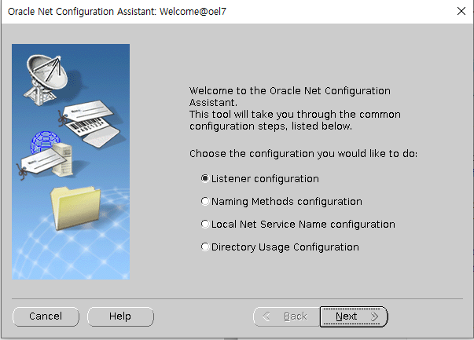

### DBCA

- Creation Mode

  - Advanced configuration

- Deployment Type

  - Oracle Single Instance database
  - Custom Database

- Database Identification

  > 가급적 동일한 이름으로 
  > 여기서는 SID를 Global database name으로 변경하여 진행

  - Global database name
  - SID

- Storage Option

  - Use following for the database storage attributes
    - File System

- Fast Recovery Option

  > 차후에 재설정 가능하므로, 현시점에서는 꺼놓도록 한다.

  - off: Specify Fast Recovery Area

  - off: Enable archiving

    > archive log mode : 아카이브 로그 생성
    > no archive log mode: 아카이브 로그 비생성
    >
    > **❗ archive log**: 데이터베이스 내에서의 모든 변경사항을 기록하는 로그
    > (궁극적으로 시점 복구를 하기 위함.)

- Network Configuration

  - check listner

- Database Options

  > 필요시 설정

  - off

- Conguration Options

  - Memory

    > ASM: Automatic Storage Management
    > ASMM: Automatic Shared Memoery Management(**only SGA**)
    > AMM: Automatic Memory Management(**both SGA and PGA**)
    > 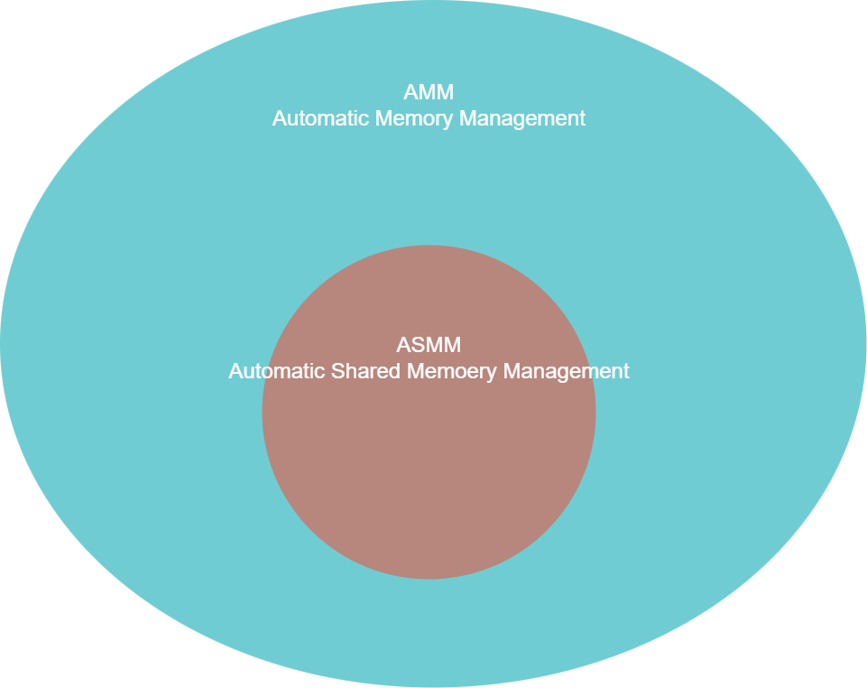

    - Use Automatic Shared Memory Management
    - Use Manual Shared Memory Management
    - ✅Use Automatic Memory Management

  - Sizing

    - Block size

      > a block is the smallest unit of storage for allocation and for I/O.
      > it cannot be changed once the database is created.
      >
      > = 할당 및 I/O를 위한 가장 작은 저장소 단위(데이터베이스가 생성 이후 변경불가)
      >
      > 할당: disk를 읽어 memory로 load하는 행위

  - Character sets

    - ✅UTF8
    - if window, MS Windows Code Page 949

  - Connection mode

    - ✅Dedicated server mode [^Dedicated Server mode]

    - Shared server mode [^Shared Server mode]
    
  - Sample schemas
  
    - if dev ✅
  
- Management Options

  - ✅Configure Enterprise Manager (EM) database express

    > GUI dashboard monitoring manager
    > like php admin

- User Credentials

  - Use the same administrative password for all accounts
    - oracle, oracle

- Creation Option

  - ✅Create database
  - Save as a database template
  - Generate database creation scripts

### complete

- finish
  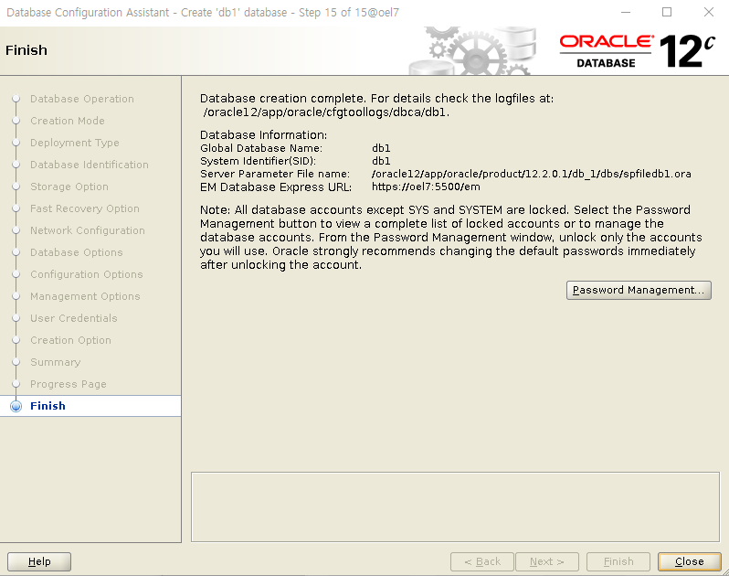

- (Optional) set alias as a oracle

  - ```shell
    su - oracle
    cd
    vi .bash_profile
    
    alias sqlplus='rlwrap sqlplus'
    alias 'c=clear'
    alias "cds=cd $ORACLE_HOME"
    alias 'his=history | cut -c 8- | uniq | sort -u'
    alias 'pslsnr=ps -ef | grep lsnr | grep -v grep'
    alias 'pspmon=ps -ef | grep pmon | grep -v grep'
    alias 'myip=ifconfig | head -2 | tail -1 | awk -Fnetmask '"'"'{print $1}\'"'"' | awk -F" " '"'"'{print $NF}'"'"''
    alias 'sss=sqlplus / as sysdba'
    alias 'alert=tail -f /oracle12/app/oracle/diag/rdbms/db1/db1/trace/alert_db1.log'
    alias 'params=cd ${ORACLE_HOME}/dbs;ls | tr ":" "\n";'
    alias 'cddbs=cd ${ORACLE_HOME}/dbs;'
    alias 'cddata=cd /oracle12/app/oracle/oradata/db1' # by select * from v$logfile;
    alias 'cdtrace=cd /oracle12/app/oracle/diag/rdbms/db1/db1/trace'
    
    . .bash_profile
    ```

# foot notes

[^Dedicated Server mode]: 1:1, WAS(Web Application Server)에서 Connection Pool을 이용해 서비스하게 되므로 **안정적인 서비스를 제공해야하는 환경이라면 Dedicated server mode를 사용하는게  일반적**, 왜냐하면 DBMS의 shared mode의 역할을 WAS의 Connection Pool이 대체하여 알아서 관리하게 될 경우,  굳이 shared server mode를 사용할 이유가 없음. (명령처리가 빠르고, 단점으로는 resource낭비 우려)                                                                                                      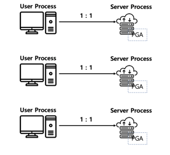  ↩

[^Shared Server mode]: N:1, 명령처리가 느린 대신 resource의 낭비 최소화)
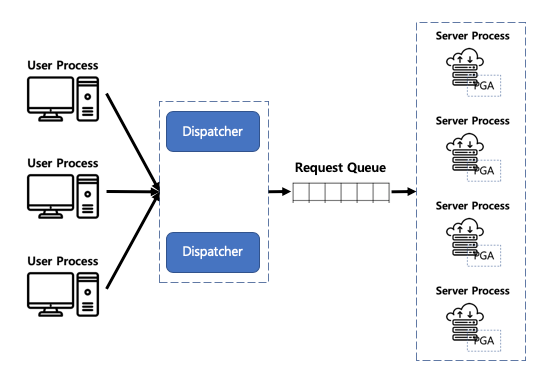

# ref capture


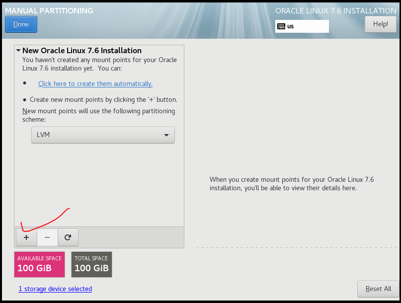

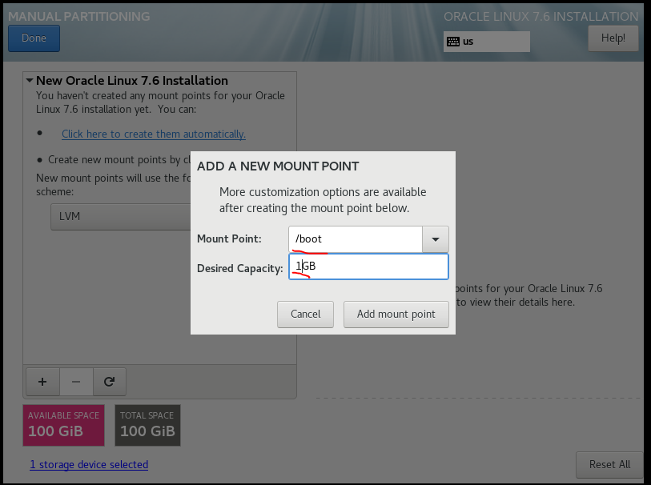


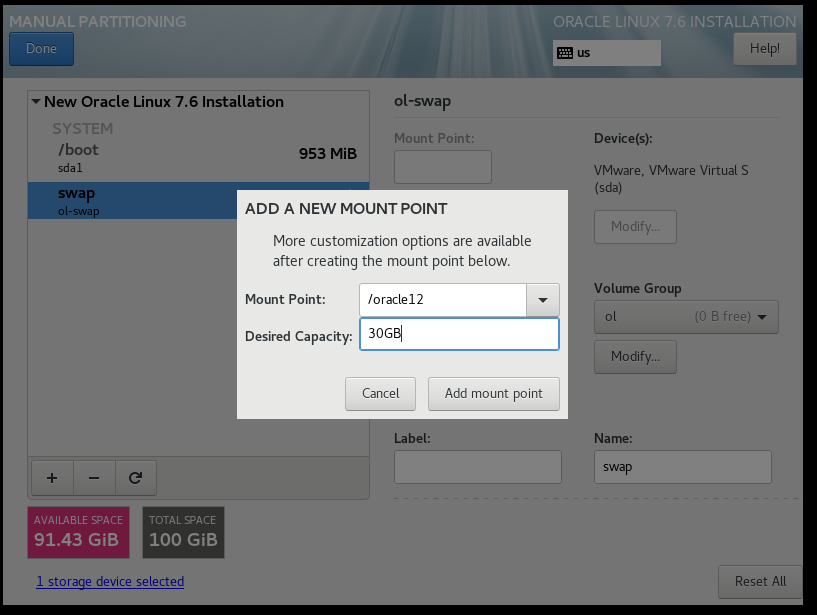


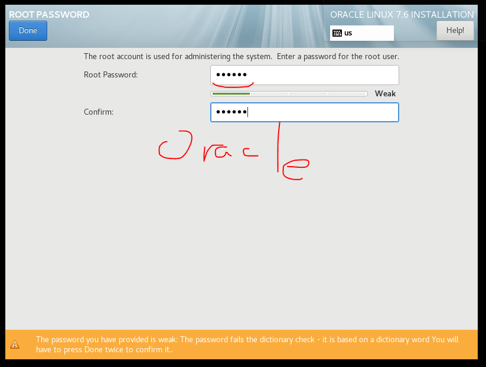


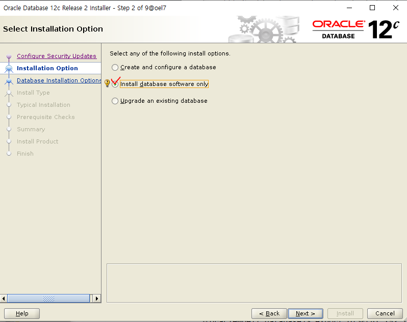

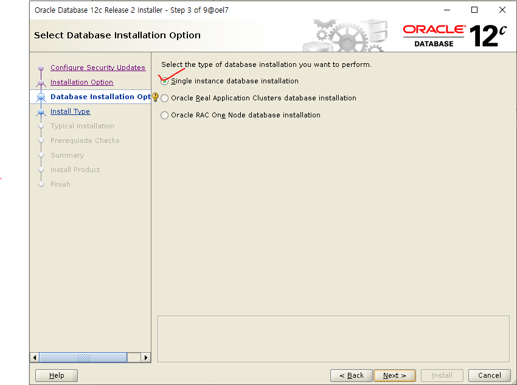

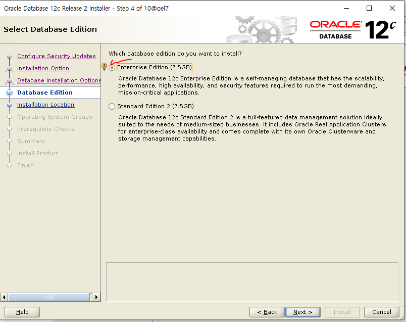


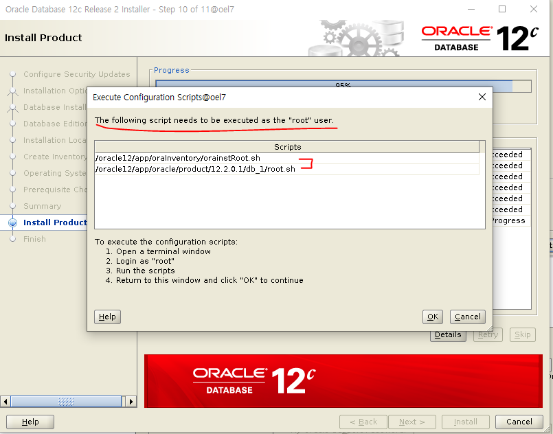

### DBCA

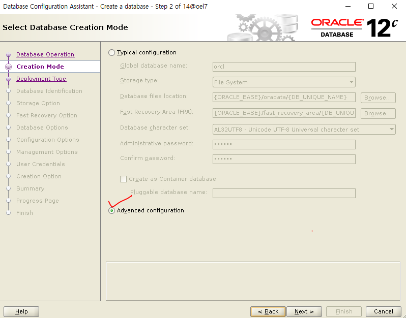


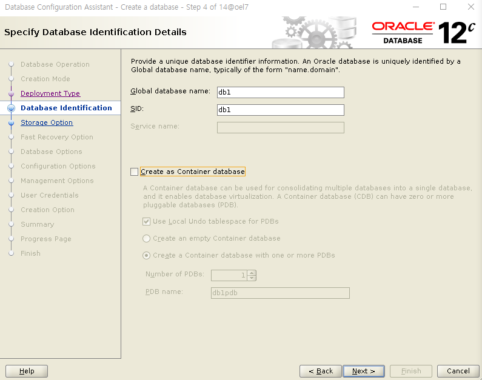

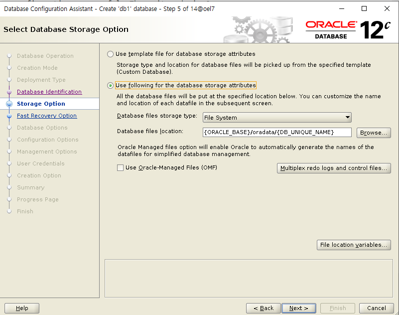


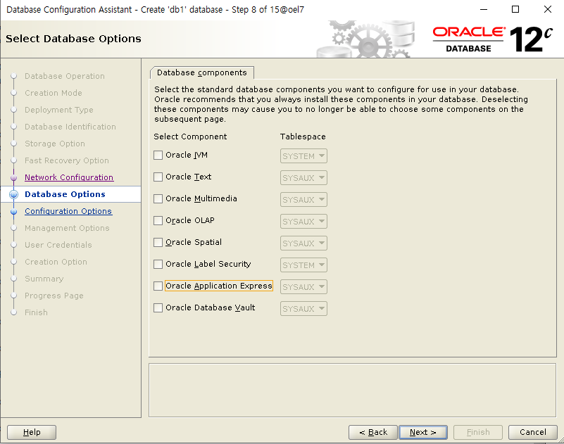


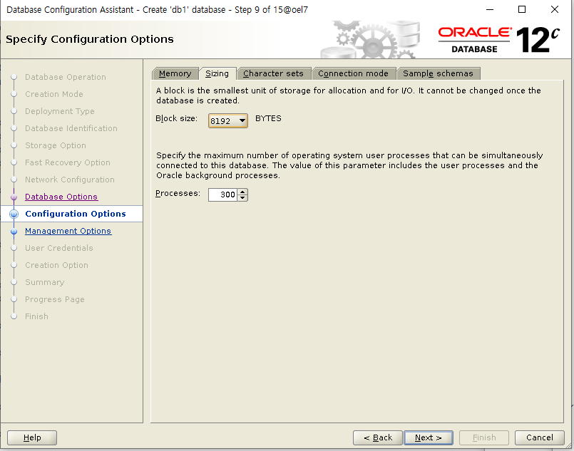

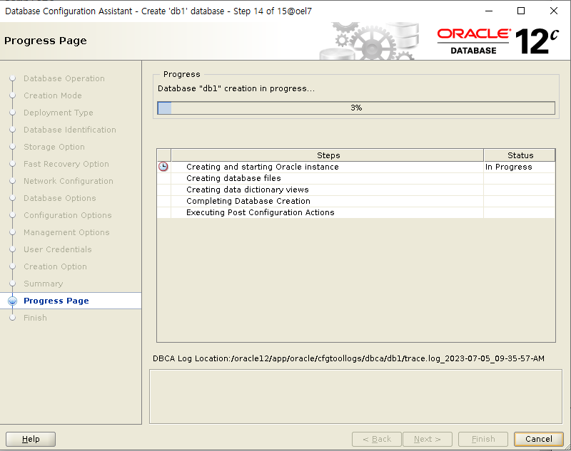


