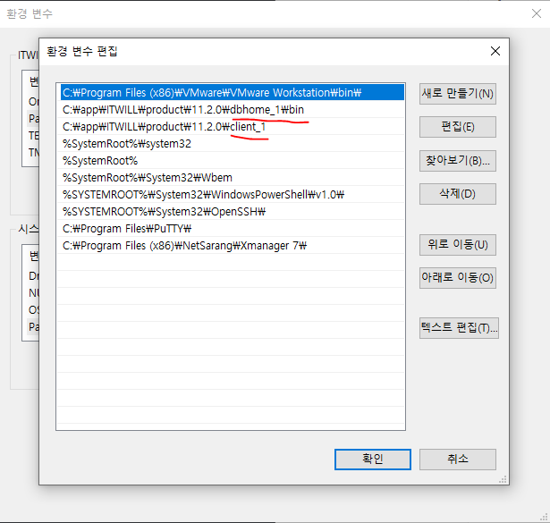

[toc]


## tnsnames.ora

> 데이터 접속목록 관리파일

### 위치

```shell
/app/${USER}/product/${VERSION}/${SID}/NETWORK/ADMIN/tnsnames.ora
```

### 우선순위

>  client와 server를 여러번 설치했을 경우
> 설치시마다 tnsnames.ora파일을 생성하고
> 가장 최우선 순위에 해당하는 `tnsnames.ora`만 읽어들인다.

- 가장 상단에 있는 환경변수의 순서가 우선순위이므로
  **환경변수 순서를 수정**하거나 **가장 위에 존재하는 위치의 tnsnames.ora파일을 수정**하도록 한다.

  > 기존 위치에서는 수정불가이므로, 수정가능한 위치로 옮긴 후, 덮어써야함.



### 수정

- 우선순위에 의거한 tnsnames.ora파일을 외부 디렉토리에 복사
- 내용 추가 및 삭제
- 복제본을 원본에 덮어쓰기

##### template

```shell
${SID_AS_A_ALIAS} = 
  (DESCRIPTION =
    (ADDRESS = (PROTOCOL = TCP)(HOST = ${IP})(PORT = ${PORT}))
    (CONNECT_DATA =
      (SERVER = DEDICATED)
      (SERVICE_NAME = ${SID})
    )
  )
```

##### apply

```shell
db1 = 
  (DESCRIPTION =
    (ADDRESS = (PROTOCOL = TCP)(HOST = 172.16.192.129)(PORT = 1521))
    (CONNECT_DATA =
      (SERVER = DEDICATED)
      (SERVICE_NAME = db1)
    )
  )
```