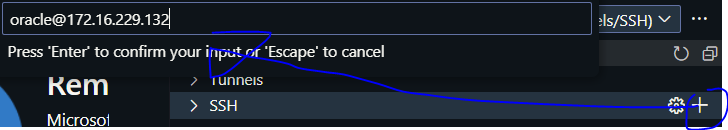
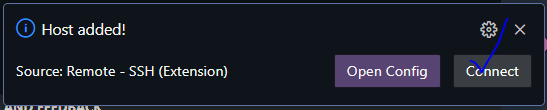
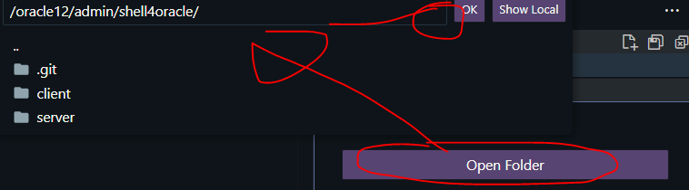
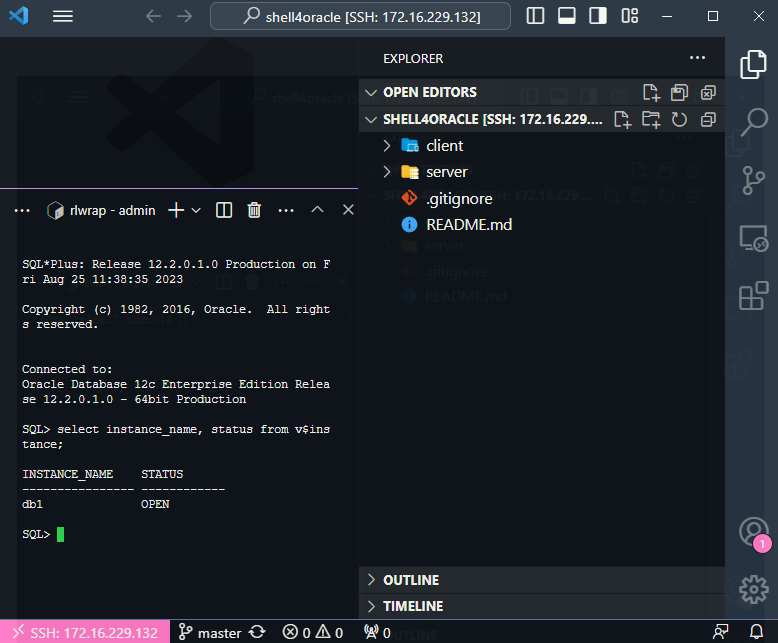

# vscode remote development

> 로컬 VSCODE에서 원격 linux 서버로 접근하여 작업하고자 할 경우

## flow

### remote server

**check version**

```shell
cat /etc/os-release | grep PRETTY_NAME | awk -F"=" '{print $NF}'
"Oracle Linux Server 7.9"
```

### local

1. run vscode
2. install extention: `remote development`
3. move sidemenu: Remote Explorer
4. change select box: `Remotes (Tunnels/SSH)`
5. add ssh
   
   
6. enter password
7. open folder
   
8. **enjoy** 🎉
   

