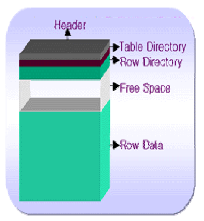

[toc]

# Block Storage

## PROPERTIES

**Header**
block의 **메타** 정보

**Table Directory**
클러스터에 존재하는 **테이블에 관한 정보**

**Row Directory**
Block내에 **Row와 관련된 정보**

**Free Space**
New Row Insert나 Update시 사용되어지는 공간(이 공간은 PCTFREE와 PCTUSED에 의해 결정)

**Row Data**
실제 테이블 데이터와 인덱스 데이터가 저장되는 공간

---

> available range
>
> (PCTFREE+PCTUSED <= 100) 

## PCTFREE

> The `PCTFREE` parameter is used to set the percentage of a block to be reserved for possible updates to rows that already are contained in that block.

- `default 10%`
- 데이터의 변경에 대비해 확보해두는 BLOCK의 여유 공간
- 여유공간의 비율을 의미하는 PCTFREE에 도달할 경우, 남은 여유공간은 오직 update만을 위해 사용되어져 더이상 새로운 데이터(row)를 취급할 수 없게된다.(=`dirty block`상태 돌입)
- 작으면 많은 ROW를 insert할 수 있지만, update시 잦은 ✨**row migration**[^row migration] 발생
- 크면 적은 ROW를 insert하는 대신, 잦은 update에 적합

| update period | PCTFREE |
| ------------- | ------- |
| somtimes      | low     |
| `frequently`  | `high`  |

## PCTUSED

> **PCTUSED** is a [block](https://www.orafaq.com/wiki/Data_block) storage parameter used to specify when Oracle should consider a database [block](https://www.orafaq.com/wiki/Block) to be empty enough to be added to the [freelist](https://www.orafaq.com/wiki/Freelist).
> This parameter is ignored for objects created in locally managed [tablespaces](https://www.orafaq.com/wiki/Tablespace) with Segment Space Management ([ASSM](https://www.orafaq.com/wiki/ASSM)) specified as AUTO.

- when disable ASSM`default 40%`
- 비어 있는 것으로 간주해야 하는 시점(=`free block`)
- delete 수행시 즉각 free공간으로 할당하지 않음.

---

# foot note

[^row migration]: 기존 블럭의 공간 안에서 수정하기에는 여유공간이 부족해 아예 새로운 블럭에 재구성하는 현상(성능저하 요인)

