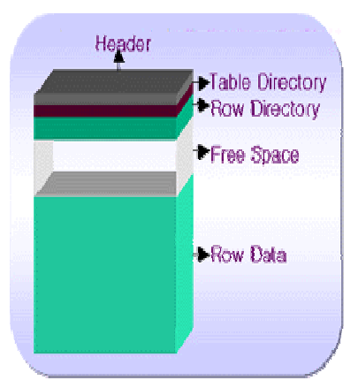

[toc]

# Manage Storage

## PCTFREE, PCTUSED



**Header**
block의 **메타** 정보

**Table Directory**
클러스터에 존재하는 **테이블에 관한 정보**

**Row Directory**
Block내에 **Row와 관련된 정보**

**Free Space**
New Row Insert나 Update시 사용되어지는 공간(이 공간은 PCTFREE와 PCTUSED에 의해 결정)

**Row Data**
실제 테이블 데이터와 인덱스 데이터가 저장되는 공간

---

> available range
>
> (PCTFREE+PCTUSED <= 100) 

## PCTFREE

> The `PCTFREE` parameter is used to set the percentage of a block to be reserved for possible updates to rows that already are contained in that block.

- `default 10%`
- 데이터의 변경에 대비해 확보해두는 BLOCK의 여유 공간
- 여유공간의 비율을 의미하는 PCTFREE에 도달할 경우, 남은 여유공간은 오직 update만을 위해 사용되어져 더이상 새로운 데이터(row)를 취급할 수 없게된다.(=`dirty block`상태 돌입)
- 작으면 많은 ROW를 insert할 수 있지만, update시 잦은 row migration[^row migration] 발생
- 크면 적은 ROW를 insert하는 대신, 잦은 update에 적합

| update period | PCTFREE |
| ------------- | ------- |
| somtimes      | low     |
| `frequently`  | `high`  |

## PCTUSED

> **PCTUSED** is a [block](https://www.orafaq.com/wiki/Data_block) storage parameter used to specify when Oracle should consider a database [block](https://www.orafaq.com/wiki/Block) to be empty enough to be added to the [freelist](https://www.orafaq.com/wiki/Freelist).
> This parameter is ignored for objects created in locally managed [tablespaces](https://www.orafaq.com/wiki/Tablespace) with Segment Space Management ([ASSM](https://www.orafaq.com/wiki/ASSM)) specified as AUTO.

- when disable ASSM`default 40%`
- 비어 있는 것으로 간주해야 하는 시점(=`free block`)
- delete 수행시 즉각 free공간으로 할당하지 않음.

---

## 관리

### 테이블 생성시

```sql
CREATE TABLE ${TABLE_NAME}(NO NUMBER, COL1 VARCHAR(2))
PCTFREE 20
PCTUSED 40
TABLESPACE ${TABLESPACE_NAME};
```


### 할당량 수정

```sql
alter user scott quota unlimited on users2;
```

### 생성

```sql
create table scott.stg_test1
(no		number,
 name	varchar2(20),
 addr  varchar2(20))
tablespace users2;
```

### 테이블 정보 조회

> 통계정보를 수집하지 않았기 때문에 보이지 않거나 최신정보와 다를 수 있음.

```sql
select table_name,
       tablespace_name,
       pct_free,
       pct_used,
       initial_extent,
       next_extent,
       num_rows,
       blocks,
       empty_blocks
  from dba_tables
 where table_name = 'STG_TEST1';
```

### 통계정보 갱신

```sql
analyze table scott.stg_test1 compute statistics;
```

### DML

```sql
insert into scott.stg_test1 values (1, 'choi', 'aaaaaaaa');
commit;
```

### extent / segment 조회

```sql
select *
  from dba_extents
 where segment_name = 'STG_TEST1';
```

### 대용량 DML

```sql
begin
for i in 1..500000 loop
insert into scott.stg_test1
values(i, dbms_random.string('A', 19), dbms_random.string('Q', 19));
end loop;
commit;
end;
/

-- 통계정보 갱신
analyze table scott.stg_test1 compute statistics;
-- segment 수,BLOCK 수 확인
select count(*), sum(BLOCKS) from dba_extents where segment_name = 'STG_TEST1';
-- segments들의 총 size 확인
select SEGMENT_NAME,
       sum(BYTES/1024/1024) as "SIZE(MB)"
  from dba_extents 
 where segment_name = 'STG_TEST1'
 group by segment_name;
```

### delete 시도

> 이미 늘어난 extent는 쉽게 줄어들거나 사라지지 않는다
>
> 새로운 데이터를 넣기위한 insert 우선 정책으로 인함.

```sql
delete from scott.stg_test1;
commit;

-- 통계정보 갱신
analyze table scott.stg_test1 compute statistics;
-- segment 수,BLOCK 수 확인
select count(*), sum(BLOCKS) from dba_extents where segment_name = 'STG_TEST1';
-- segments들의 총 size 확인
select SEGMENT_NAME,
       sum(BYTES/1024/1024) as "SIZE(MB)"
  from dba_extents 
 where segment_name = 'STG_TEST1'
 group by segment_name;
 
--> delete를 수행해도 extent나 block등의 수량은 동일(즉시 free block으로 반환되지 않음)✅
--> 실제 데이터건수와 상관없이 조회성능 악화 발생할 수 있음. -> reorg(보통 1년에 한번)
```


---

# foot note

[^row migration]: TODO