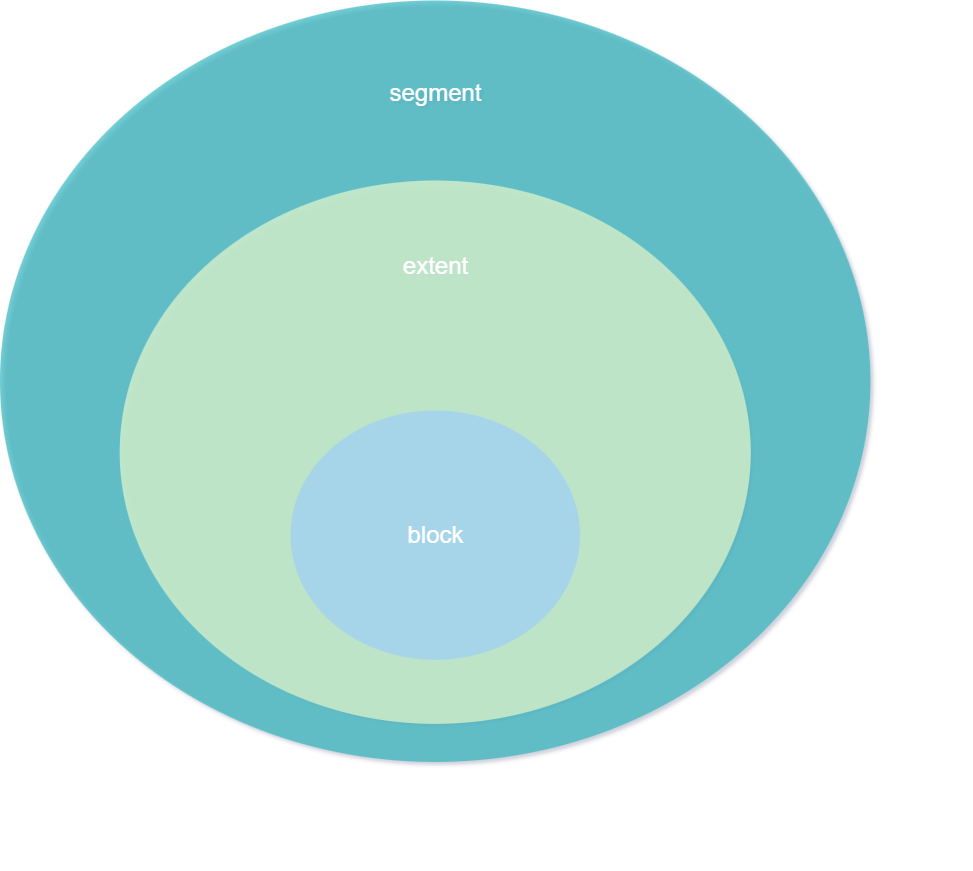

# Storage



## segment

- segment는 extent를 묶는 논리적 단위

## extent

- block을 묶는 논리적 단위(연속적인 block)
- default `64K`

## block

- 데이터를 관리하기 위한 논리적인 최소단위
- default `8K`

## usage

```sql
TABLESPACE USERS
STORAGE
(
    INITIAL 64K
    NEXT 1M
)
NOLOGGING;
```

