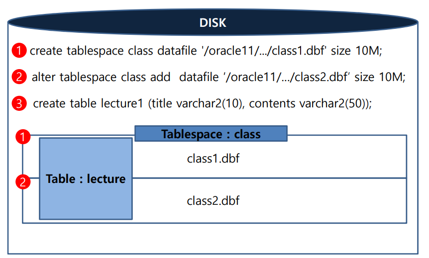

[toc]

# tablespace

> logical boundary(=📦)
>



## 특징

- 여러 객체를 묶는 논리적 공간 개념
- tablespace는 물리적으로 여러 datafile로 구성
  = tablespace는 반드시 하나 이상의 datafile로 구성

## 종류

### default tablespace

#### **1. system tablespace**

- system01.dbf
- Data Dictionary[^Data Dictionary]들이 저장되어있음

- SYS 계정 소유의 tablespace이지만 소유자인 SYS 계정도 이 테이블의 내용을 변경할 수 없음
- Data Dictionary 테이블 개수 조회
  ```sql
  SQL> select count(*) from dictionary;
  ```

#### **2. sysaux tablespace**

- oracle **성능 튜닝**과 관련된 정보 저장
- AWR[^AWR ]정보 저장

#### 3. temporary tablespace

- **2차 정렬**을 위한 공간(in disk)
- TEMP tablespace가 자동 생성됨(rename하지 않는 경우, 그대로 TEMP로 사용됨)
  - 반드시 하나의 default temporary tablespace 유지해야함
  - 다수의 temporary tablespace 생성 가능
  - user별로 서로 다른 temporary tablespace 지정 가능

- 해당 tablespace에 할당받은 datafile(disk)의 가용영역이 없을 경우, 조회되지 않거나 정렬이 수행되지 않음
  - user별로 temporary tablespace를 지정하지 않으면 연관되지 않은 업무에서의 조회로 인해 다른 업무의 조회도 조회되지 않음.
  - 주로 대용량 정렬을 시도할 경우 발생


#### 4. undo tablespace

- 읽기 일관성을 위해 **과거 이미지 보관** 임시 영역
- **rollback**을 위해 만들어진 공간
- 해당 tablespace에 할당받은 datafile(disk)의 가용영역이 없을 경우, DML 불가능
  - 주로 대용량 DML을 시도할 경우 발생


## 관리

### 1. tablespace 조회

```sql
select *
  from dba_tablespaces;
  
TABLESPACE_NAME
------------------------------
SYSTEM
SYSAUX
UNDOTBS1
TEMP
USERS
```

### 2. tablespace를 구성하는 datafiles 조회

```sql
select FILE_NAME,
			 TABLESPACE_NAME,
			 BYTES/1024/1024 AS "BYTES(MB)",		-- 실제 사용량
			 AUTOEXTENSIBLE,										-- 자동 증가여부
			 MAXBYTES/1024/1024 AS "BYTES(MB)"	-- 최대허용사용량
  from dba_data_files; -- temp tablespaces 제외한 모든 datafile
  
------------------------------------------------------------------------------------------------
FILE_NAME																					 TABLESPACE_NAME  BYTES(MB)   AUT  BYTES(MB)
-------------------------------------------------- --------------- 	----------- ---  -----------
/oracle12/app/oracle/oradata/db1/system01.dbf				SYSTEM          700 			  YES  32767.9844
/oracle12/app/oracle/oradata/db1/sysaux01.dbf				SYSAUX          550 			  YES  32767.9844
/oracle12/app/oracle/oradata/db1/undotbs01.dbf			UNDOTBS1        335 			  YES  32767.9844
/oracle12/app/oracle/oradata/db1/users01.dbf				USERS             5 			  YES  32767.9844
```

### 3. temp tablespace를 구성하는 datafiles 조회

```sql
select FILE_NAME,
			 TABLESPACE_NAME,
			 BYTES/1024/1024 AS "BYTES(MB)",		-- 실제 사용량
			 AUTOEXTENSIBLE,										-- 자동 증가여부
			 MAXBYTES/1024/1024 AS "BYTES(MB)"	-- 최대허용사용량
  from dba_temp_files; -- temp tablespaces의 모든 datafile

------------------------------------------------------------------------------------------------
FILE_NAME																					 TABLESPACE_NAME  BYTES(MB)   AUT  BYTES(MB)
-------------------------------------------------- --------------- 	----------- ---  -----------
/oracle12/app/oracle/oradata/db1/temp01.dbf        TEMP             20          YES  32767.9844
```

### 4. add✨

```sql
alter tablespace class1 
      add datafile '/oracle12/app/oracle/oradata/db1/class1_02.dbf' size 1m;
```

### 5. resize

```sql
alter database datafile '/oracle12/app/oracle/oradata/db1/class1_01.dbf' resize 2m;
```

### 6. autoextend

```sql
alter database datafile '/oracle12/app/oracle/oradata/db1/class1_02.dbf' autoextend on;
```

### 7. rename✨

- 주로 디스크의 **물리적 이동이 필요할 경우** 사용
  (디스크가 문제가 있거나 용량이 부족하여 다른 디스크로 이동해야할 경우)
- datafile **online중 물리적 복사 또는 이동 금지**
- tablespace를 `offline | shutdown` 한 후 작업 필요
- offline이 불가능한 system, undo, temp 등은 shutdown 후 처리

| datafile 물리적 이동 | online 가능 여부 | 절차                                                         |
| -------------------- | ---------------- | ------------------------------------------------------------ |
| SYSTEM               | ❌                | shutdown -> physical move -> startup mount -> logical move -> alter database open |
| SYSAUX               | ❌                | shutdown -> physical move -> startup mount -> logical move -> alter database open |
| UNDOTBS1             | ❌                | shutdown -> physical move -> startup mount -> logical move -> alter database open |
| USERS                | ✅                | tablespace offline -> physical move -> logical move -> tablespace online |
| `user define`        | ✅                | tablespace offline -> physical move -> logical move -> tablespace online |

```sql
alter database rename file '/oracle12/app/oracle/oradata/db1/class1_02.dbf' to '/home/oracle/oradata/db1/class1_02.dbf';
```

### 8. delete

- default tablespace(system, sysaux, undo, temp) 삭제 불가
- table이 존재하는 경우, 삭제불가(including contents 옵션으로 데이터와 함께 삭제)
- OS 데이터파일 그대로 남아있음

```sql
# logical delete
drop tablespace class1;											-- 테이블이 존재하므로 제거 불가능
drop tablespace class1 including contents; 	-- 테이블이 존재함에도 제거 가능

# physical delete
rm class1_01.dbf class1_02.dbf ...
```

## Data Dictionary 정보

- DBMS에서 관리되는 모든 객체, 세션, 자원의 정보를 보관하는 곳
- base table이 별도로 존재하고, 사용자에게는 view 형태로 조회가능하도로 제공 => **data dictionary view**

**data dictionary view 종류**

1. **static data dictionary view**: about object, from open

      ```sql
      # user_XXXX : 접속 계정 소유 오브젝트
        select * from user_tables;
      # all_XXXX  : 접속 계정 소유 오브젝트 + 접근 권한이 있는 오브젝트 모두
        select * from all_tables;
      # dba_XXXX  : 모든 오브젝트 조회 가능(단, DBA 권한을 가진 자만)
        select * from dba_tables;
      ```

2. **dynamic performance view**: about performance, from nomount

    ```sql
    # v$___
    select * from dba_views where view_name like 'V_$SESSION%';
    select * from v$session;
    -- origin: v$session, references: v_$session
    ```

---

# foot note

[^Data Dictionary]: 메모리로 구성된 Shared Pool.Data Dictionary Cache의 실제 물리적인 공간
[^AWR ]: **A**utomatic **W**orkload **R**epository
