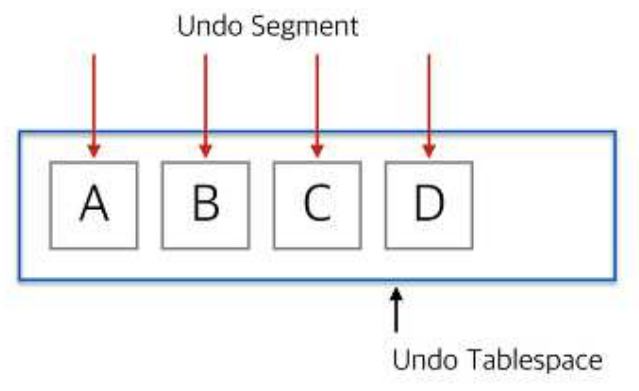
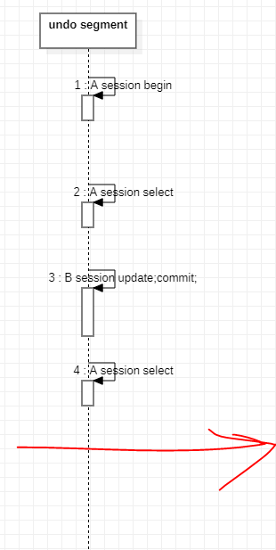

# undo tablespace

- DML 작업 수행시 원본데이터(undo data)를 저장하는 장소
- 해당 tablespace에 할당받은 datafile(disk)의 가용영역이 없을 경우, DML 불가능
  - 주로 대용량 DML을 시도할 경우 발생

## 목적

1. Transaction Rollback
2. Transaction Recovery
3. RC[^read consistency]

## CR block

A 세션의 transaction 수행시 commit이전까지 

B 세션은 A세션의 transaction의 수행전 데이터를 보여줘야 하고, 

## undo segment

**하나의 세션당 하나의 undo segment가 할당**

- 새로운 세션의 DML이 발생(트랜잭션)시, 항상 새로운 undo segment를 할당하는게 아닌
  재사용 가능한 undo segment를 찾아 할당(available undo segment의 1차 조건: `commit | rollback`(TCL))
- 만약 모든 영역의 undo segment가 transaction을 종료하지 않은 상태라서 더이상 새로운 undo segment를 할당할 수 없을 경우 DML 불가능 -> 🔥`snap shot too old`🔥
  - undo segment의 영역을 늘리거나
  - transaction을 종료시키기

extent단위로 증감(물론, 감소보다 증가가 쉽다)

실질적인 저장공간 => disk

instance recovery 수행시 근거데이터로 활용하기 위해 memory가 아닌 disk에 저장 => disk

Commit이나 Rollback이 되면 즉시 Segment의 내용이 flush 되는 것이 아니고 재사용되면서 flush(한번 늘어난 undo segment는 줄어들지 않음.)

## Undo Segment 할당원리



- Server Process가 Undo Segment 할당을 위 해 기존 Segment중에 재사용할 것이 있는지 찾음
- 재사용할 segment가 있으면 재사용하고, 없다면 새로운 undo segment를 할당받음
- 새로운 Segment를 할당 받다가 Data file의 허용범위까지 늘어나면 하나의 Segment를 2개 세션 이상의 Undo Data를 함께 기록(십시일반)
- 그 이후에도 공간이 없으면 해당 트랜잭션은 에러 발생 -> Rollback

## snap shot too old



```shell
begin; # A session
|
| begin; # B session
| update; # B session
| commit; # B session
| <B session: update> 
|
<A sesion: select>
```

### 해결 방법


## parameter

**undo retention**: commit 수행후에도 다른 서버 프로세스가 덮어쓰지 못하도록 막아주는 시간(default: `900s -> 15M`),
단, undo segment의 여분이 있을 경우에만 적용되고 여분이 없을 경우 undo retention이 무시되고 새로운 트랜잭션 수행을 위해 flush

**undo retention guarantee**: 아무리 장애가 발생하여도, undo retention을 보장해주는 파라미터 (default: `NOGUARANTEE`)

---

CR블록

