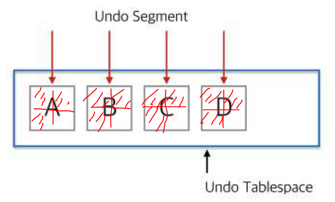
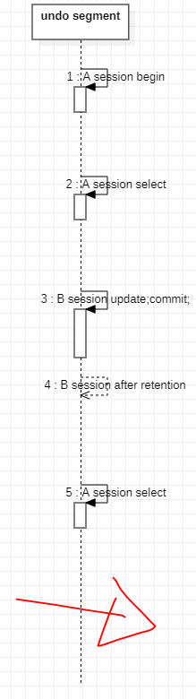

[toc]

# Undo tablespace

> 과거 이미지를 임시적으로 보관하기 위한 디스크영역

- DML 작업 수행시 원본데이터(undo data)를 저장하는 장소
- 해당 tablespace에 할당받은 datafile(disk)의 가용영역이 없을 경우, DML 불가능
  - 주로 대용량 DML을 시도할 경우 발생

## 목적

1. rollback: TCL[^TCL]
2. RC[^read consistency]: when multi session|transaction
3. instance Recovery: when system error -> cause ~~memory~~ `disk`

## 특징

- **하나의 세션당 하나의 segment 할당**
- `commit | rollback`시 사용중인 세그먼트는 재사용 가능한 상태로 변경
  (until undo retention)
- 모든 세션이 사용중이거나 재사용 가능한 세그먼트가 없을 경우에만 새로운 세그먼트를 할당
  새로운 세션의 DML이 발생(트랜잭션)시, 항상 새로운 undo segment를 할당하는게 아닌
  재사용 가능한 undo segment를 찾아 할당(available undo segment의 1차 조건: `commit | rollback`(TCL)
- 만약 모든 영역의 undo segment가 transaction을 종료하지 않은 상태라서 더이상 새로운 undo segment를 할당할 수 없을 경우 DML 불가능 -> 🔥`snap shot too old`🔥
  - increment undo segment's physical storage
  - kill transaction
  - kill session
- extent단위로 증감(물론, 감소보다 증가가 쉽다)
- Commit이나 Rollback이 되면 즉시 Segment의 내용이 flush 되는 것이 아니고 재사용되면서 flush(한번 늘어난 undo segment는 줄어들지 않음.)

## 할당원리



- Server Process가 Undo Segment 할당을 위 해 기존 Segment중에 재사용할 것이 있는지 찾음
- 재사용할 segment가 있으면 재사용하고, 없다면 새로운 undo segment를 할당받음
- 새로운 Segment를 할당 받다가 Data file의 허용범위까지 늘어나면 하나의 Segment를 2개 세션 이상의 Undo Data를 함께 기록(십시일반)
- 그 이후에도 공간이 없으면 해당 트랜잭션은 에러 발생 -> Rollback

## parameter

|                          | summary                                               | default       | values                  | description                                                  |
| ------------------------ | ----------------------------------------------------- | ------------- | ----------------------- | ------------------------------------------------------------ |
| undo_management          | undo segment의 할당을 자동 여부                       |               | `auto`                  | undo segment를 자동으로 관리하는지의 여부, segment 수를 제한하지 않고 자동 할당 |
| undo_retention           | 커밋하더라도 old image를 undo segment에 유지하는 시간 | `900s`        | `${N}s`                 | commit 수행후에도 다른 서버 프로세스가 덮어쓰지 못하도록 막아주는 시간<br/>단, undo segment의 여분이 있을 경우에만 적용되고 여분이 없을 경우 undo retention이 무시되고 새로운 트랜잭션 수행을 위해 flush |
| undo_retention_guarantee | 리텐션 보장                                           | `noguarantee` | `guarantee|noguarantee` | 아무리 장애가 발생하여도, undo retention을 보장해주는 파라미터 |

## trouble shooting

### 0. default undo tablespace

```sql
select name,
       value
  from v$parameter
 where name like '%undo%';
 
|NAME             |VALUE   |
|-----------------|--------|
|temp_undo_enabled|FALSE   |
|undo_management  |AUTO    |
|undo_tablespace  |UNDOTBS1|
|undo_retention   |900     |
```

### 1. unable to extend

#### 원인 및 현상

- undo size가 부족하면 기존 트랜잭션, 새로운 dml 수행 불가

#### 해결방법

- undo tablespace size 증가

### 2. snapshot too old(ORA-01555)✨

#### 원인 및 현상

> long query(select)시 중간에 변경된 데이터가 commit된 후, 과거 이미지를 더 이상 undo에 들고있지 않기 때문에 과거 이미지를 조회할 수 없는 현상

1. A session의 1시간 배치 업무를 위한 잦은 주기로 select시도
2. 1번 수행중,  B session이 짧은 트랜잭션으로 동일한 데이터에 대해 변경 후 트랜잭션 종료
3. A session의 업무중 2번이 처리한 동일한 데이터에 대해 select시도
4. 1번시 select한 데이터가 어느 undo segment에도 존재하지 않아 `snap shot too old`발생



```shell
<A session begin>
	<A session select>
  <B session begin>
      <B session update>
  <B session commit>
 	<A session select> 				# snap shot too old
<A session commit>
```

#### 해결방법

- [ ] 🙂 transaction 코드 수정(long query 지양)
- [ ] 😥 retention을 증가(단, 나머지 트랜잭션들도 영향을 미치므로, undo segment를 늘려주어야 함)
- [ ] 🤢 retention guarantee
- [x] 😀 A와 B의 트랜잭션 자체를 겹치지 않도록 수행시간 재배치✅
  - [ ] ASIS
    - [ ] 자정에 A작업 B작업 수행
    - [ ] snatshot too old 발생
  - [x] TOBE
    - [ ] 자정+${0}H 선행 A작업
    - [ ] 자정+${N}H 후행 B작업
- [ ] 😀 LOCK 명시
  select ~ for update wait 0

---

# foot note

[^TCL]: Transaction Control Language
[^CR Block]: 

