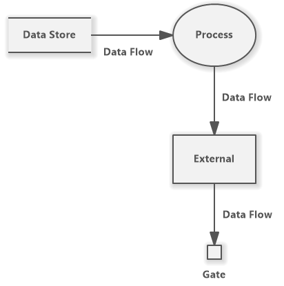
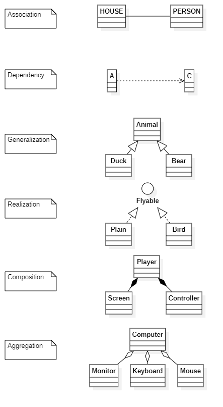
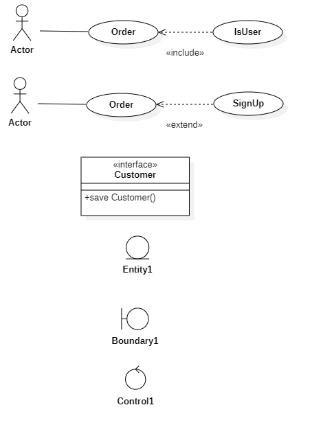

# 플랫폼

> - 애플리케이션을 구동시키는 데 필요한 소프트웨어의 환경
>- 동일 플랫폼 내에서는 상호 호환이 가능하도록 만들어진 결합체
> - 공급자와 수요자 등 복수 그룹이 참여하여 각 그룹이 얻고자 하는 가치를 공정한 거래를 통해 교환할 수 있도록 구축된 환경

- 싱글 사이드 플랫폼: Single-Side Platform
  - 소비자 : 공급자
    - 앱스토어
- 투 사이드 플랫폼: Two-Side Platform
  - 단순 중개
    - 알바천국
- 멀티 사이드 플랫폼: Multi-Side Platform
  - 복합 중개
    - SNS

## 플랫폼 성능 특성 분석

### 성능 특성 분석 기법

| 기법          | 설명                                                 | 산출물                          |
| ------------- | ---------------------------------------------------- | ------------------------------- |
| 사용자 인터뷰 | 현행 플랫폼 사용자 인터뷰를 통해 속도의 적정성 확인  | 인터뷰 결과서                   |
| 성능 테스트   | 현행 플랫폼을 대상으로 성능, 부하 테스트를 수행      | 성능 테스트, 부하 테스트 결과서 |
| 산출물 점검   | 현행 플랫폼과 유사한 타사 제품의 성능 자료 등을 분석 | 벤치마킹 테스트 결과서          |

### 성능 특성 측정 항목

| 측정 항목                      | 설명                                                         |
| ------------------------------ | ------------------------------------------------------------ |
| **경**과 시간(Turnaround Time) | 애플리케이션에 작업을 의뢰(요구)한 시간부터 처리가 완료될 때까지 걸린 시간 |
| **사**용률(Utilization)        | 애플리케이션이 의뢰한 작업을 처리하는 동안 CPU, 메모리 등의 자원 사용률 |
| **응**답시간(Response Time)    | 애플리케이션에 요청을 전달한 시간부터 응답이 도착할 때까지 걸린 시간 |
| **가**용성(Availability)       | 서버와 네트워크, 프로그램 등의 정보 시스템이 정상적으로 사용 가능한 정도 |

## 운영체제 분석

> OS; Operating System
>
> - 운영체제는 하드웨어 및 소프트웨어 자원을 효율적으로 관리하며 공통된 기능을 제공하는 소프트웨어
> - 사용자가 컴퓨터를 좀 더 쉽게 사용하기 위해 지원하는 소프트웨어

### 운영체제 현행 시스템 분석

#### 품질 측면

- 신뢰도
- 성능

#### 지원 측면

- 기술지원
- 주변기기
- 구축비용

## DBMS 분석

> DBMS는 데이터베이스(DB; Database)라는 데이터의 집합을 만들고, 저장 및 관리할 수 있는 기능들을 제공하는 응용 프로그램

### DBMS 기능

| 기능            | 설명                                                         |
| --------------- | ------------------------------------------------------------ |
| 중복 제어       | 동일한 데이터가 여러 위치에 중복으로 저장되는 현상 방지      |
| 접근 통제       | 권한에 따라 데이터에 대한 접근 제어                          |
| 인터페이스 제공 | 사용자에게 SQL, CLI, GUI 등 다양한 인터페이스 제공           |
| 관계 표현       | 서로 다른 데이터 간의 다양한 관계를 표현할 수 있는 기능 제공 |
| 샤딩/파티셔닝   | 구조 최적화를 위해 작은 단위로 나누는 기능 제공              |
| 무결성 제약조건 | 무결성에 관한 제약조건을 정의/검사하는 기능 제공             |
| 백업 및 회복    | 장애 발생 시 데이터의 보존 기능 제공                         |

### DBMS 현행 시스템 분석

- 성능 측면
  - **가**용성
  - **성**능
  - 상호 **호**환성
- 지원 측면
  - **기**술 지원
  - **구**축 비용

> 상호 호환성 중, JDBC와 ODBC
>
> JDBC: Java Database Connectivity
> ODBC: Open Database Connectivity(표준 개방형 응용 프로그램 인터페이스)

## 비즈니스 융합 분석

> 비즈니스 융합이란?
>
> 융합 기술이 제공하는 기회나 융합의 원리를 적용해 새로운 제품, 서비스, 산업을 창출하거나 기존 제품을 혁신하기 위한 기업 활동이다.
> 산업 또는 시장 간 경계를 허물어 정보통신 기술을 적용해 새로운 **비즈니스 모델**의 범위를 확대하는 것을 의미
>
> 비즈니스 모델: 고객의 가치를 창출하고 시장에서 성공적인 경쟁을 하기 위해 고안된 조직의 목표, 전략, 프로세스, 구조, 기술 등을 포함하는 총체적인 구성체를 뜻함.

### 비즈니스 융합 유형

| 유형            | 설명                                            | 사례                                   |
| --------------- | ----------------------------------------------- | -------------------------------------- |
| 고객 가치(Why)  | 개인, 사회, 인류의 행복과 번영을 위한 가치 창출 | 신재생 에너지 개발, 친환경 농산물 생산 |
| 시장 유통(Whom) | 신시장 개척 또는 미래시장 선점                  | 자율주행 자동차, 글로벌 통신망         |
| 가치 제안(What) | 시장/고객의 미충족 요구 대응을 위한 신상품 개발 | 드론 배송, 협동 로봇, 소셜 로봇        |
| 공급 역량(Who)  | 신기술, 신규역량을 활용한 상품생산 및 판매      | 스마트 밴드, 스마트 헬스케어           |
| 생산 방식(How)  | 제품/서비스의 생산, 판매 프로세스 혁신          | **스마트 팩토리**, **옴니채널**        |

> 스마트 팩토리(Smart Factory)
>
> 기획/설계, 생산, 유통/판매 등
> 전 과정을 ICT 기술로 통합, 최소비용 및 시간으로 
> 고객 맞춤형 제품을 생산하는 지능화된 공장
>
> 옴니채널(Omni-Channel)
>
> 소비자가 온라인, 오프라인, 모바일 등 
> 다양한 경로로 상품을 검색하고  구매할 수 있도록 하는 서비스이자,
> 각 유통 채널의 특성을 결합해 
> 어떤 채널에서든 같은 매장을 이용하는 것처럼 느낄 수 있도록 한 쇼핑 환경

### 비즈니스 융합 분석 절차

1. 기업전략 분석
2. 영역 및 방향 설정
3. 포트폴리오 선정
4. 융합모델 설계/평가
5. 비즈니스 융합 실행/개선

# 요구사항 확인

## 요구사항 분석 단계 절차

1. 요구사항 분류
2. 개념 모델링 생성 및 분석
3. 요구사항 할당
4. 요구사항 협상
5. 정형 분석

## 요구사항 분석 기술

- 청취 기술
- 인터뷰와 질문 기술
- 분석 기술
- 중재 기술
- 관찰 기술
- 작성 기술
- 조직 기술
- 모델 작성 기술

## 요구사항 분석에 사용하는 모델링 기법

### **데이터 흐름도(DFD; Data Flow Diagram)**

- 특징
  - 구조적 분석 기법에 이용
  - 데이터(Data)의 흐름에 중심을 두는 분석용 도구
  - 제어(Control)의 흐름은 중요하지 않다.
  - 시간 흐름을 명확하게 표현할 수는 없다
- 구성 요소
  - `○` **P**rocess
  - `→` Data **Fl**ow
  - `〓` Data **S**tore
  - `□`**Ter**minator

### **자료 사전(DD; Data Dictionary)**

- 기호
  - `=`: 정의   
  - `+`: 연결
  - `()`: 생략
  - `{}`: 반복
  - `[]`: 선택
  - `**`: 설명

# UML

> 객체 지향 소프트웨어 개발 과정에서 산출물을 명세화, 시각화, 문서화할 때 사용되는 모델링 기술과 방법론을 통합해서 만든 표준화된 범용 모델링 언어

## 특징

- **가**시화 언어
  - 의사소통 용이
- **구**축 언어
  - 소스로 변환 가능, 역공학 가능
- **명**세화 언어
  - 정확한 모델 제시 및 완전한 모델 작성 가능
- **문**서화 언어
  - 시스템에 대한 평가 및 의사소통의 문서

### 구성요소

- **사**물(Things)
- **관**계(Relationships)
- **다**이어그램(Diagrams)

## UML 다이어그램 구분

### 구조적, 정적 다이어그램

> Structural Diagram
> Static Diagram

- Class: **클**래스
- Object: **객**체
- Component: **컴**포넌트
- Deployment: **배**치
- Composite Structure: **복**합체 구조
- Package: **패**키지

### 행위적, 동적 다이어그램

> Behavioral Diagram
> Dynamic Diagram

- Usecase: **유**스케이스
- Sequence: **시**퀀스
- Communication: **커**뮤니케이션
- State: **상**태
- Activity: **활**동
- Timing: **타**이밍

### 클래스 다이어그램

> 클래스와 클래스, 클래스 속성 사이의 관계를 표현

- Class Name: 이름
- Attribute: 속성
- Operation: 연산
- Access Modifier: 접근 제어자 
  - `-`:  private(내부)
  - `+`: public(외부)
  - `#`: protected(동일 패키지, 파생 클래스)
  - `~`: default(동일 패키지)

### 유스케이스 다이어 그램

> 기능 및 외부요소를 사용자 관점에서 표현한 다이어그램

#### 구성 요소

- Usecase
- Actor
- System

#### 구성 요소 간의 관계

- Association
- Include
- Extend
- Generalization

### 시퀀스 다이어그램

> 객체 간 상호 작용을 메시지 흐름으로 표현한 다이어그램

- Object
- Lifeline
- Activation
- Message
- Self-Message

## UML의 관계

- Association: 연관
- Dependency: 의존
- Generalization: 일반화
- Realization: 실체화
- Composition: 포함
- Aggregation: 집합

##  UML 확장 모델의 스테레오 타입

> UML의 기본적 요소 이외의 새로운 요소를 만들어 내기 위한 확장 메커니즘
>
> 기존의 UML 요소를 그대로 사용하지만, 내부 의미는 다른 목적으로 사용하도록 확장
>
> UML의 스테레오 타입은 '<<>>'(길러멧; Guillemet)기호를 사용하여 표현

- include
- extend
- interface
- entity
  - 정보 또는 지속되는 연관 행위를 형상화하는 클래스
  - 기억 장치에 **저장되어야 할 정보**를 표현하는 클래 스
- boundary
  - 시스템과 외부 액터와의 **상호 작용**을 담당하는 클래스
- control
  - 시스템이 제공하는 기능의 **로직 및 제어**를 담당하는 클래스

# Agile

> 소프트웨어 개발방법론 중 하나,
> 개발과 함께 즉시 피드백을 받아 유동적으로 개발하는 방법

## 특징

- 프로젝트의 요구사항은 기능 중심으로 정의
- 절차와 도구보다 개인과 소통을 중요하게 생각
- 작업 계획을 짧게 세워 요구 변화에 유연하고 신속하게 대응
- 잘 실행되는 데에 가치를 둔다
- 고객과의 피드백 중요시

## 선언문

- 공정과 도구보다 **개인과 상호 작용**
- 계획을 따르기보다 **변화에 대응**
- 포괄적인 문서보다 **동작하는 소프트웨어**
- 계약 협상보다 **고객과의 협력**

## 유형

- XP
- SCRUM
- Lean
- Crystal
- ASD(Adaptive Software Development)
- FDD(Feature Driven Development)

### XP

> eXtreme Programming
>
> - 의사소통 개선과 즉각적 피드백으로 소프트웨어 품질을 높이기 위한 방법론
> - 기존의 방법론에 비해 실용성을 강조
> - 1~3주의 반복(Iteration) 개발 주기를 가지며, 5가지 가치와 12개의 실천항목이 존재

- **5 Value**

  - `Courage`

  - `Simplicity`

  - `Communication`

  - `Feedback`

  - `Respect`

- **12 Principle**

  - `Pair Programming`
  - `Collective Ownership`
  - `Continuous Integration`
  - `Planning Process`
  - `Small Release`
  - `Metaphor`
  - `Simple Design`
  - `Test Driven Development`
  - `Refactoring`
  - `40-Hour Work`
  - `On site Customer`
  - `Coding Standard`

### SCRUM

> 매일 정해진 시간, 장소에서 짧은 시간의 개발을 하는 팀을 위한 프로젝트 관리 중심 방법론

- `Product Owner`
- `Product Backlog`
- `Sprint`
- `Scrum Meeting`
- `Scrum Master`
- `Sprint Retrospective`
- `Burn Down Chart`

### Lean

> 도요타의 린 시스템 품질기법을 소프트웨어 개발 프로세스에 적용해서 낭비 요소를 제거해 품질을 향상시킨 방법론
>
> - JIT(Just In Time), 칸반(Kanban) 보드를 사용한다
> - 7가지 원칙

- **낭**비제거
- **품**질 내재화
- **지**식 창출
- 늦은 **확**정
- 빠른 **인**도
- **사**람 존중
- **전**체 최적화

### Crystal

> 크리스탈은 일반적으로 프로세스나 도구보다는 사람에게 더 많은 중점을 두는 방법론
>
> 생명이 중요하지 않은 시스템에서 작업하는 최대 6명 또는 8명의 공동 배치 소프트웨어 개발자 팀에 적용

### ASD(Adaptive Software Development)

> ASD는 개발을 혼란 자체로 규정하고, 혼란을 대전제로 그에 적응할 수 있는 소프트웨어 방법을 제시하기 위해 만들어진 방법론
>
> 합동 애플리케이션 개발(Joint Application Development)을 사용  

### FDD(Feature Driven Development)

> FDD 개발을 상품이나 서비스 단위가 아니라 신규 기능 단위로 하는 개발 방법론

## 전통적 방법론과 비교

| 비교 대상 | 애자일                                  | 전통적                                  |
| --------- | --------------------------------------- | --------------------------------------- |
| 계획수립  | 유동적                                  | 확정적                                  |
| 업무수행  | 팀 중심                                 | 관리자 주도적 개인 단위            |
| 개발/검증 | 반복 주기 단위로 소프트웨어를 개발/검증 | 분석/설계/구현/테스트를 순차적으로 수행 |
| 팀관리    | 업무 몰입, 팀 평가                      | 경쟁, 개별 평가                         |
| 문서화    | 문서화보다는 코드를 강조                | 상세한 문서화를 강조                    |
| 성공요소  | 고객 가치 전달                          | 계획/일정 준수                          |
| 유형      | XP, SCRUM, Lean                         | 폭포수, 프로토타입, 나선형              |

# 분석 자동화 도구

> CASE(**C**omputer **A**ided **S**oftware **E**ngineering)
>
> **소프트웨어 생명주기**의 **전체 단계를 연결해 주고 자동화해주는 통합된 도구**로써
> 소프트웨어, 하드웨어, 데이터베이스, 테스트 등을 통합하여 소프트웨어를 개발하는 환경을 조성

### 특징

- **표준화 적용과 문서화**를 통한 보고를 통해 품질 개선이 가능
- **변경사항과 변경**으로 인한 영향에 대한 추적이 쉽다
- 명세에 대한 유지보수 비용의 축소가 가능
- **자동화된 기법**을 통해 소프트웨어 품질 향상
- 소프트웨어 **모듈의 재사용성이 향상**되고, **유지보수가 용이**
- 원천 기술로는 구조적 기법, 프로토타이핑 기술, 자동프로그래밍 기술, 정보 저장소 기술, 분산 처리 기술을 사용

### 분류

| 분류            | 설명                                                         |
| --------------- | ------------------------------------------------------------ |
| Upper CASE      | - 계획수립, 요구분석, 기본설계 단계를 다이어그램으로 표현 - 모델들 사이의 모순 검사 및 모델의 오류 검증, 일관성 검증 지원 - 자료흐름도 프로토타이핑 작성 지원 및 ui 설계 지원 |
| Lower CASE      | - 구문 중심 편집 및 정적, 동적 테스트 지원 - 시스템 명세서 생성 및 소스 코드 생성 지원 |
| Integrated CASE | - SW 개발 주기 전체를 지원하는 통합 CASE                     |

### 주요 기능

- **그래픽** 지원
- 소프트웨어 **생명주기의 전 단계를 연결**
- **다양한** 소프트웨어 **개발 모형을 지원**
- **표준화된 개발 환경 구축 및 문서 자동화 기능**을 제공
- 작업 과정 및 데이터 공유를 통해 **작업자 간의 커뮤니케이션을 증대**
